# Supporter Badges v2 — Product and UX Plan

**Date:** 2026-07-21
**Status:** implementation-ready
**Companion:** [Implementation plan](2026-07-20-supporter-badges-v2-implementation.md)

Payment and badge are separate: payment creates a service grant for an eligible monthly grant period; the grant authorizes one badge issuance; core verifies and installs it.

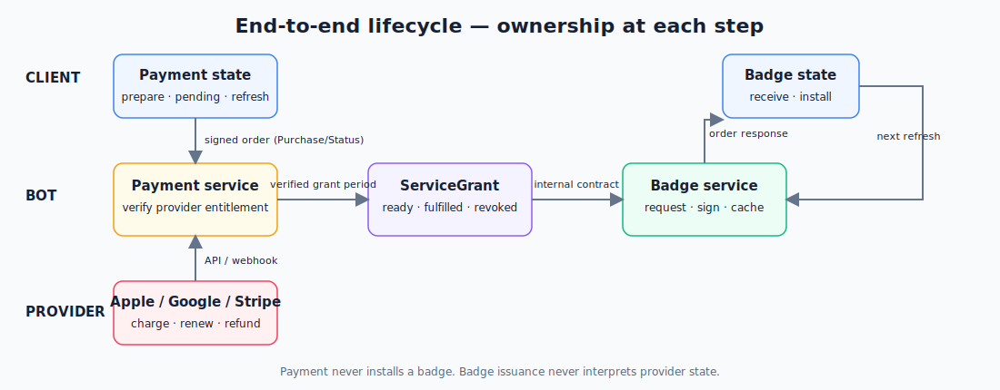

## Contents

- [1. Rules](#1-rules)
- [2. UX states](#2-ux-states)
- [3. Badge screen](#3-badge-screen)
- [4. Payment flows](#4-payment-flows)
- [5. Refresh and errors](#5-refresh-and-errors)
- [6. Acceptance criteria](#6-acceptance-criteria)

## 1. Rules

### Plans and providers

| Build | Payment | Cancel/manage |
|---|---|---|
| iOS | StoreKit | Apple subscription UI |
| Android Play | Play Billing | Google Play subscription UI |
| F-Droid / desktop | Stripe Checkout | cancel RPC; Customer Portal for invoices/payment methods |

Choices: **One-time**, **Monthly**, **Yearly**. There is no Extend action.

- One-time does not stack and is available again after badge expiry.
- Subscribing from one-time starts a new payment; there is no conversion API.
- Monthly and yearly plans issue one service grant per eligible month.
- Cancellation stops renewal. It does not shorten an issued badge.
- Stripe uses the system browser. No localhost service is required.

### Dates

| Payment event | Billing | Badge |
|---|---|---|
| Paid 21 July | monthly renews 21 August; yearly renews 21 July next year | valid through 31 August |
| Eligible grant period 21 August | monthly renews 21 September; yearly billing unchanged | new badge valid through 30 September |
| Canceled before renewal | subscription remains paid to provider period end | issued badge remains valid to signed expiry |

Show **Badge valid until** separately from **Renews on** or **Subscription ends on**.

### Sources of truth

- Core signature and expiry decide badge validity.
- Bot/provider verification decides payment status and grant eligibility.
- Store state and Stripe redirects are hints only.
- Client asks through RPC; bot returns one final response and never pushes.
- Before payment, the client generates one 32-byte BBS `BadgeMasterKey`. The payment and every badge issued from it are bound to that key; renewals reuse it.
- Payment capability authorizes bot requests. The raw BBS key, capability, and provider proofs are redacted.

## 2. UX states

| State | Condition | Display | Actions |
|---|---|---|---|
| No badge | no entitlement or active badge | plans and prices | Buy once; Monthly; Yearly |
| Payment pending | provider not complete | old badge if valid | Continue; Check again |
| Issuing | paid; badge request/install running | old badge + progress | automatic retry; Retry |
| Active one-time | one-time badge active | tier; badge expiry | Monthly; Yearly |
| Active subscription | paid, renewing, badge active | interval; badge expiry; renewal | Cancel; Manage |
| Canceled, active | renewal off; paid/badge time remains | badge expiry; subscription end | Resubscribe |
| Payment issue | grace/on-hold/provider error | active badge until expiry | Fix payment; Check again |
| Badge missing | grant exists; no usable badge | issuance error/progress | Retry |
| Expired | no entitlement or active badge | expired state | Buy once; Monthly; Yearly |
| Needs update | unknown issuer/protocol | unavailable | Update app |
| Offline/stale | refresh failed | cached state + check time | Retry |

An active installed badge remains visible during payment and network errors.

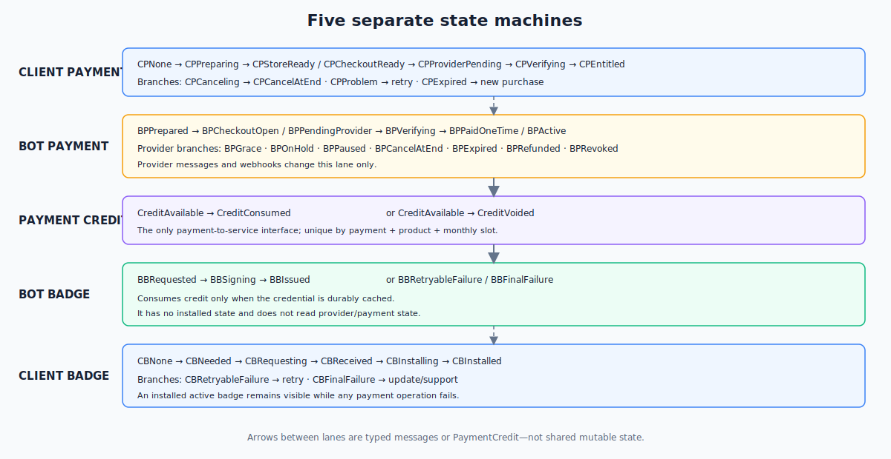

## 3. Badge screen

Display, in order:

1. badge, tier, proof status;
2. **Badge valid until**;
3. payment type and **Renews on** / **Subscription ends on**;
4. primary action, then manage/recovery action;
5. error and **Last checked** only when needed.

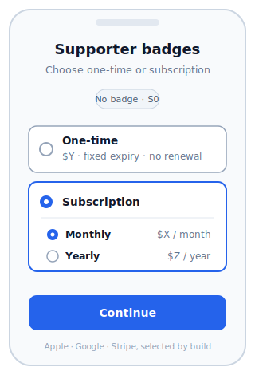
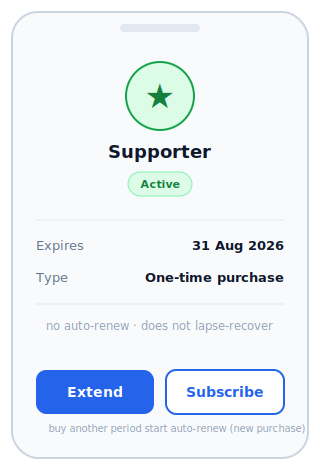
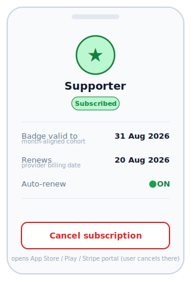

Cancellation copy: **“Cancel renewal? Your subscription stays active until {date}. You won’t be charged again.”**

## 4. Payment flows

Every diagram is one outcome. Client and bot state are labeled separately.

### Apple

#### Success

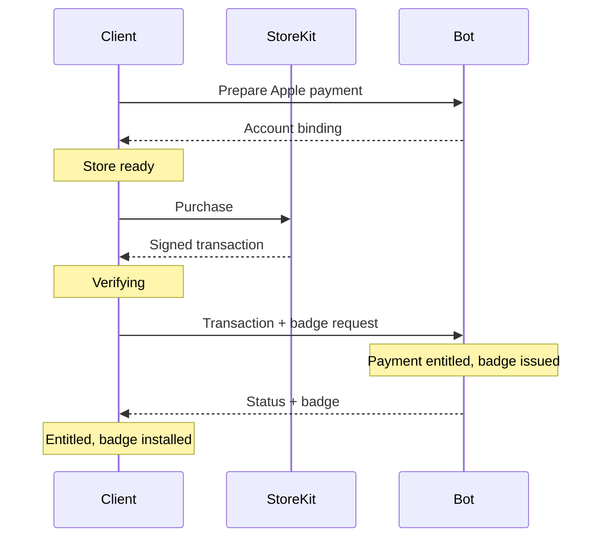

#### Pending

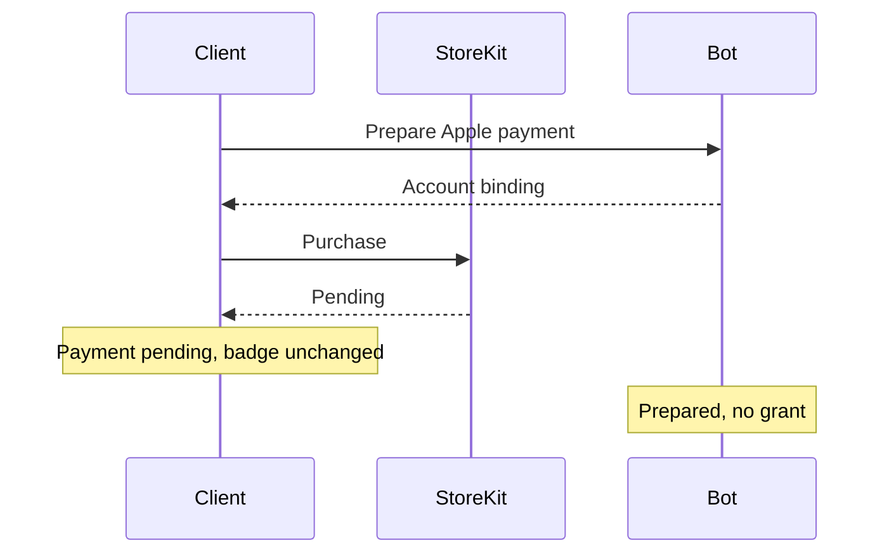

#### Canceled

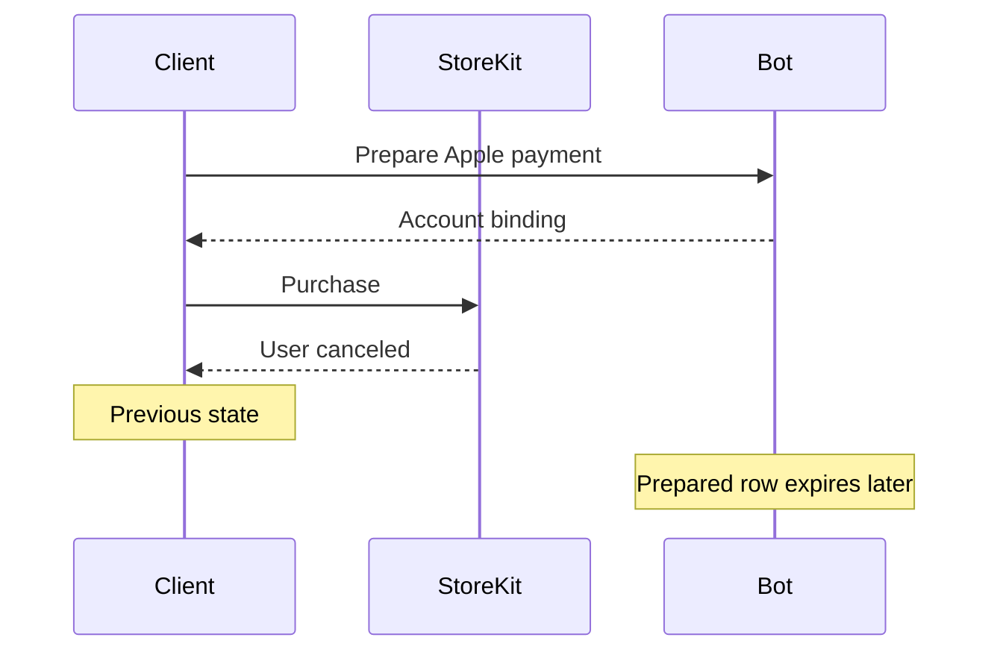

Apple initial proof is verified offline. Later status uses App Store Server API.

### Google

#### Success

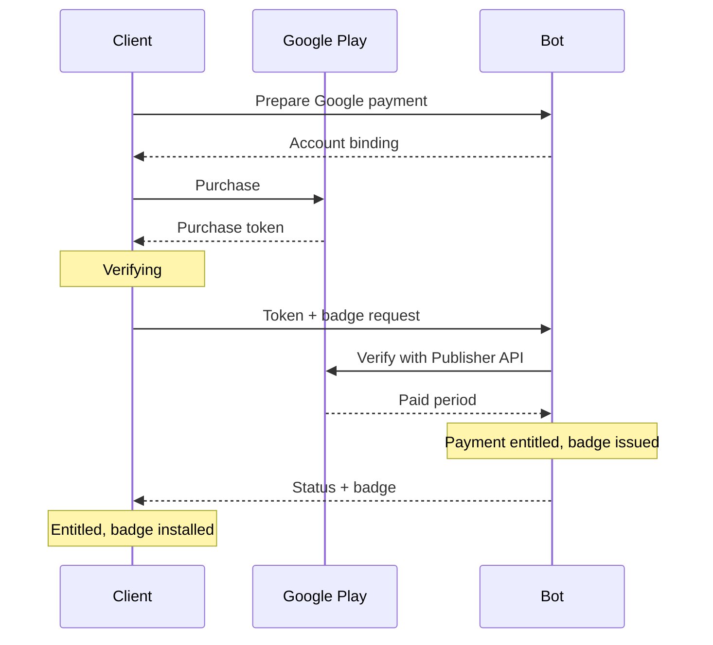

#### Pending

#### Canceled

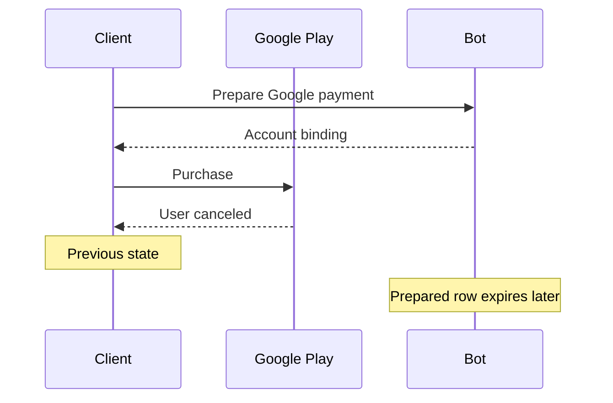

### Stripe

#### Success

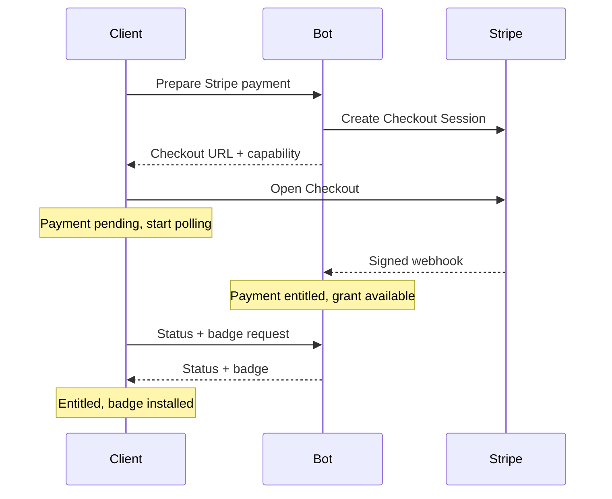

#### Still pending

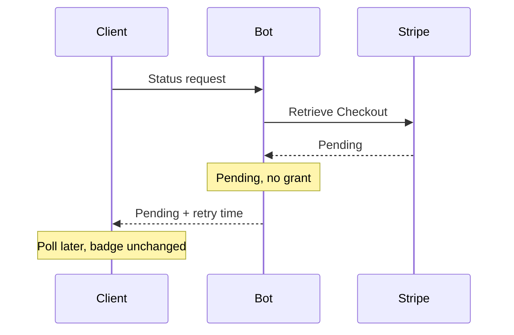

#### Expired

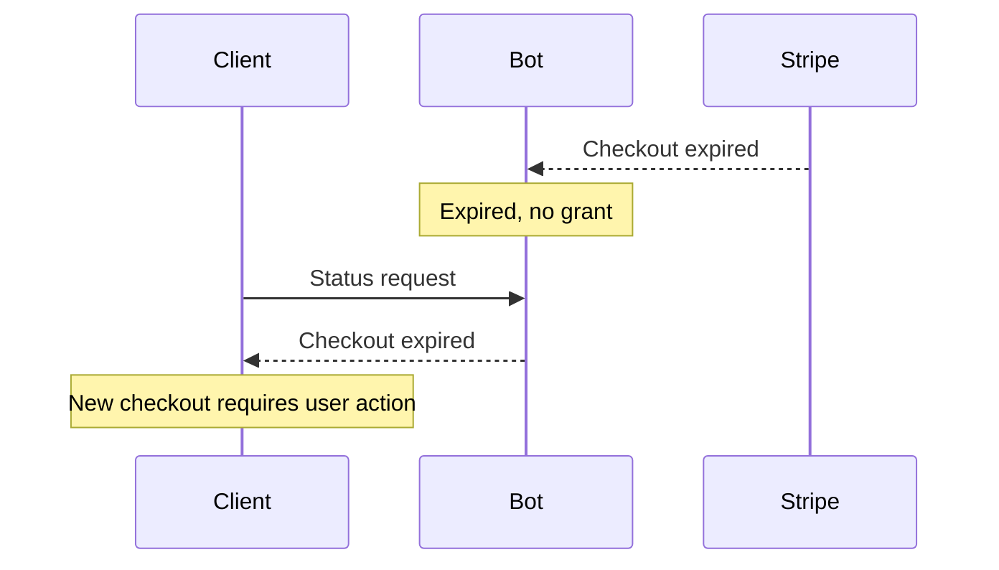

Start polling when Checkout opens and on return/foreground: 5, 15, 30, 60, 120 seconds, then normal refresh. The return link is optional routing, never proof.

### Cancel subscription

#### Apple

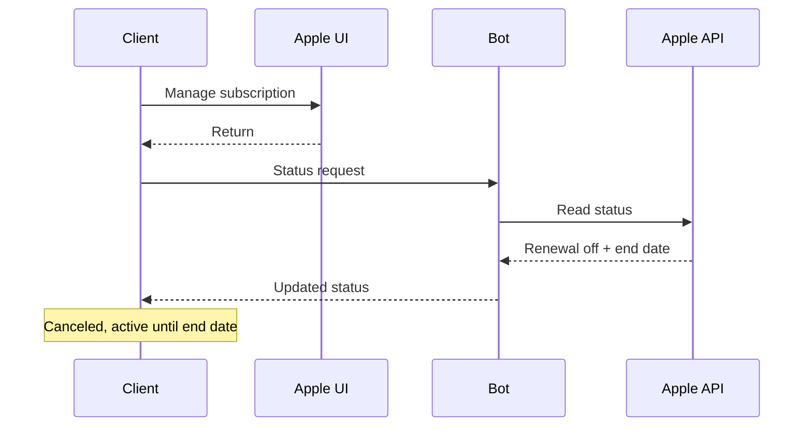

#### Google

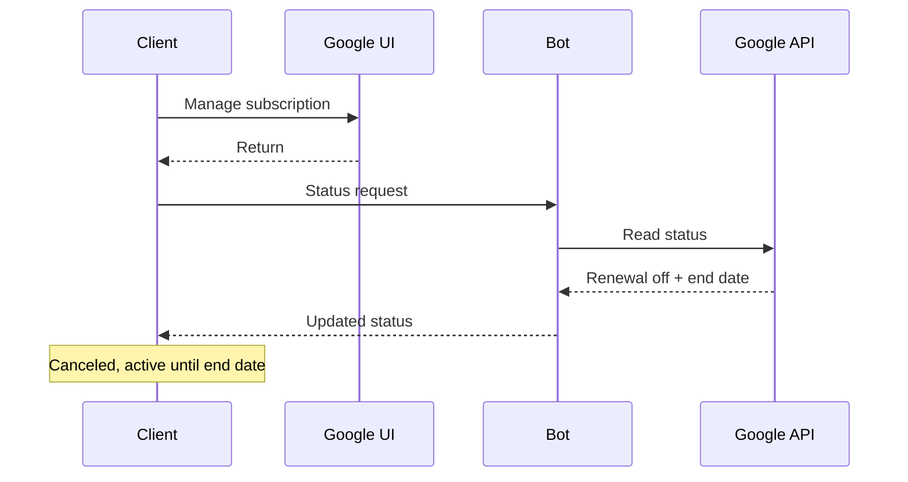

#### Stripe

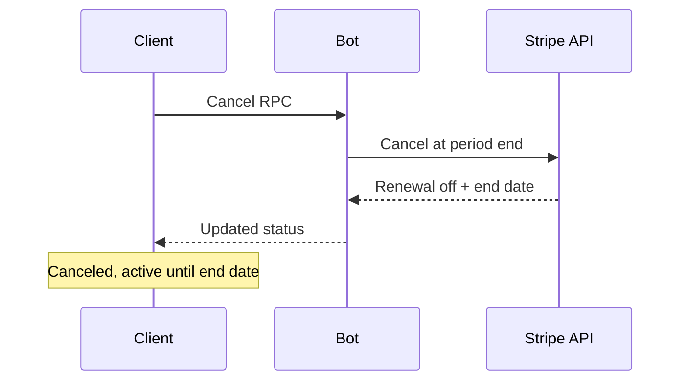

Never show canceled until the bot confirms renewal is off.

## 5. Refresh and errors

Refresh on launch, foreground, profile switch, network restore, store update, Stripe browser return, manual retry, six-hour jittered timer, and payment/badge date boundaries.

If `GrantReady` exists without the current badge, request issuance. Cache the response before core verification/install. There are no bot-initiated client events.

| Condition | Client action |
|---|---|
| Store canceled | restore previous screen |
| Payment pending | show pending; poll/schedule |
| Network/provider failure | keep cached state and active badge; retry |
| Paid, issuance failed | show “Payment confirmed. Badge is being prepared”; retry |
| Cancel failed | keep **Renews on**; retry |
| Payment issue | show Fix payment / Manage |
| Ownership/proof failure | restore/support; no sensitive details |
| Unknown issuer/protocol | require update |
| Invalid credential | reject; retain old badge; retry/support |
| Duplicate/lost response | repeat same request; no duplicate charge/badge |

Errors preserve the last payment snapshot and installed badge. The implementation plan defines retry/final handling.

## 6. Acceptance criteria

- No badge, one-time badge, and subscription badge UX is complete.
- Choices are One-time, Monthly, Yearly; no Extend.
- Payment on 21 July shows badge through 31 August while billing keeps its provider date.
- Apple, Google, and Stripe have separate linear outcomes.
- Payment verification creates a provider-neutral service grant; badge service has no provider logic.
- Client and bot payment/badge states are separate.
- RPC is client-request/bot-response only and idempotent.
- Stripe needs no localhost/deep-link success and cancels through bot RPC.
- Every error category has an owner, state-preserving action, and retry/final result.
- RPC attempts/results appear redacted in Developer Tools → Chat Console.
