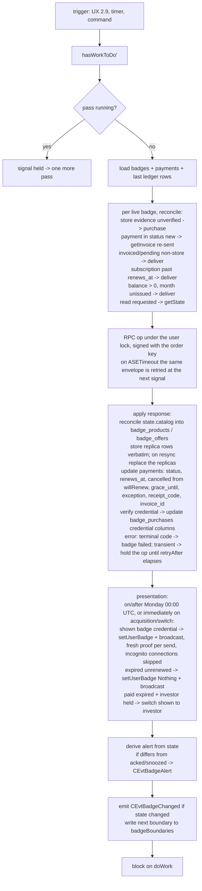

# Supporter Badges v3 — core implementation plan

**Date:** 2026-07-31
**Product plan:** `plans/2026-07-30-supporter-badges-v3-ux.md` (referenced below as UX §n)
**Transport:** service RPC (`plans/2026-07-22-service-rpc-chat.md`, implemented, branch `rpc`)
**Scope:** MVP launch set (UX §7): ops `getCatalog | getInvoice | purchase | deliver | getState | redeem` implemented; `pause | resume | transfer` are defined in the schema, post-MVP; no `use_from`, `paused_at`.

## 1. Client schema

`src/Simplex/Chat/Store/SQLite/Migrations/M20260731_user_badges.hs` — SQLite only; the Postgres variant is written when the schema is final; registered in the migrations list and cabal at delivery step 2.

- Table mapping to UX §3:
  - `badges` → `badge_purchases`
  - `issuances` → `badge_issuances`
  - `products` → `badge_products`
  - `offers` → `badge_offers`
  - `badge_ledger` → `badge_ledger`
  - `payments` and `charges` — unprefixed, product-agnostic (UX §3 ownership)
- The payment row is inserted first, the badge row in the same transaction.
- Payment columns beyond the UX §3 list (`invoice_*` client-side; `grace_until` and `exception` on both sides, sent in `paymentState`):
  - `invoice_address` — the crypto screen address (UX 2.1)
  - `invoice_crypto_amount` — the fixed crypto amount (UX 2.1)
  - `invoice_expires_at` — the countdown and the expired state (UX 2.1)
  - `grace_until` — the provider grace/hold deadline (UX 2.4 payment failed; 2.6 state 5)
  - `exception` — the provider exception state: partial or over payment (UX 2.1)
- The badge–user match for `users.shown_badge_id` is enforced in code.
- `badge_ledger` has one definition — the `badgeLedgerTable` constant in the client migration; the service schema re-uses it literally.
- Settings (reminders opt-out; "Show new badges from Monday", post-MVP) are app settings, not schema.

### `badge_ledger`

A verbatim replica of the service ledger: the service is the only author; rows arrive in statements; the last row is the balance; each row is verifiable from its predecessor.

| column | meaning |
|---|---|
| `entry_id` | local autoincrement; PK; never on the wire |
| `entry_uuid` | service-assigned UUIDv7; sent both ways; UNIQUE index |
| `badge_purchase_id` | FK → `badge_purchases` |
| `change_months` | months added or removed: `+3` credit, `−1` debit |
| `balance_months` | unused months after this entry |
| `balance_start_ts` | start of the unused balance, after this entry |
| `balance_badge_type` | the type of the unused balance, after this entry |
| `was_paused_since` | set on the entry ending a pause: paused from this time until this entry |
| `service_created_at` | service time of the entry |
| `created_at` | local time the row was stored |
| `entry_type` | `credit` \| `debit` |
| `entry_credit_type` | the `type` tag of the `credit` value — any string, known or not |
| `entry_debit_type` | the `type` tag of the `debit` value — any string, known or not |
| `entry_type_unknown` | client only, added via ALTER TABLE after the shared table: 1 when the tag is beyond the client's version; the typed reference columns stay NULL |
| `entry_type_value` | client only, added via ALTER TABLE: the credit/debit object JSON, verbatim; present only for unknown tags; re-decoded after upgrade |
| `invoice_id` | field of `credit(payment)`; FK → `payments` |
| `charge_id` | field of `credit(charge)`; FK → `charges` |
| `from_purchase_id` | field of `credit(transferIn)`; FK → `badge_purchases`, nullable — the source may not exist locally |
| `to_purchase_id` | field of `debit(upgrade)` / `debit(transferOut)`; FK → `badge_purchases` |

| kind | type | meaning | when |
|---|---|---|---|
| credit | `payment` | months credited: a settled non-recurring payment — card, crypto, code, store one-time | MVP |
| credit | `charge` | months credited: one subscription charge, the first included | MVP |
| credit | `support` | months credited by support — compensation, gift | MVP |
| credit | `transferIn` | months arriving via transfer | post-MVP |
| credit | `opening` | balance restated: the ledger is reset to the stated amount, no relation to the previous row | MVP |
| debit | `refund` | balance removed: refund or chargeback | MVP |
| debit | `upgrade` | balance converted into an upgrade's credit | post-MVP |
| debit | `transferOut` | balance transferred out | post-MVP |
| debit | `support` | balance removed by support — leaked code batch | MVP |
| debit | `badge` | one month spent on the badge — a credential issued | MVP |
| debit | `lapse` | elapsed unissued months removed | MVP |

```
entry = credit — creditType: payment {invoiceId} | charge {chargeId} | support | transferIn {fromPurchaseKey} | opening
      | debit  — debitType: refund | upgrade {toPurchaseKey} | transferOut {toPurchaseKey} | support | badge | lapse
```

The protocol entry (`StatementEntry`, §4): `entryId`, `changeMonths`, `balanceMonths`, `balanceStartTs`, `balanceBadgeType`, `wasPausedSince`?, `createdAt`, `entryType` — the same sum with wire references.

## 2. Badge RPC service schema

`plans/2026-07-31-badges-service-schema.sql` — SQLite, like the client (the Postgres variant is written when the schema is final); the bot schema, extended with the purchase/ledger layer.

## 3. Client types

Domain types — `src/Simplex/Chat/Badges/Store.hs`. Records:

- `BadgeProduct`
- `BadgeOffer`
- `BadgePurchase`
- `BadgePayment`
- `BadgeLedgerEntry`
- `BadgeCharge`
- `BadgeIssuance`
- `BadgeAlert`
- `UserBadgeState`

Id newtypes:

- `BadgeProductId`
- `BadgeOfferId`
- `InvoiceId`

Enums:

- `BadgePlan`
- `BadgeOfferState`
- `BadgeProvider`
- `BadgePaymentStatus`
- `BadgePurchaseStatus`
- `BadgeAlertKind`

Tagged sums:

- `BadgeProductType` — text with an unknown-tag catch-all, the `BadgeType` shape
- `LedgerEntryType` — `entry_type` with `credit_type` / `debit_type` (§2)
- `LedgerCreditType`
- `LedgerDebitType`

Reused from `Simplex.Chat.Badges`:

- `BadgeType`
- `BadgeInfo`
- `BadgeRequest`
- `BadgeCredential`
- `BadgeMasterKey`

Protocol types — `src/Simplex/Chat/Badges/Service.hs`, one constructor/field per JTD member:

- `BadgeServiceRequest`
- `BadgeServiceCommand`
- `ServicePaymentMethod`
- `CardProvider`
- `CryptoCurrency`
- `CurrencyAmount`
- `ServicePayment`
- `BadgeUpgrade`
- `BadgeServiceResponse`
- `ServicePaymentDestination`
- `BadgeServiceErrorCode`
- `BadgeCatalog` — undefined
- `BadgeStatement`
- `BadgeBalance`
- `StatementEntry`
- `StatementEntryType`
- `StatementCreditType`
- `StatementDebitType`

Instances — added at implementation; enums follow the `BadgeType` conventions (Badges.hs:114); the unions encode the JTD discriminator `type`:

- `TextEncoding`
- JSON
- `ToField` / `FromField`

## 4. RPC protocol

`docs/protocol/badges-rpc.schema.json` — the JTD schema (definitions `request` and `response`); `docs/protocol/badges-rpc.md` — the protocol description (identity, idempotency, op semantics, statement, errors).

A request is an envelope: `version`; `purchaseKey`? (optional for `getBadgeCatalog` — signed, the response adds the purchase's `statement`; required for other commands, which are signed with it); `request` — the command, discriminated on `type`. Responses discriminate on `type`; response types are badge-namespaced, fields inside are plain.

| request `type` | request fields (beyond `purchaseKey`, `version`) | response `type` | response fields |
|---|---|---|---|
| `getBadgeCatalog` (signature optional) | — | `badgeCatalog` | `catalog`<br>`badgeStatement`? (for signed requests) |
| `getBadgeInvoice` | `offerId`<br>`badgeInfo {badgeType, badgeExpiry?, badgeExtra}`<br>`paymentVia` — `card`: `provider`; `crypto`: `currency`<br>`upgrade`? — `fromPurchaseKey`, `receipt`, `receiptSignature`, `balance` | `badgeInvoice` | `invoiceId`<br>`badgeType`<br>`months`<br>`price`<br>`discount`?<br>`credit`?<br>`amount` (= price − discount − credit)<br>`currency`<br>`expiresAt`<br>`paymentTo` — `card`: `provider`, `url`; `crypto`: `currency`, `address`, `cryptoAmount` |
| `purchaseBadge` | `badgeRequest` — `masterKey`, `badgeInfo`<br>`payment` — `apple`: `jws`; `google`: `token`; `invoice`: `invoiceId`; `code`: `code`<br>`upgrade`? — `fromPurchaseKey`, `receipt`, `receiptSignature`, `balance` | `badgeCredential` | `credential`<br>`receipt`? (not provided for lifetime badges)<br>`statement` |
| `upgradeBadgeSubscription` | `badgeRequest`<br>`payment` — `apple`: `jws`; `google`: `token`<br>`balance` | `badgeCredential` | `credential`?<br>`statement` |
| `issueBadge` | `badgeRequest`<br>`balance` | `badgeCredential` | `credential`? (absent when the balance is exhausted)<br>`statement` |
| `pauseBadge` (post-MVP) | — | `badgeCredential` | `credential`?<br>`statement` |
| `transferBadge` (post-MVP) | `badgeRequest`<br>`receipt` | `badgeCredential` | `credential`<br>`receipt`?<br>`statement` |
| any, on failure | — | `error` | `code` (incl. `payment_pending`, `code_invalid` / `code_used` / `code_expired`)<br>`message`?<br>`retryAfter`? |

`statement` — record: `entries` — ledger entries; `previousEntryId`? — matches the client's asserted entryId, absent for the full ledger.

`balance` — record: `lastEntry` — the client's last ledger entry.

Undefined, pending design: `catalog`.

## 5. Commands and events

`ChatCommand` (Controller.hs; parsers in `chatCommandP`) — the UX 2.9 user actions. UX 2.9 actions without a command:

- reminder and presentation toggles — app settings (§1)
- pause / resume and the start-sharing date — post-MVP (Scope)
- cancel — the Cancel button opens the store management sheet; on its close the management screen re-reads state via `APIGetBadgeState` (UX §7)

```haskell
| APIGetBadgeState UserId                                        -- /_badge state <userId>
| APIGetBadgeCatalog UserId                                      -- /_badge catalog <userId>; unsigned getCatalog op
| APIGetBadgeInvoice {userId :: UserId, offerId :: BadgeOfferId, paymentMethod :: Maybe BadgePaymentMethod}  -- /_badge invoice <userId> <offerId> [<method>]; the method is absent for store offers
| APIPurchaseBadge {userId :: UserId, paymentId :: Int64, evidence :: PaymentEvidence}  -- /_badge purchase <userId> <paymentId> <json>
| APISwitchShownBadge {userId :: UserId, badgePurchaseId :: Int64}  -- /_badge shown <userId> <badgePurchaseId>
| APIRedeemBadgeCode {userId :: UserId, code :: Text}            -- /_badge redeem <userId> <code>
| APIAckBadgeAlert {userId :: UserId, kind :: BadgeAlertKind, episode :: Text, snooze :: Bool}  -- /_badge ack <userId> <kind> <episode> <snooze>
```

| command | UX | called when |
|---|---|---|
| `APIGetBadgeState` | 2.2, 2.3, 2.6, 2.1, §7 | app start — the initial model load; a badge screen is opened or regains focus |
| `APIGetBadgeCatalog` | §3 prices | the purchase screen is opened (non-store builds); non-blocking |
| `APIGetBadgeInvoice` | 2.1 | the user taps Pay on the selected offer |
| `APIPurchaseBadge` | 2.1, §5 | the store purchase flow returns evidence (store builds only) |
| `APISwitchShownBadge` | 2.6.8, 2.7 | the user selects the shown badge |
| `APIRedeemBadgeCode` | 2.8 | the user submits a code (2.6.9) |
| `APIAckBadgeAlert` | 2.4 | the user taps OK or "Remind me again" on an alert |

Purchase is two commands because the store purchase runs in the app between them: StoreKit and Play Billing are app-platform APIs, which core cannot call, and the store may deliver the result late (`pending` / Ask to Buy — via `Transaction.updates`, including after a restart). The names follow digital commerce: `APIGetBadgeInvoice` obtains the invoice (the `getInvoice` op) or the store product id; after payment `APIPurchaseBadge` presents the evidence, and the worker sends `purchase` — verification, the grant, and the first delivery in one round trip. Delivery has no command — `deliver` is core-driven (UX 2.9 engine), from the balance only: settlement grants months, issuance consumes them (UX §3 ledger), so the first and every repeat delivery are the same op.

- `APIGetBadgeInvoice` starts every purchase: core loads or creates the live purchase row for the offer's slot (per-user lock + `idx_badge_purchases_live`) — a `failed` row of the same slot is reused — creates the payment row, and points the badge row's `payment_id` at it (UX §3: the current payment). For a non-store offer core sends `getInvoice` with the method chosen in the selector (UX 2.1) and responds with the invoice — the Stripe link or the crypto screen data (UX 2.1). For a store offer core responds with the store product id, and the app starts the native purchase (UX §5: the payment row precedes `Product.purchase()`). The invoice fields are stored on the payment row (§1), so pending-payment screens re-render after a restart; after invoice expiry a new `APIGetBadgeInvoice` creates a new invoice and payment row (UX 2.1).
- `APIPurchaseBadge` completes a store purchase — the only payment whose result is delivered to the app: the store hands the app the evidence, and only that evidence ties the store transaction to the order, because the store flow knows neither order keys nor the bot. Core records it on the payment row; the worker sends `purchase` — the bot verifies, records the grant, and delivers in one round trip (§6). Stripe and crypto need no completion command and carry no evidence: the bot records their settlement from the provider webhook (UX §7 notifications); the worker's next `deliver` returns the delivery, or the `state` result with `reason: payment_pending` until the webhook arrives (§4).
- `APIRedeemBadgeCode` sends `redeem` under the user lock: keys are generated first; the badge and payment rows (`provider = code`, `offer_id` NULL) are written on success in one transaction, directly `issued` — the badge type is in the response (UX 2.8). A live row of the granted slot is superseded (at most two badges per profile, UX 2.7); its unconsumed months stay on its order — orders are unlinkable, so the bot cannot move them; recovery per UX §3 (`transfer`, post-MVP). On a timeout the error is surfaced to the user; a code consumed by a lost response is restored by support (codes tooling, delivery 7).
- `APIGetBadgeState` loads the badge state into the app model at start (and on profile switch); events only update the model afterward, so without the initial read it would hold nothing at first render — the 2.2 banner is rendered from it. The same call re-reads state when a badge screen is opened or regains focus, and signals the worker (§6); reconciliation results follow as `CEvtBadgeChanged`. Screen re-focus covers the returns that fire no core trigger: the store cancellation sheet close — UX §7 "the engine sends `status` on return"; the in-app sheet fires no foreground trigger — and return to a pending-payment screen after payment (UX 2.1), which on desktop produces no foreground event either.

`ChatResponse`:

```haskell
| CRBadgeState {user :: User, badgeState :: UserBadgeState}
| CRBadgeCatalog {user :: User, products :: [BadgeProduct], offers :: [BadgeOffer]}
| CRBadgeInvoice {user :: User, payment :: BadgePayment, storeProductId :: Maybe Text}
```

- `CRBadgeState` — the state the badge surfaces render (banner 2.2; picker 2.3; management screen 2.6); the response of every command except `APIGetBadgeInvoice` and `APIGetBadgeCatalog`. Worker results follow as `CEvtBadgeChanged`.
- `CRBadgeCatalog` — the refreshed catalog for the open purchase screen (UX §3 prices).
- `CRBadgeInvoice` — the purchase continuation (`APIGetBadgeInvoice`): `payment` carries the invoice fields — the Stripe link, or the crypto address, amount, and expiry (UX 2.1); `storeProductId` starts the native store purchase (UX §5).
- Errors: `ChatErrorType` gains `CEBadgeServiceError {badgeError :: BadgeServiceErrorCode, message :: Maybe Text, retryAfter :: Maybe Int}` — the inline redeem errors (UX 2.8) and the purchase-screen unavailable notice (UX 2.1).

`ChatEvent`:

```haskell
| CEvtBadgeChanged {user :: User, badgeState :: UserBadgeState}
| CEvtBadgeAlert {user :: User, alert :: BadgeAlert}
```

- `CEvtBadgeChanged` — emitted by the worker on any state change it applies (UX 2.9 events); open badge surfaces re-render from it.
- `CEvtBadgeAlert` — the derived current alert (UX 2.4); the app displays it and answers with `APIAckBadgeAlert`.

The reminders opt-out is an app setting: core emits `CEvtBadgeAlert` for all kinds; the app suppresses display of the two reminder kinds (`BARenewalApproaching` and `BAPrepaidEnding`) when reminders are off, and ignores them in `UserBadgeState.alert` for the picker indicator (UX 2.3).

## 6. BadgeManager

Runs in core. Controller state; the worker is the agent `Worker` framework the controller already uses (`getAgentWorker` / `hasWorkToDo'` / `cancelWorker`; the `TMap k Worker` fields, Controller.hs:304):

```haskell
data BadgeManager = BadgeManager
  { badgeWorkers :: TMap UserId Worker,          -- agent Worker: doWork TMVar, restart on crash
    badgeLocks :: TMap UserId Lock,              -- one signed badge op per user in flight
    badgeReads :: TMap UserId UTCTime,           -- read requests from APIGetBadgeState (step B)
    badgeBoundaries :: TMap UserId UTCTime,      -- next boundary per user
    badgeTimerAsync :: TVar (Maybe (Async ()))   -- the timer thread; sleeps to the earliest boundary
  }
```

One worker per user because badge state is per profile (UX 2.12): the worker serializes that profile's RPC ops and row writes, and profiles do not delay one another. The worker holds no task queue: a trigger only signals it, and each pass derives the work from stored state (the reconcile step below). Ops are idempotent (§4), so lost and duplicated signals are harmless.

Lifecycle:

1. start — the first signal for a user creates the worker via `getAgentWorker`; the timer thread is started at chat start (`badgeTimerAsync`).
2. signal — every trigger performs `hasWorkToDo'`: the UX 2.9 triggers (chat start, foreground, and network restore signal every user with a badge or payment row; profile switch — the switched-to user), the timer thread, and the commands — `APIGetBadgeState`, which also records the request time in `badgeReads`; `APIPurchaseBadge` after the evidence is recorded; `APIRedeemBadgeCode` and `APISwitchShownBadge` for presentation (step E).
3. pass — the loop takes the signal and runs the flowchart below once per live badge row (the paid and the investor slots, §5).
4. re-run — a signal that arrives during a pass stays in `doWork`; the loop runs one more pass, so state changed mid-pass is picked up.
5. idle — between passes the loop blocks on `doWork`.
6. stop — workers are stopped with `cancelWorker` at chat stop and on user deletion; the timer thread with them.

The worker and the commands that send signed RPC themselves (`APIGetBadgeInvoice` — `getInvoice`; `APIRedeemBadgeCode` — `redeem`) take the user's lock in `badgeLocks`, so one signed op per user is in flight; the same lock guards get-or-create of the badge row (§5). The unsigned, order-independent `getCatalog` (`APIGetBadgeCatalog`) is sent outside the lock. `badgeLocks` follows the `withEntityLock` discipline (Library/Internal.hs:127) — `chatLock` is waited for first — so the step E broadcast creates no new lock order.

`getState` is the read op — no `masterKey`, nothing written: sent after a restore (UX §3 recovery), on store-cancellation returns when no delivery is due (UX §7), and for paused orders (UX 2.13, post-MVP); when a delivery is due, the reconcile step chooses `purchase` or `deliver` instead. It mirrors `APIGetBadgeState`, whose `badgeReads` entry the pass reads: a request newer than the last response and no due delivery op → `getState`, then the entry is cleared.

Timer — each pass reports the user's next boundary, the earliest of:

- `renews_at` − 3d — renewal reminder (UX 2.4)
- paid-through − 3d — prepaid ending (UX 2.4)
- paid-through — ended alerts (UX 2.4); sender-side perk cutoff (UX 2.11)
- `alert_snooze_until` — the snoozed alert is emitted once more (UX 2.4)
- next Monday 00:00 UTC — presentation and removal updates (UX 2.11)

Each pass writes its user's next boundary into `badgeBoundaries`; the timer thread sleeps until the earliest entry and signals the workers whose boundaries elapsed.



Non-store purchase:

```mermaid
sequenceDiagram
  participant UI as app
  participant C as core (BadgeManager)
  participant B as bot
  participant P as Stripe/BTCPay
  UI->>C: APIGetBadgeInvoice offerId paymentMethod
  C->>C: load or create the badge row; create the payment row (lock + unique index)
  C->>B: getInvoice (signed, offerId, paymentMethod)
  B->>P: create intent / invoice
  B-->>C: result: invoice (url, paymentRef, amount)
  C-->>UI: CRBadgeInvoice (url / address, cryptoAmount, expiresAt)
  UI->>UI: browser (card) or the in-app invoice screen (crypto); user pays
  P-->>B: webhook: settled
  B->>B: advance; grant
  UI->>C: APIGetBadgeState (the screen regains focus)
  C->>B: deliver (signed, masterKey)
  B->>B: advance; issue
  B-->>C: result: delivery (+ state: catalog, payments, entries, issuances, charges, paidThrough)
  C->>C: store rows; verify credential; update badge; presentation
  C-->>UI: CEvtBadgeChanged
```

Store purchase:

```mermaid
sequenceDiagram
  participant UI as app
  participant S as StoreKit / Play Billing
  participant C as core (BadgeManager)
  participant B as bot
  participant PR as store server API
  UI->>C: APIGetBadgeInvoice offerId
  C->>C: load or create the badge row; create the payment row (lock + unique index)
  C-->>UI: CRBadgeInvoice (storeProductId)
  UI->>S: purchase(storeProductId)
  S-->>UI: evidence (JWS / purchase token)
  UI->>C: APIPurchaseBadge paymentId evidence
  C->>B: purchase (signed, masterKey, payment: evidence)
  B->>B: verify the JWS offline (Apple)
  B->>PR: verify + acknowledge the purchase token (Google)
  B->>B: advance; grant; issue
  B-->>C: result: delivery (+ state)
  C->>C: store rows; verify credential; update badge; presentation
  C-->>UI: CEvtBadgeChanged
```

Badge row status:

```mermaid
stateDiagram-v2
  [*] --> acquiring: APIGetBadgeInvoice
  [*] --> issued: APIRedeemBadgeCode, created on success
  acquiring --> issued: credential verified and stored
  acquiring --> superseded: a new row takes the slot
  acquiring --> failed: terminal error (step D)
  issued --> issued: renewal / re-issue (credential updated in place)
  issued --> superseded: a new row takes the slot (redeem; upgrade post-MVP)
  failed --> acquiring: get-or-create reuses the slot's failed row; payment_id repointed
```

## 7. UX coverage

Each UX plan point and its implementation home:

| UX | implementation |
|---|---|
| 2.1 method + duration selector, prices | app UI; `APIGetBadgeCatalog`; `badge_products` / `badge_offers` (§1) |
| 2.1 unavailable options | offer `state`; `offer_disabled` / `product_unavailable` (§4) |
| 2.1 crypto and Stripe screens | `APIGetBadgeInvoice` → `CRBadgeInvoice`; invoice columns (§1); payment statuses in `state.payments`; partial/over payment in `paymentState.exception` (§4) |
| 2.1 receipt save prompt | `receipt` on the settled payment in `state.payments` → `payments.receipt_code`; the prompt is app UI |
| 2.2 banner | app UI over `CRBadgeState` / `CEvtBadgeChanged` |
| 2.3 user picker | post-MVP (UX §7 Deferred); state and `alert` in place; the Settings row is the MVP entry point |
| 2.4 alerts | `BadgeAlertKind`; `alert_acked_kind` / `alert_acked_episode` / `alert_snooze_until` / `grace_until` (§1); worker step F; `CEvtBadgeAlert`; `APIAckBadgeAlert` |
| 2.5 start-sharing | post-MVP (`use_from`, Scope); immediate presentation in worker step E |
| 2.6 management screen | `UserBadgeState`; the commands table (§5) |
| 2.7 held badges, switching | `users.shown_badge_id`; `APISwitchShownBadge`; the investor fallback in step E |
| 2.8 redeem codes | `APIRedeemBadgeCode`; the `redeem` op; payment `provider = code` |
| 2.9 triggers | worker lifecycle item 2 (§6) |
| 2.9 engine | the worker flowchart (§6) |
| 2.9 API calls | the commands table (§5) |
| 2.10 upgrades | post-MVP (UX §7 Deferred); the `superseded` status in place |
| 2.11 dates | bot `sundayAfter` (delivery 7); Monday in step E and the timer; `mkBadgeStatus` grace (delivery 1) |
| 2.12 multi-profile | one worker per user; the incognito skip in step E |
| 2.13 pause | post-MVP; the `resume` transition (delivery 7; op value §2); ops in §4 |
| §3 ownership, tables | the §1 mapping; the service schema (§2) |
| §3 catalog rules | `badge_products` / `badge_offers`; reconciliation (delivery 4) |
| §3 payments, charges | §1; `state.payments` / `state.charges` (§4) |
| §3 ledger, issuances | replicas (§1); the `state` assertion and `resync` (§4); bot transitions (delivery 7); tests (delivery 8) |
| §3 recovery | `payments.receipt_code`; signed `getState` after restore (worker); capped store re-bind at `purchase` (delivery 7); `transfer` post-MVP |
| §4 wire protocol | `Badges/Service.hs`; `docs/protocol` |
| §5 providers | delivery 7; the §5 command bullets |
| §6 decisions 11–14 | 11 — `renews_at` / `cancelled` / charges kept; 12 — catalog seed (delivery 2); 13 — `sundayAfter`; 14 — `paidThrough` in `UserBadgeState` |
| §7 MVP set | Scope; the delivery order |

## Delivery order

1. `mkBadgeStatus`: the +7-day recipient display grace and the shifted `BSExpiredOld` boundary (UX 2.11) — released before purchases (UX §7).
2. Register migration `M20260731_user_badges` (migrations list + cabal + regenerated `chat_schema.sql` / `chat_lint.sql`); the Postgres variant of the migration; the catalog seed from app config (UX §3 prices); store functions (`Store/Badges.hs`): get-or-create with lock; last-ledger-row reads; verbatim replica inserts.
3. Instances for the types in `Badges.hs` and `Badges/Service.hs` (§3) + roundtrip tests.
4. RPC codec: `docs/protocol/badges-rpc.schema.json` packets ↔ `Badges/Service.hs` types; catalog reconciliation on every `state.catalog`.
5. BadgeManager §6: worker, locks, timer; reconcile/apply/presentation/alert steps; events.
6. Commands §5 + parsers + `View.hs` rendering.
7. Bot: schema §2; ledger transitions (UX §3); providers (Apple offline JWS, Google verify+acknowledge, Stripe intents+webhooks, BTCPay invoices+webhooks); codes tooling; notifications endpoints; receipt generation and hashing on settlement (UX §3 recovery); the capped store re-bind on `purchase` (UX §3 recovery); store setup — one Apple subscription group for all subscription SKUs and the Stripe statement descriptor with the short payment ref (UX §7).
8. Tests: ledger properties 1–4 (UX §3); `state` assertion and resync; purchase and deliver idempotency; replica equality bot↔client; offer lifecycle at `getInvoice`; alert derivation incl. supersession; Monday presentation incl. removal updates; provider sandbox flows.
