# Badge codes: web checkout

| | |
|---|---|
| Date | 2026-08-27 |
| Branch | `sh/badges-codes-new` |
| Kind | design — no phases, no tracker |
| Screens | `plans/badges-codes/badges-flow-mvp.svg` |
| Schema and protocol | `f/badge-codes` |
| Wider plan | stream 2 of `plans/2026-08-27-badges-mvp-streams.md` |

---

## Contents

- [1. Scope](#1-scope)
- [2. Architecture](#2-architecture)
  - [2.1 How the browser and the service talk](#21-how-the-browser-and-the-service-talk)
  - [2.2 How the service and the providers talk](#22-how-the-service-and-the-providers-talk)
  - [2.3 The domain model](#23-the-domain-model)
- [3. Purchase sequence](#3-purchase-sequence)
- [4. Data model](#4-data-model)
  - [4.1 Tables](#41-tables)
  - [4.2 The code](#42-the-code)
  - [4.3 Retention](#43-retention)
- [5. Service API](#5-service-api)
  - [5.1 POST /api/invoice](#51-post-apiinvoice)
  - [5.2 GET /api/invoice/:invoiceId](#52-get-apiinvoiceinvoiceid)
- [6. Payment providers](#6-payment-providers)
  - [6.1 How payment is detected](#61-how-payment-is-detected)
  - [6.2 Stripe](#62-stripe)
  - [6.3 BTCPay](#63-btcpay)
  - [6.4 Settlement](#64-settlement)
  - [6.5 The polling schedule](#65-the-polling-schedule)
- [7. The page](#7-the-page)
  - [7.1 State and routing](#71-state-and-routing)
  - [7.2 Stored orders](#72-stored-orders)
  - [7.3 Layout and assets](#73-layout-and-assets)
  - [7.4 Offline](#74-offline)
- [8. Screens](#8-screens)
  - [8.1 Choosing: B1–B4](#81-choosing-b1b4)
  - [8.2 Refusals and failures](#82-refusals-and-failures)
  - [8.3 Waiting: B5, B5b, B5c](#83-waiting-b5-b5b-b5c)
  - [8.4 The code: B6, B6b, B7](#84-the-code-b6-b6b-b7)
  - [8.5 Small screens](#85-small-screens)
- [9. Configuration](#9-configuration)
- [10. Operator CLI](#10-operator-cli)
- [11. Open questions](#11-open-questions)

---

## 1. Scope

`apps/simplex-badge-service/` is a scaffold that answers every request `unsupported_version`. This design adds a web checkout: a person opens `badges.simplex.chat`, chooses a badge level and a number of prepaid months, pays by card through Stripe or on-chain through BTCPay, and is shown a code.

**In scope:** a webpage, two payment integrations, and the rows a sale writes.
**Out of scope:** redemption, credential signing, the badge ledger, and the mockup's `In the app` band (A1–A4). OP1, promotional minting, is deferred (§11.4).

**The boundary is the code**, and the browser is the only party that ever holds it (§4.2). This service stores a `SHA-256` and never sees the plaintext.

Screens are the mockup's `On the web` and `On the web, on a phone` bands, plus OP2, which is §10's `codes status`. B7 is new here.

| Id | Screen | Id | Screen |
|---|---|---|---|
| B1 | landing page | B5 | crypto payment: address, QR, countdown |
| B2 | choose the level | B5b | card return, awaiting confirmation |
| B3 | choose the duration | B5c | invoice expired, paid in part or not at all |
| B4 | order summary and payment method | B6 | the code, disclosed |
| B4b | a payment method is unavailable | B6b | code no longer disclosable |
| B4c | prices changed under the buyer | B7 | codes saved in this browser |
| B4d | too many checkout attempts | M1–M7 | B1–B6 at 390 px, and M7 at 130% text |

**Order** and **invoice** name one thing: the browser says `?order=`, the schema says `invoices`. The **reference** is the five characters on B5, and the only order identifier a buyer may quote to a human.

---

## 2. Architecture

**The page is a single-page app with a preloaded catalog, and the service is two endpoints:** create an invoice, and check its payment. Choosing a level and a duration reaches no server.

One binary, one listener, one database. The page is static files the same binary serves.

| Part | Is | Owns |
|---|---|---|
| the page | one HTML file, CSS and ES modules on disk, with the catalog compiled in | every screen, every wizard answer, all view state (§7) |
| static files | two routes on the listener | `GET /` and `GET /assets/<buildHash>/*` (§7.4) |
| API endpoints | two routes on the listener | create an invoice, and wait for its payment (§5) |
| webhook routes | one route per provider | signature checks, and nothing a payload asserts (§6.1) |
| provider adapters | one module per provider, both behind the same three-operation interface | outbound calls to the provider API, and webhook signature checks (§6.1) |
| `settleOrder` | one function, one transaction | every status write, and marking the code paid (§6.4) |
| the poller | one background thread | reading every open invoice at its provider (§6.5), the expiry sweep, and retention (§4.3) |
| the store | the service's tables in the chat database | all durable state (§4) |
| Anubis | a reverse proxy in front of the listener | the anti-bot challenge on the page and the endpoints (§2.1) |

**The operator CLI is on no diagram** (§10). It is a separate invocation of the same binary that opens the database directly, so it reaches no route and no listener.

### 2.1 How the browser and the service talk

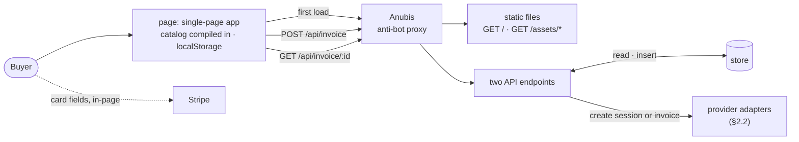
```mermaid
flowchart LR
    Buyer([Buyer]) --> Page["page: single-page app<br>catalog compiled in · localStorage"]
    Page -->|"first load"| ANB["Anubis<br>anti-bot proxy"]
    ANB --> Static["static files<br>GET / · GET /assets/*"]
    Page -->|"POST /api/invoice"| ANB
    Page -->|"GET /api/invoice/:id"| ANB
    ANB --> API["two API endpoints"]
    API <-->|"read · insert"| DB[("store")]
    API -->|"create session or invoice"| PC["provider adapters<br>(§2.2)"]
    Buyer -.->|"card fields, in-page"| STR["Stripe"]
```

- **No session, and no cookie.** Nothing is connected; requests arrive. A request identifies itself by the invoice id it names, and that is the whole of identity here. All other client state is in the URL and `localStorage` (§7.2).
- **The catalog is compiled into the page** at build time. Repricing means redeploying it, and a stale page is caught at invoice creation (§5.1).
- **The second endpoint can be asked to hold** until the status changes (§5.2). The service polls the provider and publishes over STM, so a confirmation reaches the screen without any push: no websocket, no SSE, and nothing about a waiter that survives the request.
- **One origin**, so no CORS and no preflight.
- **A service worker precaches the build**, so everything except the two endpoints works offline (§7.4).

| Fact | Browser | Service |
|---|---|---|
| the catalog | compiled in | the catalog tables, read at build and at invoice creation |
| the level and duration chosen | yes, in `localStorage`, surviving a reload | after creation, frozen on the invoice |
| which screen is showing, and which order is being resumed | yes, in `localStorage` | no |
| the invoice id | the URL, and `localStorage` | the primary key |
| the code | generated here, and held in `localStorage` | only its `SHA-256`, which the browser sends |
| whether payment arrived | no — it asks, and can wait on the answer | yes |

**Anubis challenges the page and both endpoints**, and must not sit in front of `/webhooks/*`: a provider cannot solve a proof-of-work challenge (§9).

### 2.2 How the service and the providers talk

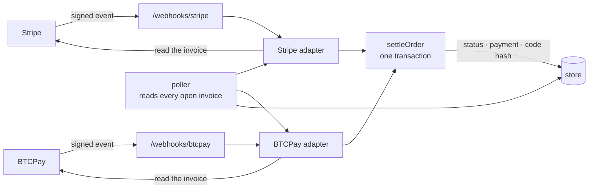
```mermaid
flowchart LR
    STR["Stripe"] -->|"signed event"| WHS["/webhooks/stripe"]
    BTC["BTCPay"] -->|"signed event"| WHB["/webhooks/btcpay"]
    WHS --> SCL["Stripe adapter"]
    WHB --> BCL["BTCPay adapter"]
    SCL -->|"read the invoice"| STR
    BCL -->|"read the invoice"| BTC
    SCL --> SET["settleOrder<br>one transaction"]
    BCL --> SET
    WRK["poller<br>reads every open invoice"] --> SCL
    WRK --> BCL
    WRK --> DB[("store")]
    SET -->|"status · payment · code hash"| DB
```

One lane per provider, both converging on `settleOrder`; the worker enters the same lanes with no webhook (§6.5). Three directions cross the boundary.

| Direction | When | Carries |
|---|---|---|
| service → provider, create | during `POST /api/invoice` | the amount, the currency and the support reference. Returns a `provider_ref` and a pay URL or an address |
| provider → service, webhook | asynchronously, at-least-once | a signed event naming a `provider_ref`, and nothing else this service trusts (§6.1) |
| service → provider, read | after every webhook, and from the worker | the authoritative invoice state, which is what gets written |

**The browser reaches a provider once**, on the card path: it loads Stripe.js from `js.stripe.com` and mounts the Payment Element with a `client_secret` (§6.2). It holds a publishable key, which is designed to be public, and never a secret one. BTCPay it never contacts at all, because the address and amount are on the invoice row before B5 renders.

### 2.3 The domain model

**catalog → invoice → code → payment**, one row per step (§4.1). The catalog is fixed before any of it; invoice and code are written together at creation; the payment row arrives at settlement.

**The code exists before the invoice does.** The browser draws it, hashes it, and sends the hash with the request that creates the invoice. The row is written `CPSUnpaid` and redemption refuses it, so a tab closed while a Monero transaction confirms loses nothing. Settlement sets that one column.

Nothing later rewrites an earlier step: the amount is fixed at creation, and the code was fixed before that.

---

## 3. Purchase sequence

The card path leaves the site and returns; the crypto path stays on one URL. Both settle on a webhook.

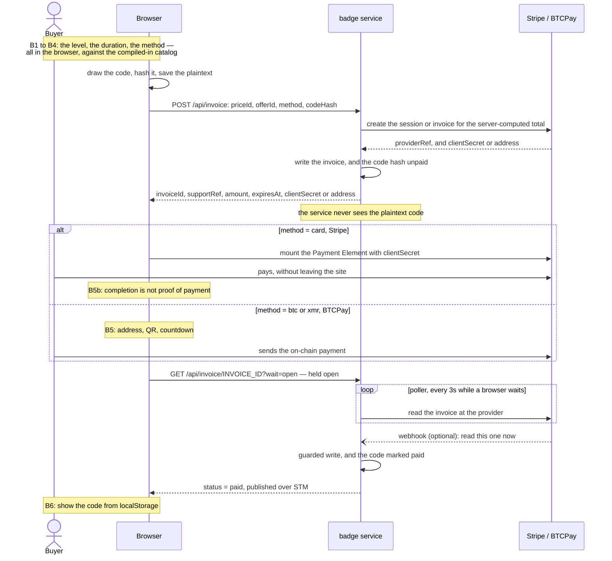
```mermaid
sequenceDiagram
    actor Buyer
    participant Page as Browser
    participant Svc as badge service
    participant Prov as Stripe / BTCPay

    Note over Buyer,Page: B1 to B4: the level, the duration, the method —<br>all in the browser, against the compiled-in catalog

    Page->>Page: draw the code, hash it, save the plaintext
    Page->>Svc: POST /api/invoice: priceId, offerId, method, codeHash
    Svc->>Prov: create the session or invoice for the server-computed total
    Prov-->>Svc: providerRef, and clientSecret or address
    Svc->>Svc: write the invoice, and the code hash unpaid
    Svc-->>Page: invoiceId, supportRef, amount, expiresAt, clientSecret or address
    Note over Svc: the service never sees the plaintext code

    alt method = card, Stripe
        Page->>Prov: mount the Payment Element with clientSecret
        Buyer->>Prov: pays, without leaving the site
        Note over Page: B5b: completion is not proof of payment
    else method = btc or xmr, BTCPay
        Note over Page: B5: address, QR, countdown
        Buyer->>Prov: sends the on-chain payment
    end

    Page->>Svc: GET /api/invoice/INVOICE_ID?wait=open — held open
    loop poller, every 3s while a browser waits
        Svc->>Prov: read the invoice at the provider
    end
    Prov--)Svc: webhook (optional): read this one now
    Svc->>Svc: guarded write, and the code marked paid
    Svc-->>Page: status = paid, published over STM
    Note over Buyer,Page: B6: show the code from localStorage
```

---

## 4. Data model

The tables exist on `f/badge-codes`. This design writes them and adds four service-only columns.

### 4.1 Tables

| Table | Holds | Written by |
|---|---|---|
| `invoices` | an amount owed: price, discount, amount, currency, payment destination, `expires_at`, `status` | invoice creation, then settlement |
| `payments` | an amount paid: `provider_ref`, `amount`, `status`, `exception` | settlement |
| `badge_code_invoices` | what the invoice bought: `price_id`, `offer_id`, `months` | invoice creation |
| `badge_codes` | one code: `code_hash` from the browser, `badge_type`, `months`, `code_payment_status` | invoice creation, then settlement flips the status |

`invoices` and `payments` are generic and shared with the chat app; `badge_code_invoices` and `badge_codes` are service-only, and the app has no table of codes at all — it keeps `badge_code_redemptions` instead, holding the plaintext and the signing keys for a retry. `badge_code_invoices` holds only what they do not: `price_id` and `offer_id` are foreign keys into `badge_prices` and `badge_offers`. They sit there rather than on `badge_codes` because the offer is what the sale bought, and a code minted without a sale (§11.4) has none.

**`invoices.invoice_id` is the order id**, 128 CSPRNG bits, base64url. The code is derived from it, so it is a bearer capability: never sequential, never logged, never in a `Referer` (§7.1).

**Statuses come from `Simplex.Chat.PaymentService.Types`.** `InvoiceStatus` is `open`, `paid`, `expired`; `PaymentStatus` is `pending`, `settled`, `failed`. `paid` is terminal; `expired` is recoverable, because late on-chain settlement is routine. The payment method is reconstructed from `invoices.provider` and `payment_crypto_currency`, so there is no method column.

**One payment row per invoice, keyed on the invoice id.** `payments.invoice_id` has only a non-unique index, so reusing the invoice id as `payment_id` makes settlement an upsert with no new constraint (§6.4). Its `amount` is the absolute total received, rewritten monotonically; a partial on-chain payment is that row at `pending`. Settlement moves it to `settled` and nothing writes it afterwards, so its `updated_at` is the settlement time.

**Six columns are added in the service migration**, beside the existing `payments.receipt_hash`. The shared block in `M20261001_user_badges.hs` is untouched.

| Column | Table | Why |
|---|---|---|
| `support_ref` | `badge_code_invoices` | `NOT NULL UNIQUE`. Short enough to read down a phone line |
| `crypto_amount` | `payments` | What arrived, in the crypto unit, verbatim from the provider. B5c prints it, and it is not derivable |
| `code_hash` | `badge_code_invoices` | Which code this invoice bought. **The only way settlement can find the row to mark paid**, since nothing can recompute it |
| `expires_at`, `revoked_at` | `badge_codes` | The redemption deadline and revocation, which upstream does not model |
| `provider_ref` | `badge_code_invoices` | `NOT NULL UNIQUE`. The provider's own invoice id, written at creation. §6.4 resolves a webhook to an invoice *before* reading the provider, and §6.5's poller maps a listed provider invoice back to ours; `invoices` is upstream's block and `payments.provider_ref` does not exist until settlement writes it, which is the step that needs the lookup |

**`code_payment_status` is upstream's column, and it is what makes an unpaid code safe.** `BadgeCodePaymentStatus` is `CPSPaid`, `CPSUnpaid` and `CPSFree` — the last being an operator mint with no invoice behind it (§11.4). A code is written `CPSUnpaid` at invoice creation and settlement moves it to `CPSPaid`.

**Redemption must refuse `CPSUnpaid`**, answering `code_invalid` like any other unusable code, so a caller learns nothing from the difference. Without that check every unpaid invoice is a free badge. `expires_at` and `revoked_at` are read there too, and are ours (§11.3).

`badge_codes` and `badge_code_invoices` are `STRICT` tables, so the added columns declare storage classes and no value is coerced.

**The invoice names the code, and that is a deliberate loss.** A browser-drawn code cannot be recomputed, so the row settlement must mark paid has to be found by a stored reference.

The cost is a joinable chain: upstream's `badge_purchases.badge_code_id` already links a code to the badge it became, so `payment → code → badge` becomes joinable inside one database. What it does not give anyone is a code — the plaintext is in no row and no log (§4.2). Retention bounds how long the rows exist (§4.3), and §11.12 asks whether the link should be cleared at settlement instead.

Timestamps are ISO-8601 UTC to the second, `YYYY-MM-DDTHH:MM:SSZ`: lexicographic comparison is chronological at one width and one zone only. Every window is computed in the service and bound in that format.

### 4.2 The code

**The browser generates the code, and this service never sees it.** Not in a request, not in a response, not in a log. `POST /api/invoice` carries a `SHA-256` and nothing else, and the plaintext exists only in `localStorage` (§7.2).

| Step | In the browser |
|---|---|
| Alphabet | `23456789ABCDEFGHJKMNPQRSTUVWXYZ` — 31 characters, with `0`, `1`, `I`, `L` and `O` removed |
| Body | 19 characters from `crypto.getRandomValues`, 94 bits |
| Check | one more character, below |
| Normalised code | those 20 characters, uppercase, no prefix, no separators — this is what gets hashed |
| Sent to the service | `SHA-256` of the normalised code, base64url. Nothing else |
| Display code | `SXB-` and the 20 characters in four groups of five |
| Kept | the plaintext, in `localStorage`, written before the request is sent (§7.2) |

**Drawing uniformly from 31 characters needs rejection sampling**, because 256 is not a multiple of 31: take a byte, discard it if it is 248 or more, otherwise use `byte mod 31`. That accepts 96.9% of bytes with no modulo bias.

**Ambiguity is removed rather than folded.** None of `0`, `O`, `1`, `I`, `L` is in the alphabet, so there is nothing to fold on input — a typed `O` is simply not a code character. That is why it is 31 characters and not Crockford's 32.

**The check character is a weighted sum modulo 31.** Number the body from the left, starting at 1. Sum `position × alphabet index` over the 19 characters. The check value is `(31 − (sum mod 31)) mod 31`.

Worked on `SXB-YDC8A-YGQTM-PUYZ9-2TUXP`, whose body is `YDC8AYGQTMPUYZ92TUX`:

| Position | Character | Index | Weighted |
|---|---|---|---|
| 1 | `Y` | 29 | ×1 = 29 |
| 2 | `D` | 11 | ×2 = 22 |
| 3 | `C` | 10 | ×3 = 30 |
| 4 | `8` | 6 | ×4 = 24 |
| … | | | |

The 19 terms sum to 3793. `3793 mod 31` is 11, so the check value is `(31 − 11) mod 31 = 20`, which is `P` — the last character of the code.

**What it catches**, verified exhaustively: every single-character substitution, and **every transposition of two body characters, adjacent or not**. 31 is prime and the weights 1…19 are distinct modulo 31, which gives both. Only a swap moving the check character itself past several others escapes. Luhn was rejected: it needs an even modulus, and over 32 characters it misses `0`↔`Z`.

**Verification belongs to the redeeming side**, since this service never accepts a typed code. A verifier uppercases, drops the prefix and separators, rejects any character outside the alphabet, recomputes the check over the leading 19, then hashes and looks the row up.

**What follows from the service never seeing a code.**

| | |
|---|---|
| Secrets | none. No `codes.secret`, no master key, nothing to rotate |
| Disclosure rules | none needed; there is nothing to disclose |
| Recovery | none. A lost browser is a lost code (§11.10) |
| Support | can confirm a payment, never a code (§10) |
| Settlement | needs a stored `invoice → code_hash` link, because it cannot recompute one (§4.1) |

**A hash that already exists is refused.** `badge_codes.code_hash` is the primary key, and a collision answers `409 code_conflict` rather than reusing the row: were the service to accept it, the second buyer would pay for a code the first buyer holds. The browser draws again and retries. At 94 bits this will not happen by chance.

### 4.3 Retention

A settled order is kept for the code lifetime, the months purchased, and ninety days; an unsettled one for ninety days past its window. A month is 30 days, so the arithmetic is portable across both stores. The ninety days must clear the poller's seventy-two-hour read cutoff (§6.5): no order may be deleted while the read pass could still settle it.

**The code lifetime is 365 days and a code constant.** It is written onto each code row at settlement, while the retention pass measures every row against the running build's value, so the two disagree about old rows. Lowering it would delete a code before the deadline stored on that row; changing it is a migration.

```sql
-- cutoff(m):  SQLite    datetime(:now, '-' || (:codeLifetime + m * 30 + 90) || ' days')
--             Postgres  :now - make_interval(days => :codeLifetime + m * 30 + 90)

-- settled orders: months is on badge_code_invoices, the settlement time on payments
SELECT i.invoice_id FROM invoices i
  JOIN badge_code_invoices b ON b.invoice_id = i.invoice_id
  JOIN payments p ON p.invoice_id = i.invoice_id AND p.status = 'settled'
 WHERE i.status = 'paid' AND p.updated_at < cutoff(b.months);

-- orders that never settled hold no code, so the ninety-day tail alone applies
SELECT invoice_id FROM invoices
 WHERE status <> 'paid' AND expires_at < :ninetyDaysBefore;

-- NOT created_at: that row is written at invoice creation (§4.1, §5.1), and §6.4
-- step 5 sets only code_payment_status and expires_at. expires_at IS measured from
-- the settlement instant, so it is the only settlement clock this table carries.
DELETE FROM badge_codes WHERE expires_at < cutoff(months);
```

**`badge_codes.created_at` is not a settlement time**, and reading it as one deletes by the wrong clock: an invoice created in January and settled in March would have its code retained from January, cutting the buyer's window short by the gap. `expires_at` is written in §6.4's step 5 as the settlement instant plus the code lifetime, and it is the only column on this table that moves when money arrives.

For each selected invoice the pass deletes `payments` first, because `payments.invoice_id` carries no `ON DELETE` action, then `invoices`, which cascades `badge_code_invoices`. It runs once a day in the poller's thread, each statement in its own transaction. After deletion `codes status` finds nothing and `GET /api/invoice/:id` answers 404, though the buyer may still hold a local record (§7.2).

---

## 5. Service API

**Two endpoints, and two webhook routes.** `GET /` returns the page, `GET /assets/*` the asset set, and `GET /sw.js` the service worker. Same origin, no CORS, no cookie, no session.

**`/sw.js` is served from the root, and it has to be.** A service worker's scope is bounded by its own path, so one served from `/assets/<hash>/` could only control `/assets/<hash>/` — the page registers `/sw.js` (§7.4) and the deploy tree is exactly `index.html`, `sw.js` and `assets/`. Registration failure is swallowed by design, so getting this wrong costs the whole offline story silently, with no error anywhere.

| Route | Does |
|---|---|
| `POST /api/invoice` | prices the choice, creates the invoice at the provider, writes the rows, returns the code |
| `GET /api/invoice/:invoiceId` | reports the payment status, and can hold until it changes |
| `POST /webhooks/stripe`, `POST /webhooks/btcpay` | settlement, not for the browser (§6.1) |

There is no catalog endpoint (§2.1). A known path with the wrong method is 405. An error body is `{"error": "<code>"}` and nothing else, so an unknown invoice id is indistinguishable from a guess.

### 5.1 POST /api/invoice

```
Request  { priceId, offerId?, method: "card"|"btc"|"xmr", codeHash }

200 { invoiceId, supportRef, badgeType, months, amount, currency, expiresAt,
      clientSecret?,                            -- card: mounts the Payment Element in place
      address?, cryptoAmount?, cryptoCurrency?  -- btc, xmr
    }
400 { error: "catalog_changed" | "bad_request" }
409 { error: "code_conflict" }       -- draw another code and retry
429 { error: "rate_limited" }        + Retry-After
500 { error: "internal" }
503 { error: "provider_unavailable" }
```

| Response | When | Screen |
|---|---|---|
| `200` | the provider accepted the session or invoice | B5, or the card form on B4 |
| `code_conflict` | `codeHash` is already in `badge_codes` (§4.2) | none — the browser draws again and resubmits |
| `catalog_changed` | a disabled price, a disabled offer, an unsold badge type, an offer not belonging to the price, or a pair whose `offerTotal` is `Left` | B4c |
| `bad_request` | a malformed body or an unknown method | the failure screen (§8.2) |
| `rate_limited` | over five per minute per IP | B4d |
| `internal` | a failure on this service's own side | the failure screen |
| `provider_unavailable` | the method's section is absent (§9), or the provider call failed | B4b |

**`codeHash` comes from the browser** (§4.2), which has already saved the plaintext (§7.2). No response carries a code, because the service does not have one.

**Badge type, months and amount are derived server-side** from `priceId` and `offerId`, so a tampered request cannot buy a Legend badge at a Supporter price. A malformed `codeHash` is `bad_request`.

**This is the only place prices are checked**, and the only reason the compiled-in catalog can be trusted. A `deprecated` price is honoured for a buyer one deploy behind; a `disabled` one is refused. Repricing appends rather than edits, which makes B4c reachable rather than a lie.

**The tables are seeded at startup, from the same values the page compiles in.** `BadgeService.Catalog.defaultCatalog` holds them and `Service.hs` writes them before the lanes start, because nothing else ever wrote either table and an unseeded instance answers every checkout `catalog_changed`. The seed is append-only, which is that rule applied to itself: a row whose id is absent is inserted and a row that exists is left exactly as it stands, status included, so a price an operator has deprecated or disabled is not resurrected by the next restart. Repricing therefore adds a new id rather than editing an old one, and a test fails if the seeded rows and `web/src/catalog.ts` disagree.

**Every refusal, including `code_conflict`, is decided before the provider is called**, so it writes nothing and costs no invoice — what B4c's "Nothing was charged" asserts. The arm taken is logged. The rate limit is five per minute because each request reaches a provider.

**One exception, and it is unavoidable.** `codeHashExists` and the insert are not atomic with each other, so two concurrent requests carrying the same hash both pass the check and the second is refused by the unique constraint — after its provider call. That is answered `code_conflict` rather than `internal`, because the browser's retry (§7.1) is the right response and a 500 is not. B4c's claim survives it: an unpaid invoice at a provider is not a charge. Closing the window entirely would need a transaction spanning the provider call, which is worse.

**There is no idempotency key.** A double submission creates a second invoice; the buyer pays one and the other expires. The Pay button is disabled on submit.

The invoice id is 128 CSPRNG bits, the support reference five characters from the code alphabet, retried on collision. The provider call precedes the insert, so `provider_ref` is known before any row exists; one transaction then writes `invoices`, `badge_code_invoices` and the unpaid `badge_codes` row.

**The total is computed here**, by the one function that also generates the compiled-in catalog, so the figure on B3 and the figure charged cannot drift.

```haskell
-- | Why a catalog row cannot be priced. Logged, never rendered: every arm lands on B4c.
data OfferInvalid = OIZeroMonths | OIFreeMonthsExceedTerm | OIDiscountTooLarge | OIAmountUnsellable
  deriving (Eq, Show)

-- | Months delivered, gross price, and amount charged, in minor units.
-- invoices.discount_amount is price - amount. Integer arithmetic throughout: the gross
-- is formed first and the division is last, so nothing intermediate is rounded.
offerTotal :: CurrencyAmount -> Maybe BadgeOffer -> Either OfferInvalid (Word8, CurrencyAmount, CurrencyAmount)
offerTotal (CurrencyAmount p) offer = case offer of
  Nothing -> charge 1 (gross 1)
  Just BadgeOffer {months, discount}
    | months == 0 -> Left OIZeroMonths
    | otherwise -> case discount of
        ODFreeMonths f
          | f >= months -> Left OIFreeMonthsExceedTerm
          | otherwise -> charge months (gross (months - f))
        ODDiscount d
          | d >= 100 -> Left OIDiscountTooLarge
          | otherwise -> charge months (gross months * (100 - fromIntegral d) `div` 100)
  where
    -- formed in Word64, above CurrencyAmount's Word32, so it cannot wrap
    gross :: Word8 -> Word64
    gross m = fromIntegral p * fromIntegral m
    maxAmount :: Word64          -- $1,000,000 in minor units
    maxAmount = 100000000
    -- the only bound, and it is on the amount charged rather than on the gross
    charge :: Word8 -> Word64 -> Either OfferInvalid (Word8, CurrencyAmount, CurrencyAmount)
    charge m c
      | c == 0 || c > maxAmount = Left OIAmountUnsellable
      | otherwise = Right (m, CurrencyAmount (fromIntegral (gross m)), CurrencyAmount (fromIntegral c))
```

`ODFreeMonths f` charges for `months - f` and delivers `months`: B3's "3 months — $140, save 33%" is $70 × 2. The division truncates, so any fraction of a minor unit goes to the buyer.

**The gross must be bounded too, and this text used to say otherwise.** An earlier draft claimed "the only bound, and it is on the amount charged rather than on the gross" and that "the bound on the amount charged is what makes narrowing to `Word32` safe". That is false: a `monthPrice` of 100000000 over 43 months with 42 free charges 100000000, which passes, while the gross is 4300000000 and wraps to 5032704 on narrowing — after which `invoices.discount_amount`, defined as `price - amount`, underflows to 4200000000. The buyer is charged correctly, because the charge is taken from the amount; what corrupts is the recorded price and the discount. Both figures must be bounded before either is narrowed.

**The guards exist because the catalog's types do not carry them.** `BadgeOffer.months` is a `Word8` with no positivity, and nothing excludes a zero term, free months at or above the term, a 100% discount, or a zero `monthPrice`. The bound on the amount charged is what makes narrowing to `Word32` safe. A pair failing any guard is left out of the compiled catalog and refused here.

### 5.2 GET /api/invoice/:invoiceId

**It answers immediately by default.** `?wait=<status>` asks it to hold: if the stored status already differs, it answers at once, otherwise it waits.

```
GET /api/invoice/:invoiceId              -- answer now
GET /api/invoice/:invoiceId?wait=open    -- hold while the status is still "open"

200 { status: "open"|"paid"|"expired",
      amountPaid?, cryptoAmountPaid?,           -- absolute; fiat minor units, and the crypto string
      settledAt?,
      badgeType?, months?, amount?, currency?, expiresAt?, supportRef?,
      clientSecret?,                            -- card: remounts the Payment Element (§7.1)
      address?, cryptoAmount?, cryptoCurrency?  -- present when the browser has no local record
    }
404 { error: "not_found" }
429 { error: "rate_limited" }        + Retry-After
```

**No response ever carries a code.** The browser drew it and holds it (§4.2).

**The method is not stored anywhere**, so every load infers it from this response: `clientSecret` means card, `address` means crypto. `OrderRecord` omits it (§7.2) and the 200 from `POST /api/invoice` clears the session that held it, so a reload has no other source — on the buyer's own device as much as on a second one.

**A held request is woken by settlement, not by re-reading the database.** `settleOrder` publishes the new status after its transaction commits (§6.4).

| Rule | |
|---|---|
| Wake source | `settleOrder` after commit, and the expiry sweep |
| Timeout | 30 s, a code constant, under the idle timeout of every proxy in front (§9) |
| On timeout | the current status; the browser reissues at once |
| Unknown `wait` value | answers immediately — a stale value costs one round trip, never a hang |
| `amountPaid` moving | not a status change and wakes nobody; B5 does not render it |
| Terminal status | `?wait=paid` answers at once, because `paid` never changes |

**The waiters are one STM structure**, doing two jobs: waking held requests, and telling the poller which invoices to list fast (§6.5).

```haskell
-- | The status is Maybe, and the reason is the whole correctness argument below:
-- the database read may only SEED an empty slot, never overwrite what publish wrote.
data Watch = Watch {wStatus :: TVar (Maybe InvoiceStatus), wRefs :: TVar Int}
newtype Waiters = Waiters (TVar (Map InvoiceId Watch))

-- | Publish after the settling transaction commits. Publishing inside it would let a
-- woken reader query a world where the write has not landed.
publish :: Waiters -> InvoiceId -> InvoiceStatus -> STM ()

-- | Subscribe, then read the database, then seed only if nothing was published.
-- The first half of that order stops a settlement landing before the Watch exists,
-- where publish would find no entry and be dropped. The second half stops the
-- opposite failure: a read that raced the settling commit returns the OLD status,
-- and writing it unconditionally clobbers the new one publish already stored --
-- after which the request blocks for its full timeout and then answers staleley,
-- which is exactly what subscribing first was meant to prevent. Seeding only an
-- empty slot is monotonic: it can fill a gap, never overwrite an answer.
awaitStatus :: Waiters -> InvoiceId -> IO InvoiceStatus -> InvoiceStatus -> Int -> IO InvoiceStatus
awaitStatus w iid readStatus seen usec =
  bracket (atomically $ subscribe w iid) (\_ -> atomically $ release w iid) $ \Watch {wStatus} -> do
    current <- readStatus                    -- after subscribing, never before
    atomically $ readTVar wStatus >>= \case  -- seed only if unpublished
      Nothing -> writeTVar wStatus (Just current)
      Just _ -> pure ()
    timer <- registerDelay usec
    atomically $
      (do s <- readTVar wStatus; check (s /= Just seen); pure (fromMaybe seen s))
        `orElse` (do readTVar timer >>= check; fromMaybe seen <$> readTVar wStatus)
```

`subscribe` creates the `Watch` on first use and increments `wRefs`; `release` decrements and deletes at zero, so the map holds exactly the invoices someone waits on. `bracket` handles a dropped connection by the same path as a timeout. The database read is passed in rather than called here, so this structure depends on no store and the seeding order is testable.

**One `TVar` per watched invoice rather than one broadcast**, so a settlement wakes only the browsers on that invoice instead of sending every held request back to the database to learn nothing changed.

The map lives in memory, so a restart is a timeout on every held request. **This binds the service to one process** (§11.11).

| Caller | Uses |
|---|---|
| B5, B5b, B5c | `?wait=`, because the screen exists to show a change |
| any first load of a `?order=` URL | plain, having nothing to compare against |
| B7's list refresh (§8.4) | plain, at most ten |

Sixty requests per minute per IP, which bites only on a caller that is not waiting. Every response carries `Cache-Control: no-store`. A 404 also answers an invoice retention has deleted, and the invoice's own fields are returned only where the browser has no local record.

---

## 6. Payment providers

### 6.1 How payment is detected

Neither the browser nor the buyer can tell this service that an order is paid. Stripe's return redirect is client-supplied and fires whether or not the charge settles; the crypto path has no return at all, because BTCPay's is deliberately unset (§6.3). The provider is the only party that knows.

**The service asks. It does not wait to be told.** A poller lists open invoices at each provider on a schedule (§6.5), and that read is the only thing that ever moves an invoice. **A webhook is an optimisation:** a verified one enqueues an immediate read and nothing more.

| | Polling | Webhooks |
|---|---|---|
| Role | primary, sufficient alone | latency only |
| Carries authority | yes — `readInvoice` is the fact | none |
| If it stops | payments stop being detected | detected a poll later |
| If never configured | the service cannot work | **the service works** |

Stripe requires the read independently: **event payloads are always minimal and cannot be auto-expanded**, so `payment_intent.latest_charge` is unreachable from an event.

**Everything is correct with webhooks switched off**, which is what makes the rest simple. A dropped delivery costs latency, not money, and a misconfigured endpoint shows up as slowness rather than silent non-delivery.

**Two routes, `POST /webhooks/stripe` and `POST /webhooks/btcpay`.**

```
200 (empty)   -- signature valid: the invoice is queued for an immediate read
200 (empty)   -- signature valid, nothing to do (unknown ref, wrong provider,
              --   unhandled event type) — logged
400 (empty)   -- signature missing, malformed, or does not verify
413 (empty)   -- body over the 64 KB cap
```

**There is no 5xx and no retry semantics**, because retrying is not how correctness is reached. The route verifies, enqueues, and answers; it does not read the provider, open a transaction, or wait for one. A failure after the 200 is corrected by the next poll. No rate limit either: the body cap and the signature are the gate.

**It does perform one indexed lookup**, and §6.4's steps 3 and 4 require it: resolving `provider_ref` to an invoice, and checking that invoice belongs to this route's provider so a `provider_ref` collision cannot credit the other provider's order. An earlier draft of this paragraph said the route does not touch the database at all, which contradicted those steps. One `SELECT` on an indexed column is not a transaction and does not wait on one; what the route must not do is any work whose failure or slowness the provider would observe. Without the lookup the route would enqueue every verified reference blindly — still correct, since the poller finds nothing for a reference it does not hold, but the unknown-reference and wrong-provider cases would become invisible.

**An adapter is a module in this service, not a library and not a process.** It holds the HTTP calls to one provider's API, that provider's signature scheme, and the mapping from its vocabulary to `PaymentSignal`. Both implement the same three operations, and everything above this line is provider-agnostic.

```haskell
newtype ProviderError = ProviderError Text deriving (Eq, Show)
newtype WebhookError = WebhookError Text deriving (Eq, Show)

-- | What a provider reports as received: the ABSOLUTE total in the minor units of the
-- invoice currency, never a delta (§6.4), and the provider's own decimal string for
-- the same receipt, which is what B5c prints.
data Received = Received {rcvAmount :: CurrencyAmount, rcvCrypto :: Maybe Text}

data PaymentSignal
  = SigFunded Received            -- something arrived, the invoice is not settled
  | SigSettled Received UTCTime   -- paid in full
  | SigClosed Received            -- the window closed

createInvoice :: ServicePaymentMethod -> OrderDraft -> IO (Either ProviderError ProviderInvoice)
readInvoice   :: PaymentProvider -> Text -> IO (Either ProviderError (Maybe PaymentSignal))

-- | A verified webhook yields a provider_ref and nothing else: a hint to read that
-- invoice now. The read is what decides anything (§6.5).
verifyWebhook :: PaymentProvider -> Headers -> RawBody -> Either WebhookError (Maybe Text)
```

| Result | Means |
|---|---|
| `Right Nothing` from `verifyWebhook` | a valid signature over an event this service does not act on |
| `Right Nothing` from `readInvoice` | an invoice whose state has not changed, so the caller writes nothing |
| `Left` from `readInvoice` | `provider_unavailable` at checkout; elsewhere the invoice waits for the next poll |

`createInvoice` takes the method because BTCPay is told which chain to offer; everything after creation is keyed on the provider.

### 6.2 Stripe

**The card form is ours, embedded, and asks for no email.** `ui_mode: elements` keeps the Checkout Session but lets this design build the form from the Payment Element, so the only fields are the ones we render — card details, inside Stripe's iframes — and no email is collected.

**It is still a Checkout Session, which is the point.** Stripe recommends Checkout Sessions with the Payment Element over the raw PaymentIntent API, and advises against PaymentIntents unless something forces them. Keeping the session preserves `client_reference_id`, `expires_at`, the `checkout.session.*` events, the `status`/`payment_status` pair, and — load-bearing here — the **list endpoint the poller depends on** (§6.5). A PaymentIntent integration would have cost all of that and more code.

| | |
|---|---|
| API | HTTP Basic, the key as username, no password. Use a **restricted key** (`rk_live_`) scoped to Checkout Sessions |
| Create | `POST /v1/checkout/sessions`, `mode=payment`, `ui_mode=elements` |
| Returned to the browser | `client_secret` (§5.1). The publishable key is compiled into the page |
| Mounting | `stripe.initCheckoutElementsSdk({clientSecret})`, then `createPaymentElement()` and `mount()` into B4 |
| Confirming | `checkout.loadActions()`, then `actions.confirm()`. Success and error are both in-page |
| Read | `GET /v1/checkout/sessions/{id}?expand[]=payment_intent.latest_charge`. `expand` caps at four levels; this is two |
| Support reference in | `client_reference_id` (max 200 chars) and `payment_intent_data.statement_descriptor_suffix` — **not** a top-level session field. `statement_descriptor` errors on a card charge, and prefix plus suffix must fit 22 characters |
| Redirects | none for cards. `success_url` and `cancel_url` are not allowed with `elements`. `return_url` is required only if a redirect-based method is enabled, which none is |
| Expiry | `expires_at`, which Stripe bounds to 30 minutes – 24 hours, default 24 |
| Signature | `Stripe-Signature` is `t=…,v1=…`; `HMAC-SHA256(secret, "{t}.{rawBody}")`, constant-time. Tolerance 300 s, which is `DEFAULT_TOLERANCE` in Stripe's libraries rather than an API rule |
| Payment methods | whatever the account's configuration offers; `payment_method_types` is **not** a documented create parameter (§11.16) |
| `provider_ref` | the session id |

**The invoice id never leaves this service.** With a hosted redirect it had to travel in `success_url`, which Stripe stores and can return — the one place the capability provably escaped. Embedded, there is no such URL. That caveat is gone, and with it the whole `from=stripe` mechanism (§7.1).

**No redirect-based methods are enabled**, so the buyer never leaves. That excludes methods like iDEAL, not the 3-D Secure challenge, which Stripe runs in an iframe from `hooks.stripe.com`.

**Stripe.js must be loaded from `js.stripe.com`.** Stripe requires it and forbids bundling or self-hosting it, which has two consequences this design has to carry: the page is no longer `default-src 'self'` (§7.3), and the card widget cannot work offline (§7.4).

Two events are acted on: `checkout.session.completed` and `checkout.session.expired`. Everything else is logged and answered 200, including `charge.refunded` and `charge.dispute.created`.

| `status` | `payment_status` | Signal | Amount | Timed by |
|---|---|---|---|---|
| `complete` | `paid` | `SigSettled` | `amount_total` | the charge's `created` |
| `complete` | `unpaid` | none — still processing | — | — |
| `expired` | any | `SigClosed` | zero | — |
| `open` | any | none | — | — |

**`status = complete` does not mean paid.** Stripe documents it as "payment processing may still be in progress"; `payment_status = paid` means "the funds are available in your account". Reading `status` alone would credit an order whose charge later fails.

**The charge's `created` is the settlement time, not the payment intent's.** In `mode=payment` the intent is created with the session, so its timestamp is order-creation time, while the Charge does not exist until payment is attempted. It is a proxy — `balance_transaction` is where money truly lands — but close enough for anything rendered here. Where a paid session carries no charge, the read time is used and the discrepancy logged.

**`payment_intent.payment_failed` is not acted on**: before `completed` it carries no session id this service stored, and a failed card leaves the session open. **There is no partial payment on the card path**, so `SigFunded` has no Stripe producer.

**`checkout.session.async_payment_succeeded` and `…_failed` are not subscribed to either.** They fire for delayed payment methods, where `completed` arrives `unpaid` and the money lands later. This design cannot rule that out, because which methods a session offers comes from the account's configuration. The guarantee is not "only cards appear" but that **settlement keys on `payment_status`, read from the provider** (§11.16).

**No email is collected, which is why the form is ours.** Stripe's own embedded Checkout (`ui_mode: embedded_page`) collects one and cannot be told not to: it is taken for receipts, `customer_email` only prefills it, and Link asks for one to offer autofill. With `ui_mode: elements` the fields are the ones this design renders, and it renders no email input. `receipt_email` is optional and stays unset, so Stripe sends no receipt — the buyer's record is the code and B7 (§7.2).

**Link must be off in the Dashboard**, or it reintroduces an email prompt of its own, and `link.com` in the CSP (§7.3).

This is the one place the design pays for a requirement in code rather than configuration: a payment form to build, style and keep accessible, and confirmation and error states to handle, where the alternative was a widget that mounts itself (§11.19).

### 6.3 BTCPay

| | |
|---|---|
| API | `Authorization: token <api-key>`, all paths store-scoped |
| Create | `POST /api/v1/stores/{storeId}/invoices`, for the fiat amount and currency |
| Read | `GET /api/v1/stores/{storeId}/invoices/{invoiceId}` |
| Read amounts | `…/payment-methods`, or inline on the list with `includePaymentMethods` (§6.5) |
| Support reference in | `metadata`, under a key of ours. BTCPay gives meaning to known keys such as `orderId` and `posData`, which surface in its UI and receipts, so this design uses none of them |
| Payment methods | `checkout.paymentMethods`, restricted to the one chain the buyer chose |
| Expiry | `checkout.expirationMinutes`, from `btcpay.expiry_minutes`, which B5's countdown reads |
| Return URL | `checkout.redirectURL` exists and is deliberately **not** set: the crypto path stays on one URL |
| Address and crypto amount | from the payment-methods response, written onto the invoice row at creation |
| Signature | `BTCPay-Sig: sha256=HMAC256(UTF8(secret), body)`, compared in constant time |
| `provider_ref` | the Greenfield invoice id |

Four event types are acted on: `InvoiceProcessing`, `InvoiceSettled`, `InvoiceExpired` and `InvoiceInvalid`. Payloads carry `type`, `invoiceId`, `deliveryId`, `originalDeliveryId` and `isRedelivery`, and no amounts. `InvoiceSettled` adds `overPaid` (§11.8) and `manuallyMarked`, an operator marking it settled by hand, which is treated as any other settlement.

**The signature is over the bytes as received.** BTCPay serialises its payload indented, so re-serialising parsed JSON changes the string and the HMAC fails. Stripe says the same of any framework that reorders keys. Hence the raw-body read in §6.4, on both routes.

| `status` | Signal | Timed by |
|---|---|---|
| `Settled` | `SigSettled` | the latest `Settled` entry in `payments`, by `receivedDate` |
| `Processing` | `SigFunded` | — |
| `Expired`, `Invalid` | `SigClosed` | — |
| `New`, something received | `SigFunded` — on-chain payment is visible before `Processing` | — |
| `New`, nothing received | none | — |

**The statuses are `New`, `Processing`, `Settled`, `Expired`, `Invalid`, and that is all of them.** There is no `Complete`; that is the legacy invoice API's name, and matching on it would silently never fire. `InvoiceInvalid` is treated as `expired`, because the remedy and the screen are identical.

**`additionalStatus` names three cases this design cares about:** `PaidPartial` is B5c's part-paid variant, `PaidOver` is §11.8, and `PaidLate` is the `expired → paid` transition. It refines `status` rather than replacing it, so the table above still decides; it is what gets logged and what the operator queue reports.

**Read `paymentMethodPaid`, not `totalPaid`.** The latter is the invoice's whole payment converted into this method's currency, so it is non-zero even when nothing was paid in it. One method per invoice makes that harmless today and wrong the moment a second is offered. B5c's `0.734 XMR` is `paymentMethodPaid`; the fiat figure is `paymentMethodPaid × rate`.

**Every amount is a JSON string, and `receivedDate` a Unix timestamp.** `rate`, `paymentMethodPaid`, `totalPaid`, `due`, `amount` and each payment's `value` and `fee` carry a numeric-string converter so decimal precision survives the wire. Parse them as decimals, never floats: the fiat figure is a decimal multiplication rounded once at the end, and `payments.crypto_amount` stores `paymentMethodPaid` verbatim, which is the figure a buyer checks against their wallet.

**`monitoringExpiration` bounds late settlement, and its default is too short.** `expirationTime` is when the invoice stops accepting payment; `monitoringExpiration` is when BTCPay stops watching it at all. Past it the invoice is frozen and reading it returns nothing new — so a payment confirming on day two is never seen, and the buyer's money is gone with no code.

| Setting | BTCPay default | This design |
|---|---|---|
| `InvoiceExpiration` | 15 minutes | 60, as `btcpay.expiry_minutes` |
| `MonitoringExpiration` | **1 day** | at least 72 hours, matching §6.5 |
| `PaymentTolerance` | 0 | 0.5% (§9) |

**`checkout.speedPolicy` decides when `Processing` becomes `Settled`**, and it is the largest influence on how long a buyer waits.

| Policy | Confirmations | Enum value |
|---|---|---|
| `HighSpeed` | 0, **or 1 if the transaction is RBF-flagged** | 0 |
| `MediumSpeed` | 1 | 1 |
| `LowMediumSpeed` | 2 | 3 |
| `LowSpeed` | 6 | 2 |

The counts are `NBXplorerListener.ConfirmationRequired`, which settles when `ConfirmationRequired <= ConfirmationCount`. **Send the name, never the integer:** the numeric order is not the speed order, so an encoded `2` means six confirmations rather than two.

**`MediumSpeed` is the choice here.** Zero confirmations would settle on an unconfirmed transaction and these invoices run to $420; one costs about ten minutes on Bitcoin, spent on B5, which is what that screen is for. `HighSpeed` is not reliably instant anyway, since any RBF-flagged transaction waits for one.

**`checkout.paymentTolerance` decides what counts as paid.** It defaults to 0, so a shortfall of one satoshi lands the buyer on B5c. A small tolerance absorbs wallet fee and rounding differences that are not the buyer's mistake, and it sets how much of the B5c queue is real.

**A partial payment is the normal first event of a multi-transaction payment.** It records what arrived and must not be rendered as an error. An invoice that then expires with something received is B5c, the one state that needs a human.

**Monero is a plugin, not part of BTCPay.** `XMR` comes from `btcpay-monero/btcpayserver-monero-plugin`, needing `monerod` and `monero-wallet-rpc` beside the server. It shares **one wallet across every store on the instance**, so this service needs an instance it does not share; Greenfield has reported gaps with it; and BTCPay's own docs warn the stack is not for non-advanced operators. **Bitcoin can ship without it** — they are two config entries and two buttons on B4 (§11.15). If XMR is unavailable, `createInvoice` fails and the method is refused as `provider_unavailable`, which is B4b.

### 6.4 Settlement

Each route is bound to one provider and has no order until verification produces one. It:

1. reads the raw body, capped at 64 KB, before any parsing;
2. verifies the signature;
3. resolves `provider_ref` to an invoice;
4. checks that the invoice belongs to this route's provider, so a `provider_ref` collision cannot credit the other provider's order;
5. reads the invoice at the provider for a signal;
6. calls `settleOrder`.

`settleOrder` is one function, called only by the poller (§6.5). It does one transaction.

1. Read the invoice and its current status.
2. Decide the write from that status and the signal, by the table below. A signal against a `paid` invoice ends the call and the caller answers 200.
3. Write the payment row: `INSERT … ON CONFLICT (payment_id) DO UPDATE`, keyed on the invoice id (§4.1), taking the larger of the stored and reported amount.
4. Write `invoices.status`, `WHERE invoice_id = ? AND status = ?`, with the status observed in step 1. **If this affects zero rows, another transaction advanced the invoice first: stop, change nothing, commit, answer 200.**
5. On settlement, read `code_hash` from `badge_code_invoices` and `UPDATE badge_codes SET code_payment_status = 'paid' WHERE code_hash = ? AND code_payment_status = 'unpaid'`. The row already exists, written when the invoice was created (§4.1). `expires_at` is set in the same statement, to the settlement instant plus the code lifetime.
6. Commit, then `publish` the new status to the invoice's waiters (§5.2).

| Signal | Invoice status after | Payment row | Code |
|---|---|---|---|
| `SigSettled` against `open` or `expired` | `paid` | amount, `settled` | `unpaid` → `paid` |
| `SigFunded` against `open` or `expired` | unchanged | amount, `pending` | — |
| `SigClosed` against `open` | `expired` | amount, `pending` | — |
| `SigClosed` against `expired` | unchanged | amount, `pending` | — |
| any signal against `paid` | unchanged | unchanged | — |

The last two rows are why a replay is not inert: a redelivered `InvoiceExpired` rewrites the same values, which is idempotent rather than ignored. Only a `paid` invoice rejects a signal outright.

**An expired invoice never revokes its code.** The row stays, unpaid and worthless, until retention removes it, so late settlement works by the same statement as any other. That is what makes `expired → paid` legal.

**Those writes make a replay safe, with no `provider_events` table.**

- Step 4's guard names the status observed in step 1, so a repeated delivery lands on the row it observed or on no row at all.
- Step 3's amount is absolute, never a delta, and the write takes the larger figure: `MAX(payments.amount, ?)` in SQLite, `GREATEST` in Postgres, where `MAX` is an aggregate. Replaying a receipt of 40000 twice leaves 40000, and an out-of-order event cannot lower what B5c displays. `crypto_amount` is not comparable as text, so it is written only when the fiat figure increases.
- Step 5's `code_payment_status = 'unpaid'` guard means a second settlement changes nothing, so `expires_at` is measured from the first settlement and never a later one.
- `publish` in step 6 is after the commit, so a woken waiter reads committed rows.

**Any future code that treats a provider amount as a delta reintroduces the need for a dedup table.**

A crash mid-transaction rolls back and the provider retries; the 200 is returned only after the commit. The cost of having no event table is the audit trail (§11.7).

### 6.5 The polling schedule

**The poller lists, it does not read one invoice at a time.** One filtered request covers every open invoice.

| | Stripe | BTCPay |
|---|---|---|
| Endpoint | `GET /v1/checkout/sessions` | `GET /api/v1/stores/{id}/invoices` |
| Filter | `status=open`, `created` interval | `status` (an array), `startDate`/`endDate` |
| Page size | `limit`, up to 100 | `take`/`skip` |
| Amounts inline | no | **yes**, `includePaymentMethods=true` |

A pass is one request per provider. A detail read follows only for an invoice whose status moved, and only on Stripe, which needs `expand[]=payment_intent.latest_charge` for the charge timestamp that a list will not carry.

The cadence still turns on one fact — **is a browser waiting?** — but it now selects how often the list is fetched, not how many requests a pass costs. That fact is the STM registry of §5.2.

| Pass | Cadence | Cost |
|---|---|---|
| open invoices, a waiter present | every 3 s | one list request per provider |
| open invoices, nobody waiting | every 60 s | one list request per provider |
| queued by a webhook | at once | one detail read |
| window closed, within 72 h | hourly | one list request, date-bounded |
| window closed, past 72 h | never | the scan needs an exit |

**Listing is what keeps Stripe's limits irrelevant.** Stripe meters an account at 100 requests per second, an endpoint at 25, and reads at an average of 500 per transaction over thirty days. One list every three seconds is a third of a request per second whatever the number of buyers waiting, so neither binds; the ceiling becomes the page size of 100 open invoices. Reading one invoice per buyer would have capped out near 75 concurrent buyers, and unpaid invoices would still have consumed the read allocation that only paid ones earn. Past 100 open invoices the list paginates, a request per hundred. A `429` carries `Stripe-Rate-Limited-Reason`, and the poller backs off the whole pass.

`readInvoice` returning a signal goes to `settleOrder` (§6.4). A `Left` leaves the invoice for the next pass, so a provider outage delays detection and loses nothing.

**The expiry sweep is local and calls no provider.**

```sql
UPDATE invoices SET status = 'expired', updated_at = :now
 WHERE status = 'open' AND expires_at < :graceCutoff
   AND invoice_id IN (SELECT invoice_id FROM badge_code_invoices);
```

The ten-minute grace covers a read racing the deadline and clock differences at the provider. Expiring early is self-correcting: `expired → paid` is legal and B5c keeps waiting into B6. The sweep writes `status` alone, so a later `SigClosed` still records what was received — which keeps a partly paid order out of B5c's "Nothing was received" variant.

**The list pass is capped at fifty pages**, five thousand invoices in one window, and past that the overflow is never detected on any pass — not merely delayed, because the pages are deterministic. Which buyer falls off the end depends on Greenfield's list ordering, which this design does not pin down. The cap exists so a provider answering a full page forever cannot hang the pass and starve the expiry sweep with it; settling what was read beats losing all of it. A store expecting more than five thousand open invoices inside the window needs this raised, and needs the ordering pinned first.

`:graceCutoff` and the seventy-two-hour cutoff are code constants. The cutoff must stay under the ninety-day retention tail (§4.3) and under BTCPay's `monitoringExpiration` (§6.3). The pass also reports expired invoices with something received, which is the B5c population and a human queue.

**Refunds and disputes are operator actions.** Either is revoked with `codes revoke` (§10). Stripe refunds and disputes are not acted on, BTCPay refunds are initiated at the provider, and revocation leaves the invoice `paid`. Until an operator acts a disputed payment leaves a live code — deliberately, because the alternative puts a provider event in charge of a capability the operator holds.

---

## 7. The page

No framework and no bundler. TypeScript is compiled to ES modules and served as-is. One module touches the DOM and the rest is pure, so routing, formatting, the local store and the disclosure branch are testable without a browser. Markup is never assigned from a string.

### 7.1 State and routing

**All page state is here, and all of it is in `localStorage`** (§7.2). The URL says which order is being looked at; the store says everything else, including where in the wizard the buyer had got to and what they had chosen.

**A load resolves in this order.**

| Load | Store | Renders |
|---|---|---|
| `?order=<id>` | any | that order, by the status table below. The URL always wins |
| `/` or `#/…` | an `open` order exists | **the newest one's payment screen**, with **[ New invoice ]** |
| `/` or `#/…` | no open order, a session step | that step, with the answers restored |
| `/` | neither | B1 |

**A returning buyer resumes.** Someone who sent a Monero payment and closed the tab reopens `badges.simplex.chat` and sees their pending invoice, not a landing page. The open order's status is fetched first, so an invoice that settled while they were away renders B6 instead.

**[ New invoice ] is the way out**, on every resumed payment screen. It abandons the old invoice — which stays in the history and expires on its own (§6.5) — clears the session, and returns to B1. Nothing is deleted, and the old invoice keeps its entry and its code.

**Where several orders are open**, the newest by `createdAt` is the one resumed. The rest are reachable from B7. This is possible because there is no idempotency key (§5.1).

**Resuming the newest open order applies to a fresh load only.** Within a session the URL decides: Back and Forward navigate by hash and `?order=`, never by the store. Otherwise Back from a payment screen resolves the newest open order and renders that same screen again, and a buyer holding an older unpaid invoice can never walk the wizard backwards at all.

**The URL never carries an answer.** The step is mirrored into the hash so that Back works, but the level, duration and method live only in the store — so a URL passed to someone else transfers no selection.

| Carrier | Holds |
|---|---|
| `/` | the landing page, B1 |
| `#/tier`, `#/months`, `#/checkout` | which wizard question is showing, mirrored from the session key. B4b, B4c, B4d and the invoice failure render on `#/checkout` |
| `#/codes` | the local history, B7. Carries no order reference |
| `?order=<invoiceId>` | everything after checkout. Overrides the hash |


**Rendering an `?order=` load is total over status, method and `from`.**

| Response | Renders |
|---|---|
| `paid`, code held locally | B6 |
| `paid`, no local copy | B6b — and nothing can recover it |
| `expired` | B5c, in the variant `amountPaid` selects |
| `open`, crypto | B5 |
| `open`, card, confirmation returned success | B5b |
| `open`, card, otherwise | **the card form, mounted again** on the still-open session |
| `open`, method not inferable | the details are unavailable: the reference, [ Check again ], [ New invoice ]. The loop keeps waiting |
| 404 | §8.2 |

**Reopening an unpaid card order remounts the form.** The Stripe session is still `open`, so the buyer can simply pay; this is what Stripe's own guidance says to do with an `open` session. It replaces the "unconfirmed card" screen an earlier redirect-based draft needed, along with the `from=stripe` hint that selected it.

**B5b is chosen by a local flag, not by the URL.** A successful `actions.confirm()` writes `submitted` onto **the order's own record** in `sxb.orders.v1` (§7.2) before the status has moved. It is a hint and not evidence — exactly what `from=stripe` was — but it is now the browser's own note to itself rather than something a URL can assert.

**It belongs to the order, not to the session.** `sxb.session.v1` is page-global and is cleared by starting a new order or finishing one (§7.2), so a flag held there is lost the moment the buyer does either — and reopening the confirmed order would then offer both Pay and [ New invoice ] on an order whose charge may be in flight, which is precisely what §8.3 withholds. Held per order it also cannot answer for the wrong one: a page-global flag made *any* reopened card order render B5b.

**Going back.** Each wizard step is its own history entry, so the browser's Back button works unasked.

| Control | Does |
|---|---|
| **[ ← Back ]** on B2, B3, B4 | one step left, by `history.back()`, so button and browser agree |
| browser Back on B1 | leaves the site |
| **[ Start again ]** on B4c | returns to B1 and **replaces** the entry, so Back cannot walk into the prices that just changed |
| the 200 from `POST /api/invoice` | **replaces** `#/checkout` with `?order=`, so Back from a payment screen returns to the wizard and can never resubmit |

**Re-entering B4 while an unpaid order exists** shows a line linking to it — *You have an order waiting for payment* — from the local store. Paying again creates a second invoice; the first expires unpaid.

On restore the hash is rewritten with `replaceState`, so resuming adds no history entry and Back still leaves the site from B1.

**`?order=` is not a code.** It names an invoice and yields its status, amount and reference — worth not leaking, not enough to redeem anything (§4.2). The service keeps it out of its logs, pages carrying it send `Referrer-Policy: no-referrer`, and it is absent from the Stripe cancel URL.

**Waiting for payment.** One loop, used by B5, B5b and B5c. Each pass is `GET /api/invoice/:id?wait=<the status on screen>`.

- **A 200 renders and reissues immediately.** No interval, no timer.
- **A confirmed payment arrives in about the time the webhook takes**, because the hold is woken by settlement (§5.2).
- **Suspended while the tab is hidden**, resumed on `visibilitychange`.
- **A network error backs off** — one second, doubling to thirty — leaving the last known status rendered. The only delay anywhere.
- A 429 waits out `Retry-After`; a 404 stops the loop and renders §8.2.
- **`expired` keeps waiting**, so a buyer who paid at the last second sees B5c become B6. **`paid` stops the loop.**
- B5b gives up after 15 minutes (§8.3). Nothing else gives up.
- Every 200 updates the local record (§7.2) before rendering.

### 7.2 Stored orders

**Everything the page knows lives in `localStorage`** — the step the buyer is on, the answers given so far, every invoice and every code. Nothing is held only in memory, so a reload, a crash or a closed tab loses nothing. No account and no lookup.

Two keys, because they have different lifetimes and different value.

| Key | Holds | Cleared by |
|---|---|---|
| `sxb.session.v1` | the wizard step and the draft answers | starting a new order, or finishing one |
| `sxb.orders.v1` | every invoice and code, newest first | **[ Forget everything on this device ]** only |

Losing the session key costs a buyer their place. Losing the orders key costs them their codes, which nothing can recover (§4.2) — hence the separation, and hence only the second is bounded and guarded.

```json
sxb.session.v1
{ "step": "months", "priceId": "…", "offerId": "…", "method": "xmr" }
```

Each key carries its version: a later format takes a later key, which is also its migration.

```json
{ "orderId": "…", "supportRef": "K7M2Q", "badgeType": "legend", "months": 12,
  "createdAt": "2026-08-24T11:02:19Z", "status": "paid",
  "amount": 42000, "currency": "usd", "method": "xmr",
  "code": "SXB-YDC8A-YGQTM-PUYZ9-2TUXP" }
```

Every field has a reader: `orderId` is B7's link, `badgeType` and `months` its line, `createdAt` orders and dates the list, `amount`, `currency` and `method` are what it cost and how it was paid, and `status` and `code` choose how it renders. Settlement time is not stored.

**`amount`, `currency` and `method` are kept permanently**, on every status. B7's row is the reader (§8.4): a history that named a level and a term but neither the price nor the method would be a list of purchases with the purchase left out. `method` is the buyer's own answer on B4 for an order this browser created, and §5.2's `inferMethod` for one it did not; an inference that fails leaves what is stored standing rather than erasing it. This is an amendment — the pair used to be cleared with the destination below, and *Method and settlement time are not stored* used to be the rule.

**An `open` order also carries `address`, `cryptoAmount`, `cryptoCurrency` and `expiresAt`** — everything §7.4 needs to redraw B5 with no network, including the countdown. Without `expiresAt` an offline resume shows a payable address hours after the rate window closed, which is the one thing this row exists to prevent. They are cleared when the order becomes `paid` or `expired`, since nothing reads a destination after settlement. The rule that clears them is *nothing may still be sent there*, which is why the fiat pair above is not part of the set: a price is not somewhere to send. **`clientSecret` is never stored** — §7.4 puts the card form under *needs the network*, so no payment secret goes to rest.

| Event | Effect on the store |
|---|---|
| every wizard answer | written to `sxb.session.v1` with the step, before the panel moves |
| before `POST /api/invoice` | the code is drawn and held in memory. `createdAt` is the browser's clock |
| 200 from `POST /api/invoice` | writes the entry, `status: "open"`, with the code, `orderId`, `supportRef`, the price, and the method the buyer chose |
| 200 from `GET /api/invoice/:id` | overwrites `status`, and `amount`, `currency` and `method` wherever the response resolves them |
| a successful `actions.confirm()` | sets `submitted` on **that order's** entry, so B5b survives a later purchase (§7.1) |
| 200 with no entry present | creates one from the response — a `?order=` link opened on a second device, which will never hold a code |
| 404 | removes nothing |
| a 200 from `POST /api/invoice` | clears `sxb.session.v1`: the draft became an invoice |

**The entry is written on the 200, not before the request.** Writing it first would save a code with no `orderId`, which can be neither checked nor paid and is therefore worth nothing; and because an entry holding a code is never dropped (below), fifty abandoned drafts would fill the store and refuse every later write. The window that matters is a tab closed *after* payment starts, and by then the entry exists. A response lost in transit orphans an unpaid invoice, which expires on its own (§8.2).

**The write is not guaranteed, and it is load-bearing.** Where quota or private browsing refuses it there is no second copy and no way to make one: B6 drops its saved-copy clause (§8.4), and §11.10 argues the page should refuse to start a payment.

**Bounds.** Fifty entries. The one dropped is the oldest holding no code, which is an invoice that never settled and is recoverable from its URL. An entry holding a code is never dropped, and where every entry holds one the new entry is not stored.

**Failures.** Every read and write is wrapped. Storage disabled, a private-browsing `SecurityError`, or an unparseable value leaves the store empty for the session. The wizard still works inside the open tab, held in memory, and only loses the ability to resume; the orders key failing is the serious case (§11.10). An unparseable value is corruption rather than a newer format, so the next write replaces it.

**A code is never rendered while its order is unpaid.** The plaintext is in `localStorage` from before the invoice exists (§4.2), so every screen that could show one checks the status first.

| Screen | Shows the code |
|---|---|
| B6, on a `paid` order | yes — the only place |
| B5, B5b, B5c, and the mounted card form | **no** |
| B7, on an `open` or `expired` entry | **no**, only *waiting for payment* or *this invoice expired* |

That covers the QR and the copy button as well as the text: nothing may put an unpaid code on screen or on the clipboard. An unpaid code redeems nothing, because it is `CPSUnpaid` (§4.1), and showing one invites a buyer to try it, be told it is invalid, and conclude the purchase failed.

**This puts every code the buyer has bought in the browser.** B7 says so at the top of the list and B6 beside the code. **[ Forget everything on this device ]** removes the key after a confirmation.

### 7.3 Layout and assets

- One centred column, `max-width: 560px`, generous whitespace, a system font stack, and accent `#0053D0` from `website/tailwind.config.js`. It is not the app's chrome.
- One question per screen, each ending in a Continue button rather than advancing on selection.
- Colour tokens are defined on bare `:root` and redefined under `prefers-color-scheme: dark`.
- Every screen carries `simplex.chat/contact` in the footer. B4b, B4c, B5c, B6b and the failure screens direct people there.

**The wizard is a horizontal track.** B1 to B4 are four panels in a row, each one column wide. Continue scrolls right by one panel and Back scrolls left; nothing else moves, and the surrounding page does not.

- **The track does not free-scroll.** A panel the buyer has not reached cannot be scrolled to, and drag is disabled on it, because each step depends on the one before. It is a stepper, not a carousel.
- **Scrolling is `scroll-behavior: smooth`**, suppressed under `prefers-reduced-motion: reduce`, which jumps instead.
- **Only the panel in view is in the tab order.** The others are `inert`, so Tab cannot reach a control on a step the buyer has not answered.
- **Below the column width each panel is the viewport width**, so the same track is the phone flow (§8.5). No second layout exists.
- **The screens after checkout are not on the track.** B5, B5b, B5c, B6 and B6b are single screens on `?order=`, reached by replacing the URL rather than advancing, because there is nothing to go back to.

| Asset | Source | Licence |
|---|---|---|
| logo | site assets | |
| `phone-supporter.png` hero, B1 and M1 | simplex-chat-art, as `PhoneSupporterHero` uses today | |
| badge artwork on B2's tier cards | `MR/images/badge_{supporter,legend}.svg` | |
| Bitcoin and Monero marks, B4 | simple-icons, registered brand colours | CC0-1.0 |
| `credit-card` glyph, B4 | Lucide | ISC |
| QR encoder | vendored, no network call | MIT |

One listener serves the page, its assets and every route, so everything of ours is same-origin. **Stripe.js is the one exception**, and the policy has to name it:

```
default-src 'self';
script-src  'self' https://js.stripe.com https://*.js.stripe.com;
frame-src   https://js.stripe.com https://*.js.stripe.com https://hooks.stripe.com;
connect-src 'self' https://api.stripe.com;
img-src     'self' https://*.stripe.com
```

`hooks.stripe.com` is the 3-D Secure challenge frame. If Link is left enabled in the Dashboard it needs `link.com` and `*.link.com` in `frame-src`, `connect-src` and `img-src` as well — a reason to turn it off beyond the email it asks for (§6.2).

**Two screens draw a QR.** B5 encodes a payment URI, `bitcoin:{address}?amount={cryptoAmount}` or `monero:{address}?tx_amount={cryptoAmount}`, because a bare address does not prefill an amount. B6 encodes the display code, never the `?order=` URL.

### 7.4 Offline

**The page works with no network, because the code may exist nowhere else.** A buyer holds their only copy in `localStorage` (§4.2); needing connectivity to read it back would be a poor trade for a bearer instrument. Everything local works offline, and only the two moments that need a provider do not.

| Works offline | Needs the network |
|---|---|
| B1–B4, the whole wizard: the catalog is compiled in (§2.1) | `POST /api/invoice` — the provider must create the invoice |
| B7, and B6 rendering a saved code | `GET /api/invoice/:id` — only the provider knows if money arrived |
| Resuming an open invoice's stored address, amount and QR (§7.1) | its **status**, which is never cached |
| Copying a code, and the QR for it | the card form, since Stripe.js loads from `js.stripe.com` and may not be self-hosted or precached (§6.2) |

**A service worker precaches one build and serves it cache-first.** Assets live under `/assets/<buildHash>/`, so a shell and the modules it imports are always the same build and can never skew. Installing a new build is atomic: precache under the new hash, activate, delete the old cache.

| Rule | |
|---|---|
| `/` and `/assets/<hash>/*` | cache-first, from the precache |
| **`/api/*`** | **network-only, never cached, never stored in the Cache API** |
| Activation | on the next full load, not `skipWaiting` mid-flow — swapping the catalog under an open wizard buys nothing |
| Eviction | on activation, every cache whose hash is not the current build |

**An API response must never be cached, and a stale one is worse than none.** A cached `paid` would show a code for an order that later failed; a cached `open` would hide a settled one. `Cache-Control: no-store` (§5.2) covers the HTTP cache, and the service worker must exclude `/api/*` explicitly, because a naive "cache everything" handler would defeat it. No API response carries a code (§4.2), so a cache leak would not disclose one — but it would still lie about money.

**A stale shell is safe, and this is why prices are re-checked at checkout.** A buyer on last week's build has last week's compiled-in catalog; `POST /api/invoice` revalidates and answers `catalog_changed`, landing on B4c with "Nothing was charged" (§5.1). Offline support does not add a stale-price risk, it just makes the existing window a little wider.

**The offline state is shown, not simulated.** The waiting loop (§7.1) already backs off on a network error and keeps the last known status rendered; offline it also shows *Offline — will keep checking* beside the status, so nobody reads a frozen screen as a stalled payment. Pressing Pay offline reaches the invoice failure screen (§8.2), whose copy — "The order was not created, and nothing was charged" — is exactly true.

**Anubis complicates the first load** (§9). Its challenge is served as HTML at the same path as the page, so a worker that precaches whatever `/` returns can enshrine a challenge page as the shell. Registration therefore happens only after a load that produced the real shell, and the worker precaches by explicit `/assets/<hash>/` URLs rather than by caching its own navigation response.

**A manifest makes it installable**, with `display: minimal-ui` so the address bar stays visible on a page that handles money. It is optional: offline needs the worker, not the manifest.

---

## 8. Screens

Screens with a mockup source are rendered from it: each is a group extracted from `badges-flow-mvp.svg` into `screens/`, trimmed to its content, and edited where this design changed the copy. Screens this design adds have no drawing yet and are given as text (§11.5).

`[ ← Back ]` was added to B2, B3, B4 and B4's two refusal states, and to M2, M3, M4 and M7 — the wizard steps §7.1 gives it. B4c does not have it: its **[ Start again ]** replaces the history entry, so there is nothing behind it.

**Two things in the renders are not authoritative.** **B6's QR still encodes the mockup's old code** — the text was updated to `SXB-YDC8A-YGQTM-PUYZ9-2TUXP`, but the QR is a picture of the code it was drawn with, and the rule is in §7.3. **The browser chrome and URL bar** are drawing furniture.

### 8.1 Choosing: B1–B4

**B1 landing page.**

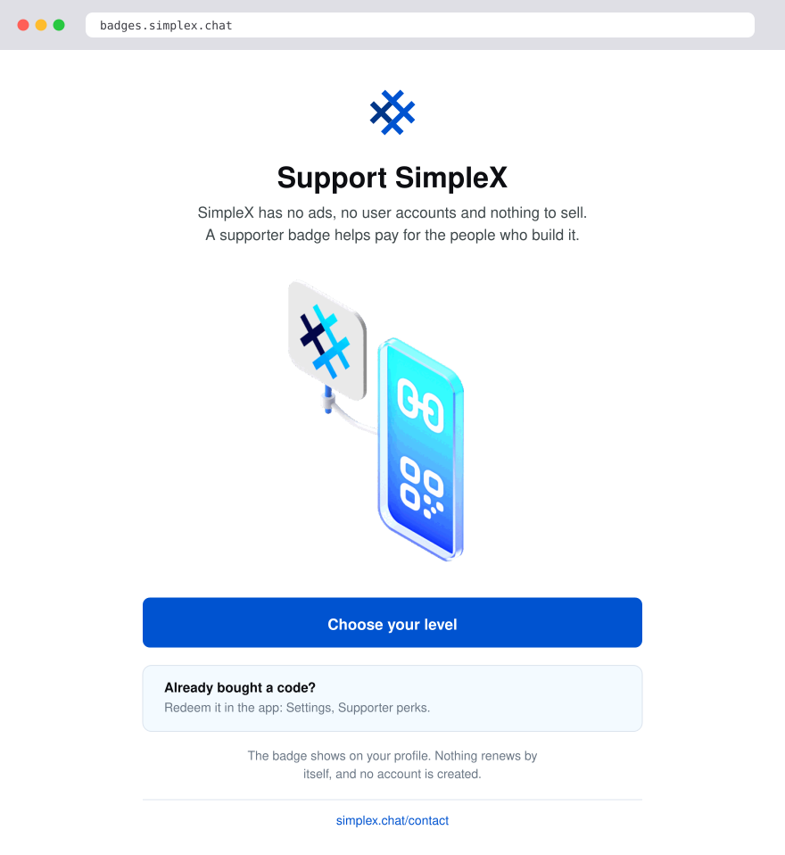

Every buyer begins here, because the app opens the site with no parameters. Where the local store holds an entry, a line above the footer links to `#/codes`.

**B2 level.**

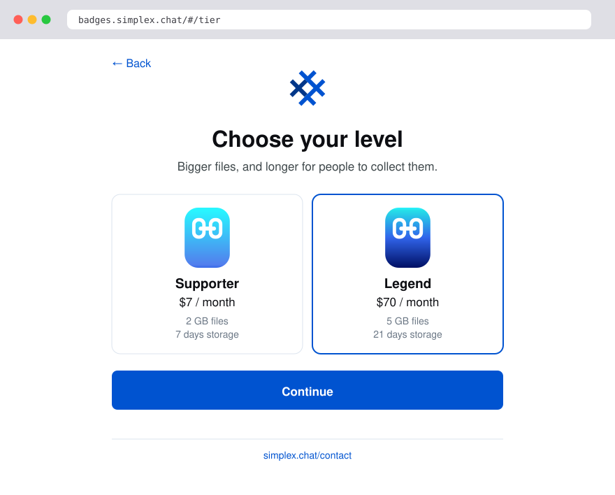

**B3 duration.**

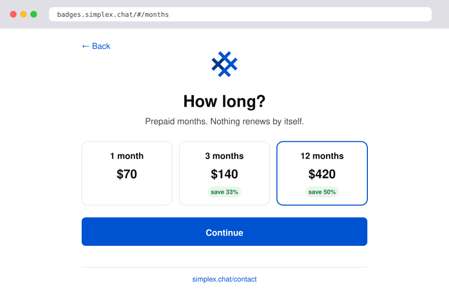

Every figure comes from the compiled-in catalog (§5.1). The saving percentage is the only number the browser computes. A duration with no total renders disabled and unpriced; a price with no total disables the tier.

**B4 order summary and payment method.**

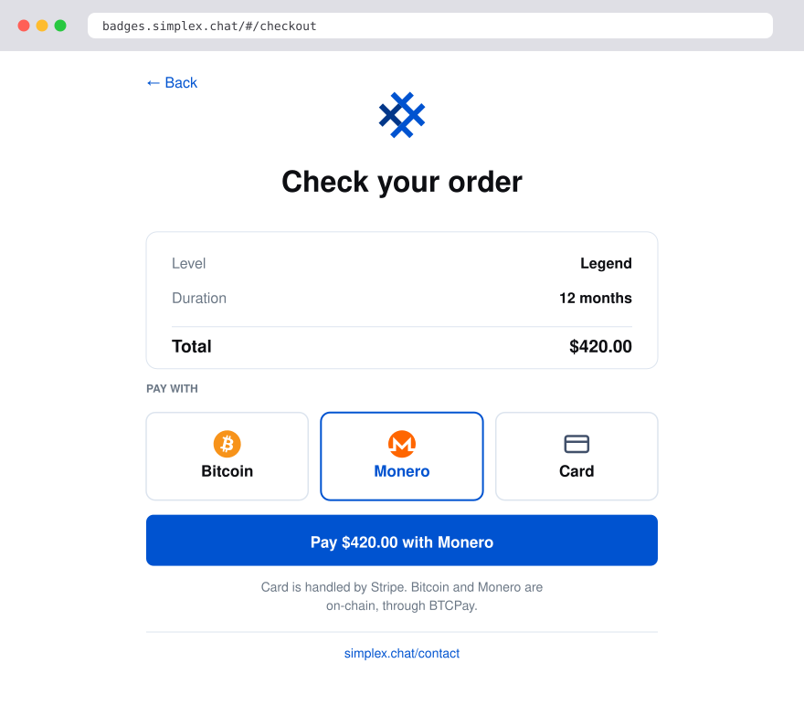

Summary and method are one screen because they are one decision. One Pay button, carrying the total, disabled from the moment it is pressed until `POST /api/invoice` answers. Back returns to B3 with the duration still chosen (§7.1).

### 8.2 Refusals and failures

**B4b provider unavailable**, after a 503.

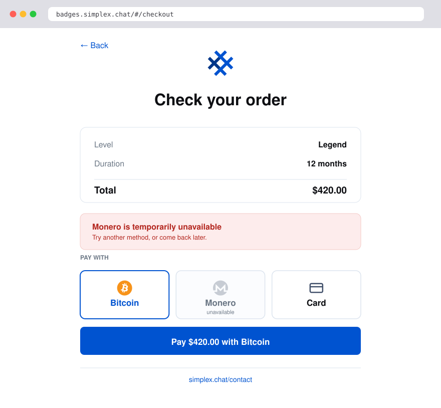

The method is shown and disabled rather than omitted, so an operator who forgot a configuration section sees it. The Pay button re-labels to the method now selected.

**B4c catalog changed**, after a 400 `catalog_changed`. Returns to B1 and refetches the catalog.

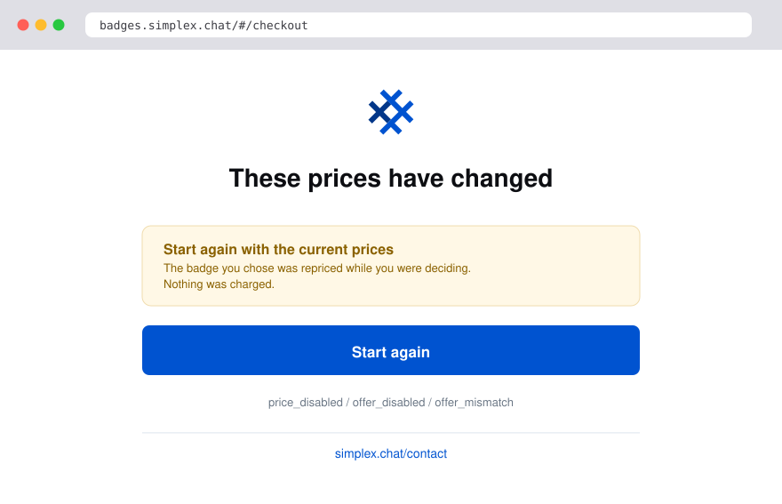

**B4d rate limited**, after a 429. The interval is `Retry-After`, and the button is disabled for exactly that long.

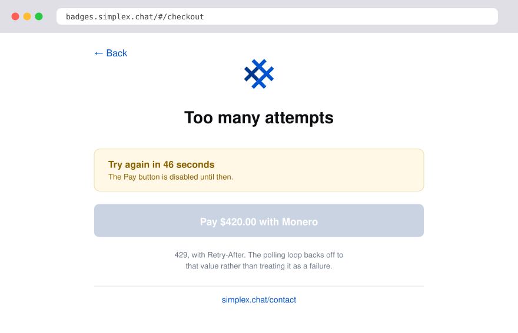

**The invoice failure.** Reached on `400 bad_request`, any 5xx, a network failure, or a 30-second client timeout. There is no "prices unavailable" screen, because the catalog is compiled in (§2.1).

> **That did not go through**
> The order was not created, and nothing was charged.
> If this happens again, get in touch.
> **[ Try again ]**

**[ Try again ]** re-submits the same selection, and a 429 on the retry lands on B4d.

This is the one request that may have already reached a provider: a timed-out attempt can leave an invoice the browser never learned the id of, which is never shown, never paid, and expires. **The copy still says the order was not created, because from the buyer's side nothing exists.** The causes are not distinguished on screen, and the response code is logged.

**Unknown order**, on a 404. Reachable by mistyping the URL, and by opening an order retention has deleted. Nothing here distinguishes an unknown invoice id from a guess.

> **This link does not work**
> Check the address you were given, or start again.
> **[ Start again ]**

### 8.3 Waiting: B5, B5b, B5c

**B5 crypto payment.**

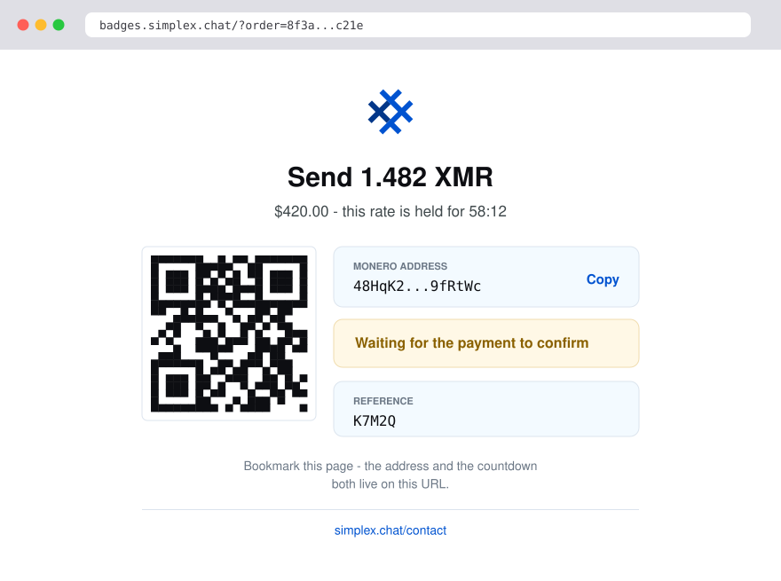

Everything needed to pay is on one URL that survives a reload and a device change. This is the first screen where a buyer might need a human, so it carries the reference. A partial payment does not change it.

**Reached by resume rather than by checkout** (§7.1), B5 and B5c each gain a secondary **[ New invoice ]** below the primary content, and B5 a line above it: *Started 14 minutes ago.* The renders do not show either — both postdate the mockup. **B5b never gains it**, on any branch — see below.

The countdown reads `expiresAt`. At zero, with the server still reporting `open`, the page replaces it with "Checking with the payment network" and keeps waiting. **The browser never renders expiry on its own clock:** `expired` comes from the server.

**B5b card submitted.** `actions.confirm()` returned success (§7.1). That is not proof of payment, so this screen waits.

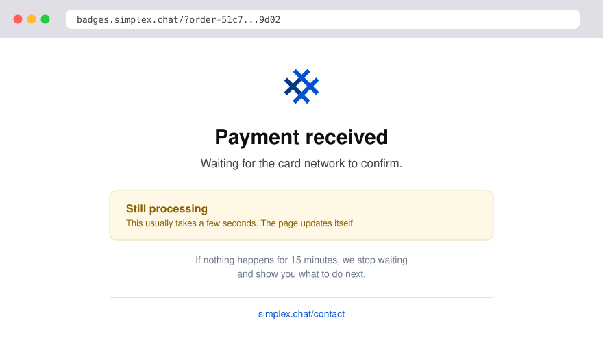

After fifteen minutes with the order still `open` it renders:

> **This is taking longer than expected**
> The payment has not been confirmed. This page keeps working: come back to it later, or quote the reference below.
> REFERENCE — `K7M2Q`
> **[ Check again ]**

**[ New invoice ] is withheld from B5b**, on both branches, even on a resume. This is the one screen where `actions.confirm()` returned success, so a card payment may already be in flight; the button abandons rather than cancels (§7.1) and §5.1 has no idempotency key, so a second invoice is a second real charge with no remedy (§11.4). The rule is not "a resumed screen gets an exit" but **a new invoice is offered only where nothing has been charged** — which is why every screen that does offer it says exactly that in its own copy. The fifteen minutes are irrelevant to it: the give-up screen is B5b later, so a charge that is possible at minute 16 is possible at minute 2. A buyer here keeps [ Check again ], the reference and §7.3's contact, and once the invoice expires B5c offers a new one with nothing charged.

The fifteen minutes run from the first render, not from the order's creation, so a buyer opening the URL a day later is owed the same wait.

**B5c invoice expired.** Two variants, on `amountPaid`. With something received:

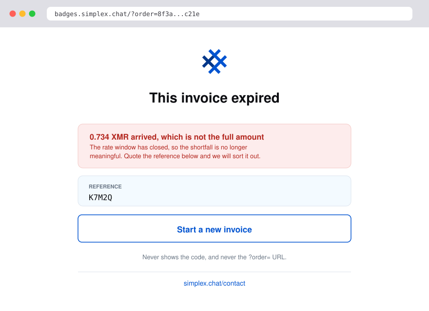

The crypto figure is `cryptoAmountPaid`; absent, the line reads "$300.00 of $420.00 arrived, which is not the full amount".

With nothing received, which is how every unpaid crypto invoice and every expired Stripe session ends:

> **This invoice expired**
> Nothing was received, and nothing was charged.
> **[ Start a new invoice ]**

Neither variant shows the code, and neither prints the `?order=` URL as text: a buyer may be about to forward the screen to support.

### 8.4 The code: B6, B6b, B7

**B6 code.**

> ✓ **Paid. Here is your code.**
> `SXB-YDC8A-YGQTM-PUYZ9-2TUXP`
> **[ Copy code ]** — with a QR, *scan to carry it to your phone*
> REDEEM IT IN THE APP — Settings → Supporter perks → Redeem code
> ⚠ **This is the only copy.** It is saved in this browser and nowhere else — not in any account, and not on our side. Anyone using this browser can read it, and clearing the browser loses it.
> *Codes you bought on this device* → `#/codes`

**B6 renders from `localStorage` alone.** The browser drew the code before the invoice existed (§4.2), so nothing is fetched and a reload needs no network.

**The warning is the recovery policy, not a caution.** There is no second copy: the service holds a hash. Where the local write failed (§7.2) the page must not claim a saved copy, and §11.10 argues it should never have reached this screen. The mockup's promise that the page "stops the moment the code is redeemed" is removed, because this service does not observe redemption (§11.3).

**B6b the code is not on this device.** One screen, rendered on a `paid` order whose browser holds no code. There are no variants, because there is no condition under which the service could have shown it (§4.2).

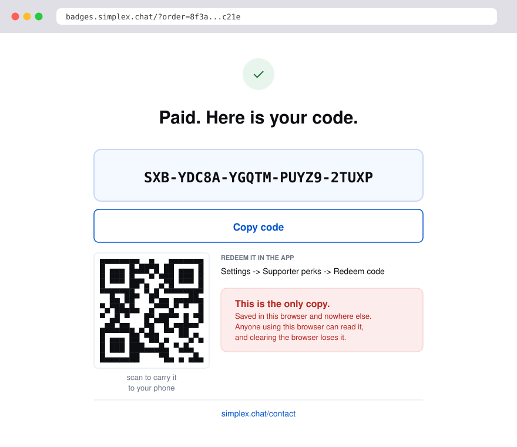

The reference is here because it is the only thing the buyer can act on (§11.2). **What support can do about it is unresolved:** an operator can confirm the payment (§10) but cannot produce the code, so the only remedy is minting a replacement, which is deferred (§11.4).

**B7 codes on this device.** At `#/codes`, from B1 and B6. Renders the local store newest first.

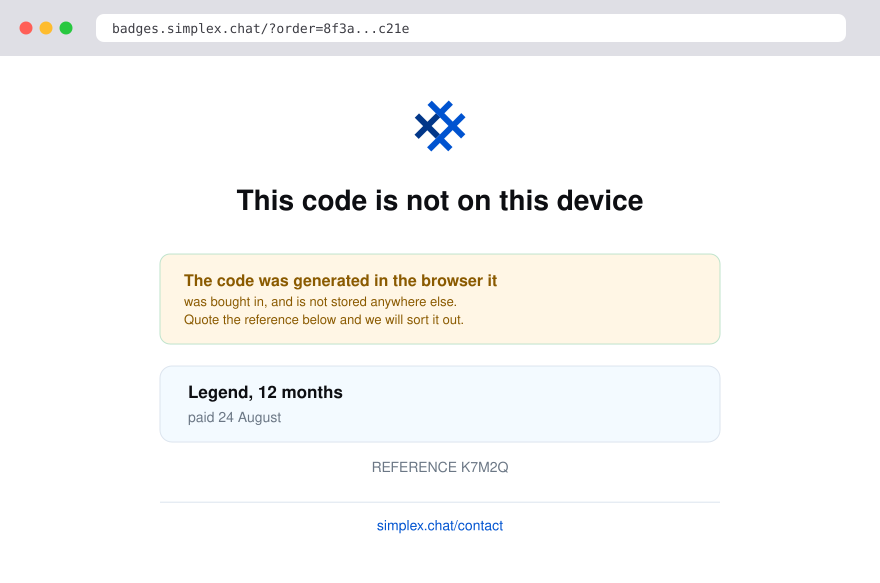

**Each row is a receipt**: the badge artwork of its tier, the level and the term, what it cost, the method with its mark, the day it was bought, and the state below. Everything but the state comes from §7.2's record, and a record that holds less shows less rather than dropping out of the list. The four states are these.

| Entry | Line |
|---|---|
| `paid`, with a code | prints the code, with **[ Copy ]** |
| `open` | *waiting for payment*, with **[ Open ]** |
| `expired` | *this invoice expired*, with **[ Open ]**, landing on B5c |
| `paid`, no code | *paid, and the code was not saved here*, with **[ Open ]**, landing on B6 or B6b |

Every entry keeps its link for as long as it is stored, including one whose order retention has deleted; that link lands on §8.2. **[ Open ]** is the only invoice id rendered as a link, and never as text.

**B7 does not wait.** On open it re-reads the entries whose status can still change, `open` and `expired`, newest first, at most ten, one plain request each, stopping on a 429. Without that, a line could read "waiting for payment" for an order settled on another device.

**[ Forget everything on this device ]** asks for a confirmation, then removes the key. An empty store reads "Nothing bought on this device" and offers **[ Choose your level ]**.

### 8.5 Small screens

The same webpage at a narrow viewport, and the same horizontal track (§7.3) with each panel at viewport width. The mockup's phone band is B1–B6 at 390 px, and the widths below are measured from it, with 320 px as the floor.

| | | | |
|---|---|---|---|
| 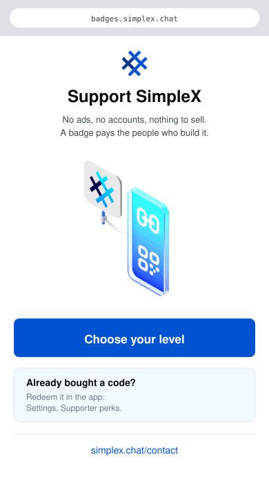 | 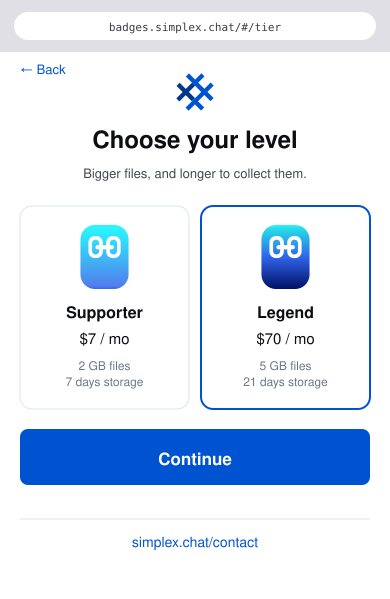 | 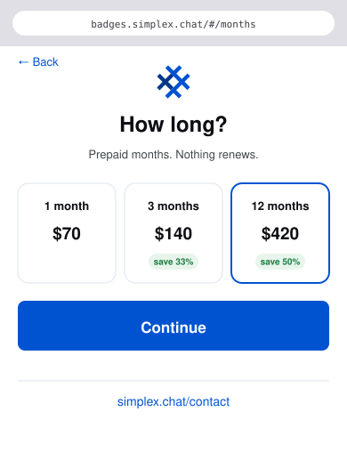 | 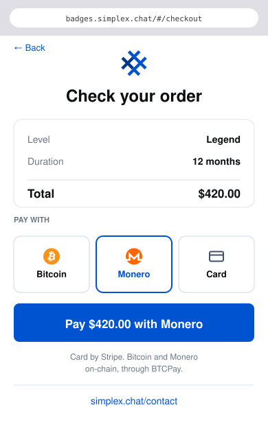 |
| **M1** landing | **M2** level | **M3** duration | **M4** checkout |
| 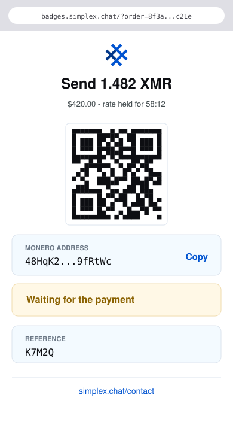 | 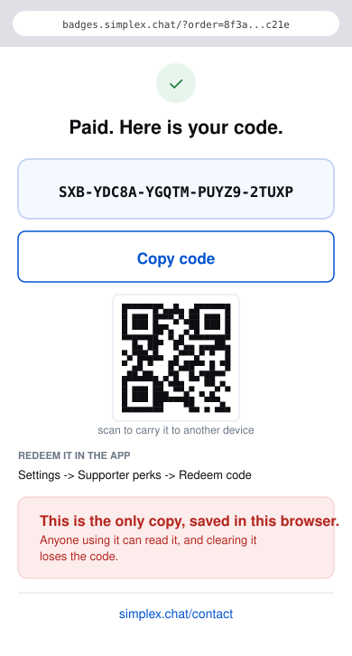 | 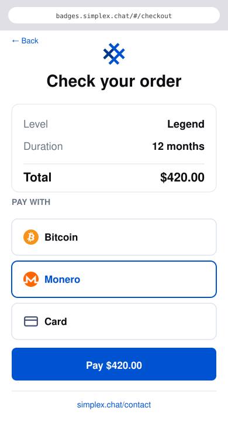 | |
| **M5** crypto payment | **M6** the code | **M7** checkout at 130% text | |

**Back is a control, not a gesture.** The **[ ← Back ]** button is in the panel on every width. A horizontal drag would be the obvious phone gesture and it is deliberately not bound, because the track is a stepper (§7.3) and a half-completed drag on a payment flow is worse than no gesture at all.

**What stays in columns.** M2's two tiers (169 px each at 390, 134 at 320) and M3's three durations (110 px, 87 at 320) stay side by side: values being compared must stay comparable, and stacking puts the second below the fold. Only the badge art shrinks. M3's saving pill moves under its price.

**What stacks.** M5 puts the QR first, then the details — a phone paying from a wallet on the same device needs the address. M6 stacks code, copy button, QR, then where to redeem, with the warning last and red; the code must wrap at its hyphens and the redeem path at its arrows.

**M4 is the tightest fit in the document**: 110 px per pay button at 390, 87 at 320, holding a 24 px mark above a 47 px word. That is why the three marks carry no text beside them.

**M7 is the text-scale case.** A 24 px mark beside a 17 px word needs 96 px and the row has 100, so at 130 % system text the row fails on every phone up to 412 px. The marks become a stack and the Pay button drops the method, reading "Pay $420.00".

**Copy that changes on a phone.** M1 takes a shorter lede ("No ads, no accounts, nothing to sell. / A badge pays the people who build it.") because a three-line lede is too long in a 280 px column. M2 reads "Bigger files, and longer to collect them." with prices as `$7 / mo`; M3 reads "Prepaid months. Nothing renews."; M4 reads "Card by Stripe. Bitcoin and Monero / on-chain, through BTCPay."; M5 drops the bookmark line; M6 shortens the QR caption and cuts the warning's third sentence, keeping the first two, which are conditional in the same way B6's are.

---

## 9. Configuration

`badge_service.ini`, read at boot. An absent provider section disables its methods, which is the B4b case; a section present but incomplete is a boot failure.

| Key | Section | Default | Purpose |
|---|---|---|---|
| `host` | `listener` | `127.0.0.1` | Bind address. Local by default, because the reverse proxy is where TLS and the query-string drop live (§7.1) |
| `port` | `listener` | `8080` | Bind port |
| `static_dir` | `listener` | none | **Required.** Directory served as `GET /` and `GET /assets/*` |
| `trust_forwarded_for` | `listener` | `off` | Whether `X-Forwarded-For` is used for rate limiting (§11.10) |
| `base_url` | `site` | none | **Required.** Origin for Stripe's return URLs. Absolute and https |
| `secret_key` | `stripe` | none | Restricted API key, `rk_live_` (§6.2) |
| `publishable_key` | `stripe` | none | Compiled into the page to mount the Payment Element. Public by design |
| `webhook_secret` | `stripe` | none | Signing secret for `POST /webhooks/stripe` |
| `session_minutes` | `stripe` | 60 | Checkout Session expiry, within Stripe's own bounds Range checked at boot. |
| `host` | `btcpay` | none | Greenfield API base URL |
| `api_key` | `btcpay` | none | Greenfield API key |
| `store_id` | `btcpay` | none | Greenfield store id |
| `webhook_secret` | `btcpay` | none | Signing secret for `POST /webhooks/btcpay` |
| `expiry_minutes` | `btcpay` | 60 | `checkout.expirationMinutes`: the invoice and rate window for both chains |
| `speed_policy` | `btcpay` | `MediumSpeed` | Confirmations before an invoice settles (§6.3) |
| `payment_tolerance` | `btcpay` | 0.5 | Percentage under-payment still counted as paid (§6.3) |
| `waiting_seconds` | `poll` | 3 | How often the open-invoice list is fetched while a browser is waiting (§6.5) |
| `idle_seconds` | `poll` | 60 | How often the open-invoice list is fetched when nobody is waiting |

The two `poll` keys trade provider load against how quickly a payment is noticed, which is a deployment decision and the only place that trade is exposed. Every other figure in §4.3 and §6.5 is a code constant, including the 30-second hold (§5.2).

**Anubis is deployed in front, and is not configured here.** Three deployment facts are this design\'s requirements, and none of them are visible from inside the service.

| Requirement | Why |
|---|---|
| `/webhooks/*` bypasses Anubis entirely | A provider cannot solve a proof-of-work challenge. This costs latency rather than money, because polling is what settles an order (§6.1), but a permanently challenged endpoint makes every payment feel slow |
| The proxy read timeout exceeds 30 seconds | A held request stays open that long (§5.2); a shorter timeout turns every wait into a proxy error |
| The proxy keeps `?order=` out of its access log | It is not a code (§7.1), but it names a purchase; the service redacts its own logs and the proxy should match |

Anubis challenges the page and both endpoints. It is not a substitute for the per-IP limits above: it raises the cost of a fleet of scrapers and does nothing about one browser submitting repeatedly.

**Operational logging is off unless the process is started with `-l debug`, or with
`--log-agent`.** `logInfo`/`logWarn`/`logError` calls throughout this service go through
`simple-logger`, which installs no sink at all — file or stderr — until
`Simplex.Chat.Core.simplexChatCore` calls `withGlobalLogging`, and it only does that when
`--log-agent` was passed or `--log-level`/`-l` is `debug` (`src/Simplex/Chat/Options.hs:340`).
**No other `-l` level turns logging on, `info` included** — `-l warn`, chosen by an operator
wanting a quieter deployment, instead makes it *silent*, this service's own lines included;
the flag that reliably gates it is `--log-agent`, named for the SMP agent's own logs and easy
to miss for that reason. This is a coupling in shared chat-core code, not a choice this
service makes, and a deployment fact the service cannot enforce or warn about, the same way
it cannot enforce that Anubis is in front of it. Verified against a live run:
`[INFO … BadgeService/Service.hs:140] badge catalog: 2 prices and 4 offers compiled in, 2
prices and 4 offers inserted` appears under `-l debug`; nothing does under `-l info` or the
default. Without `-l debug` or `--log-agent`, an operator loses, silently:

- the abandoned-invoice lines §5.1 relies on as the only record of an invoice created and
  paid at BTCPay that this service never recorded (§5.1 has no idempotency key);
- the skipped-invoice lines, including the distinction between a stranger's unreadable
  invoice and our own buyer's stuck one;
- amendment A2's payment-method-id check, whose stated purpose — a mismatch "visible in
  the first line of the log rather than in a failed checkout" — depends on that line being
  written anywhere;
- every refusal's arm, which §5.1 above states "is logged".

---

## 10. Operator CLI

One subcommand, `codes`, on the service binary: a privileged offline database write, not an HTTP endpoint. Authorisation is possession of the database. The buyer quotes the five-character reference off B5 or B5c.

**`codes status`.**

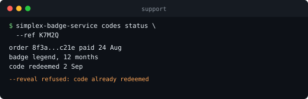

```
$ simplex-badge-service codes status --ref K7M2Q
order    8f3a...c21e   paid 24 Aug
badge    legend, 12 months
code     issued 24 Aug
```

- The invoice id is printed truncated: a full one on a terminal, or in a ticket, is the code.
- The `code` line reports the row: `issued 24 Aug`, `not issued` on an unsettled order, or `revoked 2 Sep` with no reason, because no reason is recorded.
- **There is no `--reveal`, and there cannot be.** The service holds a hash (§4.2). An operator can confirm that a code exists and was paid for, and can stop it working. That is all.
- The mockup's redemption line, `code redeemed 2 Sep`, is not available (§11.3).

An unresolved reference prints `no order with reference K7M2Q` on stderr and exits 1, which also covers a reference retention has deleted.

An unsettled order is the case an operator meets most:

```
$ simplex-badge-service codes status --ref K7M2Q
order    8f3a...c21e   expired 24 Aug 15:20
badge    legend, 12 months
paid     $300.00 of $420.00 (0.734 XMR)
code     not issued
```

An `open` order prints `open, expires 24 Aug 15:20`, and `paid  nothing received` where nothing arrived.

**`codes revoke`.**

```
$ simplex-badge-service codes revoke --ref K7M2Q
revoked the code for order 8f3a...c21e
```

It resolves the reference to the invoice, reads `badge_code_invoices.code_hash` (§4.1), and sets `revoked_at` `WHERE revoked_at IS NULL`, so a repeated command does not move the timestamp. The code stops redeeming.

Where the invoice names no code it changes nothing and says so, printing `no code for order 8f3a...c21e` and exiting 1. **A revocation must never be a silent zero-row update.** This is the whole refund path.

---

## 11. Open questions

1. **A provider-supplied timestamp is now load-bearing for money and retention.** Settlement stamps `payments.updated_at` and `badge_codes.expires_at` from BTCPay's `receivedDate` (§6.3), so a code's deadline and the retention cutoff both come from the provider's clock rather than ours. `receivedDate` is a required field, so a rename fails the decode loudly — but a Greenfield switch from seconds to milliseconds would write an `expires_at` around the year 55000, and a skewed provider clock could write one already past retention. This was a low-ranked wire risk while the value was parsed and discarded; sourcing it correctly promoted it to the highest. Whether to clamp, and which clock wins if the two disagree, is a decision this design has not made.

1. **§4.3's retention pass has no implementation.** The section gives the cutoff arithmetic and the delete order in full, and §2's architecture table assigns the pass to the poller, but nothing in the service runs it: no code, no invoice and no payment row is ever deleted. Everything it depends on exists — `codeLifetime`, `expires_at` written at settlement, the seventy-two-hour window — so this is absent rather than partial. It is a stated retention commitment the shipped service does not keep.

1. **§10's operator CLI has no implementation.** The `codes` subcommand does not exist. Its data layer does: `getInvoiceBySupportRef` resolves `--ref`, `revokeCodeByHash` implements the never-a-silent-zero-row rule, and `codeRowForInvoice` reads what `codes status` prints. Those three are written and tested with no caller, deliberately, so the command is a parser over an existing store rather than new plumbing.

1. **The expired-with-something-received queue has no implementation.** §6.5 says "The pass also reports expired invoices with something received, which is the B5c population and a human queue." The poller does not: `expireOverdue` returns a count only, and enumerating that population needs a statement nobody has written. Nothing is lost by the omission — the sweep writes `status` alone so the receipt survives, and §5.2 still reports `amountPaid`, so B5c's own inputs are intact — but no operator can currently find the buyers who paid something and got nothing. It needs one `Store.hs` query and one caller, and it is the only part of §6.5 the service does not do.

1. **The storage perk on B2 has no implementation.** File size is a real badge perk; the storage duration is in no catalog payload and implemented nowhere. Either it ships first, or the line comes off B2 and M2.

2. **B6 and B6b do not show the support reference, but B6b says to get in touch.** It appears on B5, B5c and B5b's give-up screen only. Either B6b gains it or the copy says what to send; the local record holds `supportRef`.

3. **Redemption must refuse `CPSUnpaid`**, or every unpaid invoice is a free badge (§4.1). Upstream's `code_payment_status` models this, so the agreement is only that redemption honours it. `expires_at` and `revoked_at` are still ours and read there too, and the alphabet and check rule (§4.2) must match, since the app parses what a browser generated.

4. **Promotional minting is deferred, and it is the only way to replace a lost code.** Upstream's `CPSFree` is the status for it, so what remains is a `batch` column and — unlike everything else here — an operator-side generator, since there is no browser to draw one. B6b sends people to support with no remedy behind it until this exists.

5. **Five screens have no drawing, only copy** (§8): B5b's give-up screen, B5c's nothing-received variant, the invoice failure, the unknown-order screen and B7. B6's QR also encodes a stale code. All of it needs the review and drawing the mockup's screens had.

6. **M7's wrapping mechanism is unverified.** The finding is measured; the implementation (§8.5) is an inference and needs a browser check.

7. **There is no at-rest record of provider reads or webhooks.** Replay safety needs none (§6.4), but "when did we learn this settled" is a log question, and retention means the invoice row will not answer it. The fix is log retention or an append-only event log — not a dedup table, which would put the replay guarantee in two places.

8. **Overpayment of a crypto invoice.** BTCPay settles it and the buyer gets a code; the surplus is an operator matter with no automated path and no screen.

9. **Rate limits are per IP, and the service sits behind Anubis.** B4d's limit holds only if the service sees the real client address, so `listener.trust_forwarded_for` must be on and the proxy must set the header.

   **The adjacent proxy must REPLACE `X-Forwarded-For`, not append to it** — nginx `proxy_set_header X-Forwarded-For $remote_addr`, never the more common `$proxy_add_x_forwarded_for`. The service reads the leftmost entry, which is the real client only under a replacing proxy; under an appending one a caller sending its own `X-Forwarded-For: 1.2.3.4` is recorded as `1.2.3.4` and evades the limit entirely. The service additionally refuses any entry that does not parse as an IP address and falls back to the socket address, which bounds the key space but cannot detect a forged-yet-valid address. With Anubis and a TLS terminator both in front, the chain is at least two hops, so this is a deployment contract the service cannot verify for itself.

10. **A browser that cannot write `localStorage` has nowhere to keep the code, and there is no second copy.** Where the write fails (§7.2) the buyer's only copy is the open tab, and losing it means the money is spent and the badge gone. **Given that nothing can recover it, refusing to start the payment looks right.**

11. **The STM map binds the service to one process** (§5.2). A second instance would neither publish to nor read the first's map: its waiters would run to the timeout and its poller treat every invoice as unwatched. Horizontal scaling needs the map moved out, or the fallback accepted.

12. **The invoice stores the code hash, which makes payment → code → badge joinable** (§4.1) — and upstream has now put `badge_purchases.badge_code_id` in the service schema too, so the whole chain sits in one database rather than two. The alternative is clearing `badge_code_invoices.code_hash` at settlement, so the link exists only before any badge does. The cost is `codes revoke --ref`: a chargeback arrives with no code attached and there would be no row to find.

13. **The browser is trusted to draw the code.** `crypto.getRandomValues` is a CSPRNG everywhere the site supports, and a broken client harms only itself — but nothing lets the service detect it.

14. **The poll cadences are unmeasured** (§6.5). Listing means a pass costs one request per provider, so provider limits no longer bind; the open question is freshness against load. Three seconds for a list of up to 100 open invoices is a guess, and past 100 the list paginates.

15. **Three BTCPay facts must be pinned to the deployed version** (§6.3): the payment-method identifier strings, the confirmation counts behind `speedPolicy`, and `monitoringExpiration`, whose one-day default is shorter than the seventy-two hours the read pass assumes — leave it and late settlement is undetectable past day one. **Monero is also a third-party plugin**, so shipping card and Bitcoin first is the lower-risk order, which the design already allows.

16. **Which payment methods a Stripe session offers is not set by this service** (§6.2). Settlement is safe regardless, because it keys on `payment_status`. But a delayed method makes B5b's fifteen-minute give-up screen misleading, so the account should offer cards only and someone has to own that setting.

17. **Resuming an open invoice on a bare load is a guess about intent** (§7.1). A buyer returning to finish a Monero payment wants it; a buyer who abandoned one and came back to buy something else has to press **[ New invoice ]** first. The alternative — always landing on B1 with a banner — costs the first buyer a click and is less likely to be wrong. This needs a product answer, and it is cheap to change either way.

18. **A service worker is a persistent script on the origin** (§7.4). It survives a tab closing and updates itself, which is what makes offline work and also what makes a compromised deploy harder to undo: a bad build can be cached on every visitor's device until its own successor evicts it. The mitigations are the usual ones — short-lived precache, an unregister path, and never caching `/api/*` — but the risk is real on a page that handles money, and it did not exist before.

19. **Collecting no email costs a form.** `ui_mode: elements` is chosen over embedded Checkout precisely because Checkout collects an email and cannot be told not to (§6.2). The bill is a payment form of our own — layout, styling, accessibility, validation, and the confirm and error paths — where the alternative mounts itself in one call. **Two things remain unverified against a live account**: whether a session with `ui_mode: elements` renders any email field of its own regardless of what we mount, and whether suppressing the receipt has any consequence for disputes. Both need a test, not a document.

20. **The page is no longer `default-src 'self'`** (§7.3). Stripe.js must be loaded from `js.stripe.com` and may not be bundled, so the strongest form of the CSP is gone and a third-party script runs on a page that handles money. The mitigations are Stripe's own domains only, no other third party anywhere, and Link disabled to keep `link.com` out of the policy.
