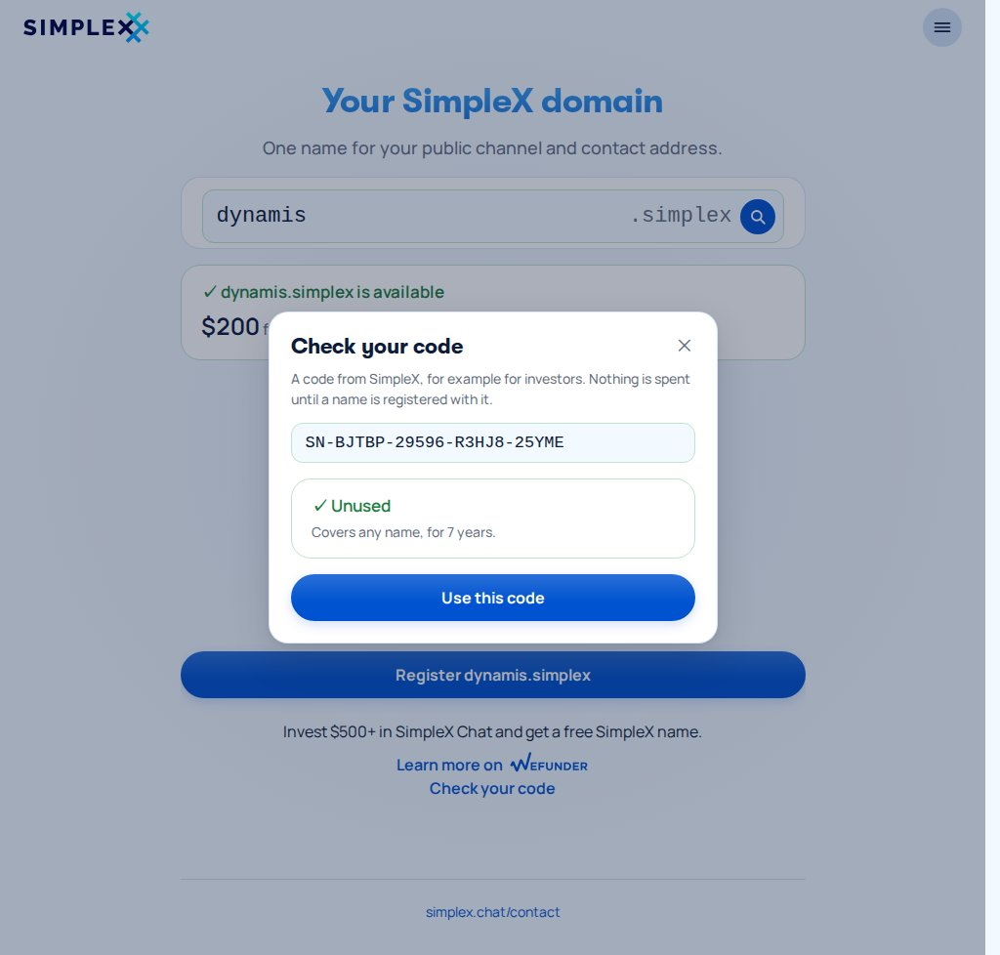
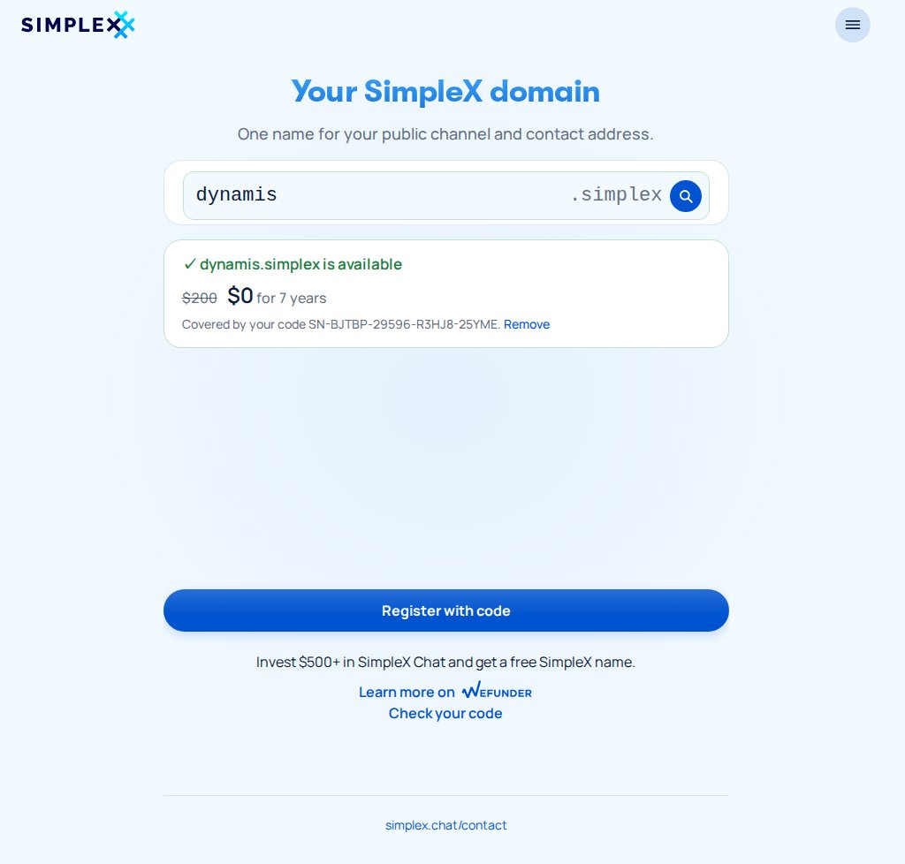
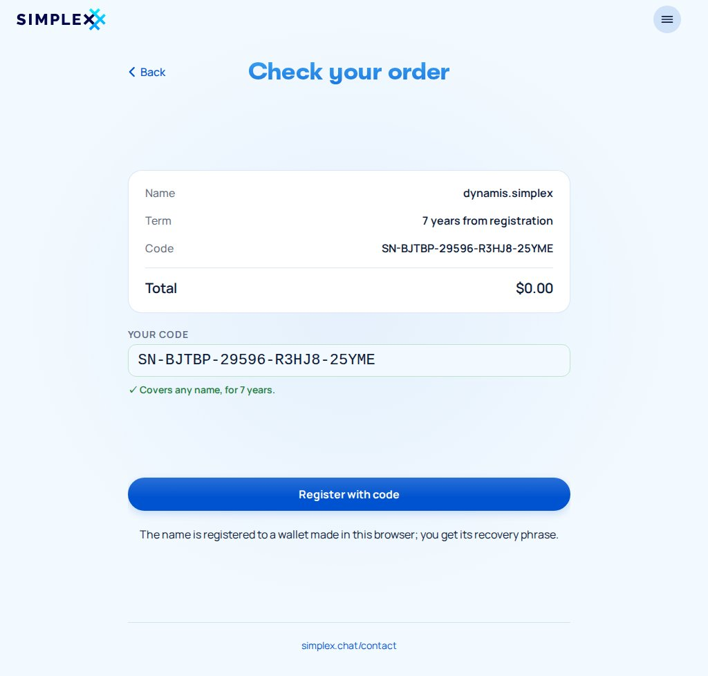
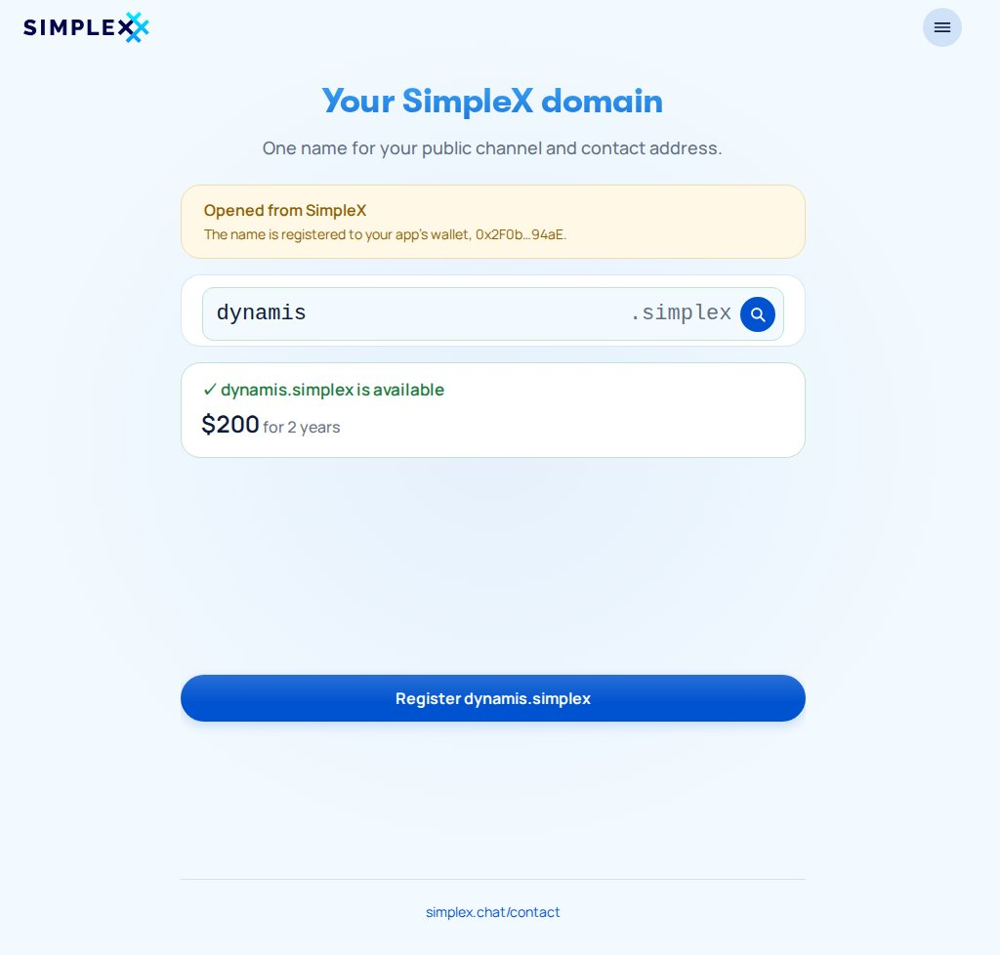

# SimpleX names store: simplex.domains

The names store sells SimpleX names (`<label>.simplex`) at **simplex.domains**:
1. The buyer searches a name and sees whether it is free, and at what price.
2. The buyer pays by card, Bitcoin or Monero, or redeems a code.
3. The browser makes the name's wallet, a 12-word recovery phrase, and the service registers the name to that wallet's address.
4. Nothing is held in custody. Imported as the master of an app with no wallet yet, the phrase gives the app the name's key; the app shows the name after `bind account=0` or the chain scan (out of #7475's scope). An app that already has a wallet needs account import, not built yet.

Badges keep their own store at **badges.simplex.chat**. The implementation plan is [`2026-10-09-names-web-store-plan.md`](2026-10-09-names-web-store-plan.md).

The app side:
- redeeming codes in the app is #7530's (`origin/ab/names-actions-api:plans/2026-09-28-name-registration-core-cli.md`);
- #7475's wallet (`origin/ab/wallet:docs/rfcs/2026-09-10-wallet-keys.md`) imports a name's phrase only as the device's single master; importing it beside an existing master is still to be built (#7475/#7530), since #7475 excludes keys its master does not derive;
- editing a name's records is later app work, out of #7530's scope.

**The board**, every screen and how each leads to the next: [`names-flow.svg`](names-flow.svg). It is generated, see [§13](#13-regenerating-the-board). View it on GitHub from the file view, not "raw": the raw host's Content-Security-Policy blocks the embedded screens.

[](names-flow.svg)

## Contents

1. Scope
2. Two stores
3. Search
4. Price and term
5. The wallet
6. Registration
7. Codes
8. Service API
9. Storage
10. Configuration
11. The page
12. Deployment
13. Regenerating the board
14. Open questions

## 1. Scope

**In:**
- The names store: search, checkout by payment or code, the wallet in the browser, registration with its steps, and the phrase.
- The flow opened from the app.
- History with "Check a code".
- The StoreService side: search, codes, orders, the registration worker, operator issuing.
- One webapp codebase building both stores.
- Deployment.
- The mock.

**Out:**
- The app side (importing a phrase beside an existing master, records, codes in the app). The board draws two app screens in grey (A1, A2).
- Selling codes on the web.
- Renewals, transfers, in-app purchase.
- Refunds (manual, by support).

## 2. Two stores

| | Names | Badges |
|---|---|---|
| Host | simplex.domains | badges.simplex.chat (simplex.chat/badges redirects there) |
| First screen | Search (N1) | The badge landing (B0, unchanged but for the link) |
| Cross-link | "SimpleX badges" in the menu (N13) | "SimpleX names are at simplex.domains" under the landing |
| History | "Your names" (N12) | "Your codes", as today |

One service (StoreService, the renamed badge service) and one webapp codebase run both. The payment and card screens are shared; each store has its own history. Each store keeps its own `localStorage`, since the two hosts are different origins.

## 3. Search

**The field (N1):** the name, a fixed `.simplex`, and a magnifying glass at the end. The glass, Enter and the Search button at the bottom all search. The name is judged when searching, not while typing, and the rules line appears only after a mistake (N1b, N1c). The rule is shared by `Simplex.Chat.Names.validNameLabel` and `web/src/names.ts`:
- `a-z`, `0-9` and `-`, no leading or trailing hyphen, and no `--` at positions 3–4 (#7530's `validLabel`);
- at least 6 characters (the controller's `minCharLength`);
- at most 63 (simplexmq's label limit).

simplexmq lower-cases a name when parsing it (`SimplexDomain`'s `strP`, `labelHash`) and #7530's `validLabel` admits only a–z, so the page folds upper case as the buyer types.

**Searching:** `GET /api/name/:label`. The service validates the label and hashes it with keccak256, then asks `GET {resolver_url}/v2/resolve/[<hash hex>].<tld>`. The request carries only the hash; for a registered name the resolver still knows which name it was. The service never logs a searched label, and stores it only for an order.

| Answer | The page shows |
|---|---|
| `available` | N2: available, its price for 2 years (or $0 when an applied code covers it, K2), and Register |
| `registered`, with links | N2a: "Used by", one card per `simplexContact`/`simplexChannel` link, with picture, display name, link and Open in SimpleX (deep link) |
| `registered`, no links | N2b: taken, pointing nowhere (a name bought here reads like this until its owner sets records) |
| `reserved` | N2c: reserved, with "Contact the SimpleX team" |
| held by another open order | N2f: being registered |
| no answer, an error | N2d (503) |
| the rate limit | N2e (429) |

**Taken names:** the service opens each link with its own chat core. `APIConnectPlan` returns the link's display name and picture from its link data without connecting. Each fetch has a 3 s timeout, its own rate limit and a short cache.

**Under the main button:** the invest block, Wefunder's sentence, logo and link with a names amount (a placeholder for now), and **Check your code** (§7).

## 4. Price and term

- **Term:** 2 years for a paid name, fixed: the registry's minimum (730 days), and nothing is charged for years whose price cannot be known yet. A code registers for its own `years`; investor codes get 7, 5 or 3 by investment date, as simplex.domains says. A year on chain is 365 days (31,536,000 seconds, as simplexmq's `protocol/simplex-messaging.md` prices it), so the duration is `years × 365` days from registration: 9 October 2028 for a name registered on 10 October 2026.
- **Price:** the service's answer for the searched name; no price list is shown.
  - The rule is internal: a seeded per-length table that per-name entries can override, insert-only.
  - The starting values are $100 for 8+ letters, $200 for 7 and $400 for 6, for the 2 years, in `Catalog.defaultNamePrices`.
- **Checkout** carries the shown price. The service prices again and answers `catalog_changed`, with the new price, if it moved (N3b).

## 5. The wallet

At checkout (N3), the browser makes the name's wallet:

1. 128 bits from `crypto.getRandomValues`.
2. A 12-word BIP-39 phrase, with its checksum.
3. The BIP-39 seed: PBKDF2-SHA512, 2048 rounds, no passphrase (WebCrypto).
4. BIP-32 to `m/44'/60'/0'/0/0`: HMAC-SHA512 from WebCrypto, secp256k1 from vendored `@noble/secp256k1`.
5. The EIP-55 address, with keccak-256 from vendored `@noble/hashes`.

How the phrase and address are handled:
- **The phrase** is stored in this browser before the order is created. Checkout warns when storage is unavailable ("This browser will not keep your recovery phrase", N3f), as the badge checkout does for codes; N7a then shows the phrase once.
- **The address** is the only thing sent to the service.
- **The path** is #7475's account 0. Tests pin the `abandon … about` vector to #7475's address for account 0, `0x9858EfFD…aEda94`.

N7 shows the phrase in numbered columns, with Copy and a QR for the app to scan, and says plainly that it owns the name and that nobody else has a copy. History keeps it, behind "Show phrase".

**Importing in the app** (A1, A2) is not built as drawn. #7475's device wallet is one master per device, generated with 24 words or imported from a 12–24-word phrase. On a device with no wallet, importing the name's phrase as the master gives it the name's key at account 0, and the app shows the name after an explicit `bind account=0` or the chain scan, which #7475 leaves out (its known limit 2); a device that already has a master cannot add it as an account. The phrase also works in any BIP-44 wallet at account 0.

**One wallet per order:** a taken order retargeted to another name (N8a) keeps its address, so the same phrase owns the new name.

**Opened from the app (L1–L3):** the app's link carries the name and the app's own owner address, `simplex.domains/#/?name=<label>&owner=<address>`. The page shows that address on the search and at checkout, so a crafted link cannot pass unnoticed. It makes no wallet, offers no "I have a code" (the app redeems codes itself), and ends with "Back to SimpleX".

## 6. Registration

1. **Orders:**
   - Paid: `POST /api/invoice {kind: "name", label, price, method, owner}`; settlement moves the registration to `queued`.
   - By code: `POST /api/name/register {label, owner, code}`, with no invoice. The code is reserved for the registration and spent when it succeeds.
2. **One order per name:** while an open invoice or unfinished registration holds a label, a second order is refused with `name_pending`.
3. **The worker**, one per registration, resumed after a restart. It uses #7530 §10's chain client (JSON-RPC to the resolver host's reth node, a dry run of every transaction, serial nonces, EIP-1559 fees, receipts with replacement):

| Phase | What happens | Page |
|---|---|---|
| `queued` (paid, or code reserved) → `committing` | Send `commit(makeCommitment(Registration{label, owner = buyer's address, duration, secret, …}))` from the service's key. `duration` is 2 years when paid and the code's `years` when redeemed; the secret is the service's own | N6 |
| `committed` | Mined; wait `minCommitmentAge`, read from the controller (60 s in the docs) | N6a |
| `registering` | Send `register`, paying the contract's fee | N6b |
| `registered` | Receipt + 3 blocks; `expires_at` recorded | N7 (or L3) |
| `taken` | The register dry run reverted `NameNotAvailable`; nothing was sent | N8 |
| `failed` | Any other failure after the service's retries; Try again, `POST /api/registration/:id/retry`, requeues it at no charge | N9 |

- **All phases:** `unpaid` (invoice open) → `queued` (paid, or code reserved) → the rows above. From `taken` a paid order goes back to `queued` with its new label, or ends `code_issued`; a code order ends at `taken` with its code released. A code is reserved from `queued` until it is `registered` (spent) or `taken` (released); `failed` keeps it for Try again.
- **Ownership from the start:** `register()` takes the owner as a struct field, and `makeCommitment` hashes the struct rather than `msg.sender` (names v2 RFC). So the name belongs to the buyer's address from the start, and the service's key never holds a name.
- **Records:** the name is registered with none. The owner sets them from the app after import.
- **Progress:** each phase is published to the long poll (`GET /api/invoice/:id` or `GET /api/registration/:id`).
- **Taken:** possible only for a name registered outside the store. The order keeps its value:
  - paid: another name at most its price, searched on the order's own page, `POST /api/registration/:id/name` (N8a), where a cheaper one refunds nothing and a dearer one is `bad_request`; or a code for the original name's length (8+ for longer names) for 2 years, `POST /api/registration/:id/code` (N8b), which the service generates and returns once, storing only its hash;
  - by code: the code is released, unspent, for another name.
- **Failed:** "Paid, not registered". Try again charges nothing, and refunds are manual.
- **Signing the service's transactions:** `signRecoverable` and `signEip1559Tx` in simplexmq #1887, on `names` (not `master`).

## 7. Codes

| | |
|---|---|
| Shown | `SN7-BJTBP-29596-R3HJ8-25YM7`; `SN6-…`, `SN20-…`; `SN-…` with no length |
| Grammar | `SN`, an optional 1–2 digit length, then 20 Crockford base32 characters |
| Check | Luhn mod 32 over the length digits and the 19 payload characters |
| Reading | Case-insensitive, separators optional, `I`/`L` → `1`, `O` → `0` |
| Stored | SHA-256 of the canonical form, nothing else |
| Truth | The service's `name_codes` row: `min_length` (or none), `years`, status. The length in the text is a convention |
| Issued by | The operator (`//issue name [<length>] [years <Y>] [paid\|unpaid\|free]`, 2 years by default; group `/issue name [<length>] [years <Y>]`, `/bulk name [<length>] [years <Y>] count <N>`), the app (an owner decision; #7530 defers in-app purchase, and the names v2 RFC has it buy a name directly), and the service for a taken order (N8b). Not sold on the web |
| Use | Single-use: reserved from `queued` until it is `registered` (spent) or `taken` (released); `failed` keeps it for Try again |

**Check your code** (K1), under the invest block, opens a popup. `POST /api/code/check {code}` answers what the code covers (`minLength` or none, `years`) and whether it is unused, reserved by an unfinished registration, used (K5), revoked, expired or unpaid, without spending it. A typo fails the check character before any request (K6).

**Use this code** applies it: a covered name shows $0 and the code's term (K2, where Remove drops it), checkout goes to Register with code (K3), and the name registers for the code's years (K8). The board's example is an investor code, `SN-` for 7 years. A name the applied code does not cover shows its normal price, with a line saying what the code covers.

The popup's answer per state, drawn for unused, used and a typo:

| State | Line |
|---|---|
| `unused` | ✓ Unused, and what it covers (K1) |
| `reserved` | This code is being used for a name now |
| `used` | This code was already used (K5) |
| `revoked`, unknown | This code is not valid |
| `expired` | This code has expired |
| `unpaid` | This code is not paid for yet |
| typo | This code is not valid, check it for a mistyped character (K6): the check character fails before any request |

**I have a code** at checkout (K4) does the same in place. A code that does not cover the name says so (K7), and the buyer can still pay.

**History:** "Check a code" (N12a) asks the same question and adds the code to the list, where Use applies it.

## 8. Service API

```json
GET /api/name/dynamis
200 {"status": "available", "label": "dynamis", "price": 20000, "currency": "usd", "years": 2}

GET /api/name/bakery
200 {"status": "registered", "label": "bakery", "entities": [
      {"type": "address", "displayName": "Alice's Bakery", "image": "data:image/jpg;base64,…",
       "link": "https://smp8.simplex.im/a#…", "deepLink": "simplex:/a#…"},
      {"type": "channel", "displayName": "Bakery news", "image": "data:image/jpg;base64,…",
       "link": "https://smp9.simplex.im/c#…", "deepLink": "simplex:/c#…"}]}

GET /api/name/support   200 {"status": "reserved", "label": "support"}
GET /api/name/orbital   200 {"status": "pending", "label": "orbital"}

POST /api/code/check {"code": "SN7-BJTBP-29596-R3HJ8-25YM7"}
200 {"minLength": 7, "years": 2, "state": "unused"}
    state: unused | reserved | used | revoked | expired | unpaid; an SN- code has "minLength": null

POST /api/invoice        {"kind": "name", "label": "dynamis", "price": 20000, "method": "btc", "owner": "0x5aE1…7cD3"}
POST /api/name/register  {"label": "dynamis", "owner": "0x5aE1…7cD3", "code": "SN7-BJTBP-29596-R3HJ8-25YM7"}

GET  /api/invoice/:id         … plus "registration": {id, phase, label, owner, years, commitTx, registerTx, revealAfter, expiresAt, error}
GET  /api/registration/:id    the same registration object, long-polled
POST /api/registration/:id/name {"label": "dynamos"}
POST /api/registration/:id/code
POST /api/registration/:id/retry
```

- **Errors:** new on HTTP: `invalid_name`, `name_taken`, `name_pending`, `code_not_covering`, `code_reserved`, and the chat protocol's code errors `code_invalid` (unknown or revoked), `code_used`, `code_expired` and `payment_pending` (an unpaid code). `catalog_changed` carries the new price.
- **On the page:** `name_pending` and `name_taken` from an order go back to search (N2f, N2a); code errors from the service show where the code was entered, the popup (K5) or the checkout entry (K7), and a typo is caught on the page (K6); anything else is N3d.
- **The registration id** is a random 128-bit token, like order ids; whoever holds it can act on the registration.
- **Rate limits:** `/api/name` and `/api/code/check` each have their own.
- **`owner`** must be a checksummed address.

## 9. Storage

Migration `20261010_names`, in SQLite and Postgres. The badge tables (`sx_badge_service_badge_codes`, `sx_badge_service_badge_code_invoices`, …) are untouched, so there is no table rebuild.

- **`sx_badge_service_name_codes`:** `name_code_id`, `code_hash` (unique), `min_length` (null for `SN-`), `years`, `code_payment_status`, `spent_at`, `revoked_at`, `expires_at`, `created_at`.
- **`sx_badge_service_name_prices`:** `price_id`, `min_length`, `label` (null for a length rule), `price`, `currency`, `status`, `created_at`.
- **`sx_badge_service_name_registrations`:** `registration_id`, `label`, `owner`, `secret`, `commitment`, `phase`, transaction hashes and blocks, `years`, `expires_at`, `invoice_id` (null when paid by code), `name_code_id` (null when paid), `error`, `created_at`, `updated_at`.
- **`sx_badge_service_name_invoices`:** `invoice_id`, `registration_id`, `price_id`, `provider_ref`.
  - The webhook and poller lookups by `provider_ref` cover both this table and `sx_badge_service_badge_code_invoices`. As in `Web/Server.hs` today, a row whose provider differs from the webhook's is ignored, since `provider_ref` is unique only within each table.

## 10. Configuration

```ini
[listener]
; hosts that get the names store when this service serves the webapp itself
names_hosts = simplex.domains

[names]
resolver_url = http://127.0.0.1:8000
; simplex once that namespace is deployed
tld = testing

[chain]
rpc_url = http://127.0.0.1:8545
chain_id = 1
controller = 0x…
; the resolver contract set in each Registration
resolver = 0x…
; pays gas and the registration fee; holds funds only, never names
service_key = replace-me
confirmations = 3
```

## 11. The page

**Routes on simplex.domains:**
- `/`: search;
- `#/checkout`;
- `#/names`: history;
- `#/?name=&owner=`: opened from the app;
- `?order=<id>`: payment, registration, the phrase, and another name's search after `taken` (N8a);
- `?registration=<id>`: a registration paid with a code.

**Modules:**
- `wallet.ts`: the crypto (§5);
- `names.ts`: rules and result types;
- `nameScreens.ts`: the screens;
- `namesMain.ts`: wiring.

The shared `codes.ts`, `api.ts`, `domain.ts`, `store.ts`, `order.ts`, `screens.ts`, `main.ts` and `crowdfunding.ts` grow for names.

**New rules in `styles.css`:** the search field with its glass, results and entity cards, the steps, the phrase grid, the popup and the check-code line, from `mockups/mockups.css`, all on the existing tokens. The invest block keeps the main button at the same height as on the badge pages.

| | | |
|---|---|---|
|  |  |  |
| **N1** search with the glass | **N2** available, with its price | **N3** checkout, I have a code |
|  |  |  |
| **N6a** the steps | **N7** yours, with the phrase | **N2a** taken: what uses it |
|  |  |  |
| **K1** check your code | **K2** covered: $0 | **K4** a code at checkout |
|  |  |  |
| **L1** opened from the app | **N12** your names and codes | **N8** someone was faster |

## 12. Deployment

Production is the split deployment in `scripts/badge-service/` (`scripts/store-service/` after the rename):
- Caddy serves the webapp folder the service exports at boot and proxies `/api` and `/webhooks`.
- The service runs with `+client_postgres` and host networking, with its ini mounted read-only.

What changes:
- **Build:** `build.js` emits two site roots, `dist/badges/` and `dist/names/`, each with its own `index.html`, `sw.js` and `assets/<hash>/`.
- **Export:** both are exported, with the Stripe key in each shell.
- **Caddy:**
  - `badges.simplex.chat` → `web/badges`;
  - `simplex.domains` → `web/names`;
  - both proxy `/api/*`; `/webhooks/*` stays on badges.simplex.chat, where BTCPay and Stripe already send it;
  - `apps/simplex-badge-service/README.md` (`apps/simplex-store-service/` after the rename) gains the host blocks, and the CSP in its `web/README.md` gains simplex.domains.
- **Chain:** the resolver (`:8000`) and reth (`:8545`) on loopback when they share the host.
- **Unchanged:** the database `badge_service` and the `sx_badge_service_` prefix.

## 13. Regenerating the board

`mockups/screens.js` builds every screen in the browser on the webapp's compiled modules. Shared screens call the real `screens.js`, and name screens are prototypes for `nameScreens.ts`. `mockups/layout.mjs` holds the captions, positions and arrows. `mockups/board.mjs` reads the built assets from `apps/simplex-badge-service/web/dist/assets`, a path that follows the stage 1 rename and, after stage 5, the names site root. It renders each frame with Playwright into `screens/<tag>.jpg` (JPEG at quality 85, animations frozen) and writes `names-flow.svg`.

```
cd apps/simplex-badge-service/web && npm install && npm run build && cd ../../..
npm install --prefix /tmp/pw playwright && npx --prefix /tmp/pw playwright install chromium
PLAYWRIGHT=/tmp/pw/node_modules/playwright/index.mjs node plans/names-codes/mockups/board.mjs
```

## 14. Open questions

1. **Importing the phrase in the app:** #7475 imports a phrase only as the device's single master, so an app that already has a wallet needs an account-import path (#7475/#7530). It decides whether a web-bought name reaches such an app.
2. **Funding and cost:** the `.testing` controller's `register` is payable in ETH. The service's key pays the fee and gas while the buyer paid a fixed USD price, so a gas spike is the service's loss. #7530 §9 sends `registerWithCredit` (a USD allowance, `setRegistrarAllowance`), and the names v2 RFC proposes credits for `.simplex` (`setRegistrarCredits`); the two differ and need coordinating.
3. **Signing:** simplexmq `names` (#1887) has to reach the simplexmq the service builds against.
4. **Coordination with #7530:** the StoreService rename (#7530 proposes `SHC`/`SHP`/`SHE`; this plan uses `STC`/`STP`/`STE`), the `Registration` encoder, the chain client, codes in the app, and four code decisions that differ from #7530 §6/§9: the `SN7-` format without years in the text, a table of their own instead of a kind column, no codes sold on the web, and the service's table rather than the text deciding what a code covers, so the app cannot check one offline.
5. **The investor amount** in the invest block, $500+ as on simplex.domains today, is a placeholder.
6. **Fetching link profiles** puts a load on the service that grows with searches. The cache, a timeout and a rate limit of its own bound it.
7. **simplex.domains today** is a countdown page; the store replaces it at launch. Its heading and line are kept.
