# SimpleX names store: simplex.domains

The names store sells SimpleX names (`<label>.simplex`) at **simplex.domains**:
1. The buyer searches a name and sees whether it is free, and at what price.
2. The buyer pays by card, Bitcoin or Monero.
3. The service registers the name on chain, holds it, and hands the buyer a claim code that moves it into the app.

Badges keep their own store at **badges.simplex.chat**. The implementation plan is [`2026-10-09-names-web-store-plan.md`](2026-10-09-names-web-store-plan.md). The app side of claiming and redemption is #7530's: `origin/ab/names-actions-api:plans/2026-09-28-name-registration-core-cli.md`.

**The board**, every screen and how each leads to the next: [`names-flow.svg`](names-flow.svg). It is generated, see [§14](#14-regenerating-the-board). View it on GitHub from the file view, not "raw": the raw host's Content-Security-Policy blocks the embedded screens.

[](names-flow.svg)

## Contents

1. Scope
2. Two stores
3. Search
4. Price and term
5. Registration
6. Claiming
7. A code for any name
8. Service API
9. Storage
10. Configuration
11. Operator commands
12. The page
13. Deployment
14. Regenerating the board
15. Open questions

## 1. Scope

**In:**
- The names store: search, checkout, payment, registration with its steps, and the claim code.
- The secondary "code for any name" flow.
- The StoreService service side: search with prices and what uses a taken name, name invoices, the registration worker, `claimName`, and operator issuing.
- One webapp codebase building both stores.
- Deployment.
- The mock.

**Out:**
- The app and core side of claiming and redemption (#7530). The board draws its two screens in grey (A1, A2).
- Renewals, transfers between users, in-app purchase.
- Funding the registrar wallet.

## 2. Two stores

| | Names | Badges |
|---|---|---|
| Host | simplex.domains | badges.simplex.chat (and embedded on simplex.chat, as today) |
| First screen | Search (N1) | The badge landing (B0, unchanged) |
| Cross-link | "SimpleX badges", under the main button and in the menu | "SimpleX names are at simplex.domains", under the landing |
| History | "Your names" (N12) | "Your codes", as today |

To the user these are two stores. One service (StoreService, the renamed badge service) and one webapp codebase run both. The payment, card and history screens are shared. Each store keeps its own `localStorage`, since the two hosts are different origins.

## 3. Search

**Typing (N1, N1a):** the page judges the label without asking anything (N1b, N1c). The rule is shared by `Simplex.Chat.Names.validNameLabel` and `web/src/names.ts`:
- `a-z`, `0-9` and `-` only, no leading or trailing hyphen, and no `--` at positions 3–4 (#7530's `validLabel`);
- at least 6 characters (the controller's `minCharLength`, which the resolver reads);
- at most 63 (simplexmq's label limit).

Core rejects upper case, so the page folds it to lower case as the buyer types.

**Searching:** `GET /api/name/<label>`. The service validates the label and hashes it, keccak256 over the ASCII bytes. It then asks `GET {resolver_url}/v2/resolve/[<hash hex>].<tld>`, so the resolver sees only the hash. The service never logs or stores the label.

| Resolver says | The page shows |
|---|---|
| `available` | N2: "dynamis.simplex is available", the price for 2 years, and Register |
| `registered`, with links | N2a: "Used by", one card per `simplexContact`/`simplexChannel` link, each with picture, display name, the link and Open in SimpleX (deep link) |
| `registered`, no links | N2b: taken, and pointing nowhere (a name held for an unclaimed buyer reads like this) |
| `reserved` | N2c: reserved, with "Contact the SimpleX team" |
| held by another open order (proposed) | being registered: not offered until that order expires or finishes |
| no answer, or an error | N2d (503) |
| the read rate limit | N2e (429) |

**What uses a taken name:** the service opens each link with its own chat core, as `APIConnectPlan` does, for the display name and picture, and builds the deep link. A short cache keeps one search to at most one fetch per link. Each fetch has a 3 s timeout and its own rate limit, since a name's records can point at any server. This mirrors the app's own search result (canvas 3b).

## 4. Price and term

- **Term:** 2 years, fixed: the registry's minimum (730 days, `protocol/simplex-messaging.md`), and nothing is charged for years whose price cannot be known yet. The term runs from registration, not from the claim.
- **Price:** the service's answer for the searched name. The page never shows a price list.
  - The price rule is internal: a seeded per-length table, with per-name entries able to override it, both insert-only. A change is a new price id.
  - The starting values are $100 for 8+ letters, $200 for 7 and $400 for 6, for the 2 years. They live in `Catalog.defaultNamePrices` and can change before launch.
- **Checkout** carries the price the page showed. The service prices again and answers `catalog_changed`, with the new price, if it moved (N3b).

## 5. Registration

1. Checkout (N3) → `POST /api/invoice` with `kind: "name"`.
   - The page makes a claim code and sends only its hash.
   - The service writes the invoice, an unpaid claim code row bound to the label, and a `name_registrations` row in phase `awaiting_payment`.
2. Payment uses the badge lane, unchanged (N4, N5, N10…). Settlement moves the registration to `paid`.
3. The registration worker (one per paid registration, resumed after a restart) moves it through these phases:

| Phase | What happens | Page |
|---|---|---|
| `paid` → `committing` | Dry-run, then send `commit(makeCommitment(Registration{label, owner = registrar address, duration = 2 years, secret, …}))` | N6 |
| `committed` | The commit is mined; wait `minCommitmentAge`, read from the controller (60 s in the docs, set per deployment) | N6a |
| `registering` | Dry-run, then send the register call | N6b |
| `registered` | Receipt + 3 blocks; `expires_at` recorded; the claim code becomes claimable | N7 |
| `taken` | The register dry run reverted `NameNotAvailable`; nothing was sent | N8 |
| `failed` | Any other failure after retries; the payment is kept and retrying charges nothing | N9 |

- **Progress:** each phase is published to the order's long poll. The page shows the steps as the app does (canvas 9), with transaction links, and a reload or another device shows the same state.
- **Taken (N8):** the order keeps its value. The buyer can register another name priced at or under what was paid (N8a, `POST /api/invoice/:id/name`); a cheaper name refunds nothing. Or they can turn the claim code into a code for any name of the original name's length (`POST /api/invoice/:id/unbind`); that is worth less if the name carried a per-name price above the length price.
- **One order per name** (proposed): while an open invoice or an unfinished registration holds a label, a second order for it is refused with `name_pending`, and search shows it as being registered. This makes N8 rare. It still covers names registered outside the store.
- **Refunds:** none in the service. A registration that fails for good is refunded manually by support.
- **The chain client** is #7530's (§10 there): JSON-RPC to the resolver host's reth node, a dry run of every transaction, serial nonces from the registrar key, EIP-1559 fees, receipts with replacement, and 3 confirmations.
- **Signing:** recoverable secp256k1 is in simplexmq #1843 (merged into `names`, not `master`); EIP-1559 transaction signing is on `ab/eth-tx`.

## 6. Claiming

N7 shows the claim code with Copy, a QR and **Open in SimpleX** (`simplex:/name#code=<code>&label=<label>`). The link format is a proposal for the app team. The app (A1, #7530) sends a new service command:

```
claimName {code, owner, nameLinks}  →  name {registration}
```

The service handles it in four steps:
1. It checks that the code is paid, bound to a held name and unspent.
2. While it still owns the name, it sets the resolver records `nameLinks` asks for: the address and/or channel.
3. It transfers the registrar token and the registry node to `owner`.
4. It marks the code spent.

It refuses an unknown or spent code with `code_invalid`, and a name it no longer holds with `name_not_held`. Until the claim, the name points nowhere (N7's warning) and its 2 years run.

**A lost claim code (N7b):** the operator's `//reissue <reference>` issues a new claim code for a held, unclaimed name, after support confirms the order, and revokes the old one.

**Claim code prefix** (proposed): `SC<len>-2Y-…` for claim codes, `SN<len>-2Y-…` for length codes. The app then knows from the text whether to send `claimName` or #7530's `redeemNameCode`. The board still shows claim codes as `SN`, and changes if this is confirmed.

## 7. A code for any name

The secondary link, "Buy a code for any name of 6+ letters":
- C1: choose the shortest length (6+, 7+, 8+), each with its price.
- C2: checkout, with `kind: "nameCode"`.
- C3: the code.

The app registers a name with it later, with the same steps (#7530's `redeemNameCode`).

| | |
|---|---|
| Shown | `SN7-2Y-9EEHX-PTHPY-NCH03-R54E6` |
| Grammar | `SN`, one digit for the minimum length (6–8), the years (`2`), `Y`, then 20 Crockford base32 characters |
| Check | Luhn mod 32 over the parameter characters and the 19 payload characters, so `SN7` → `SN6` fails |
| Reading | Case-insensitive, separators optional, `I`/`L` → `1`, `O` → `0` |
| Stored | SHA-256 of the canonical form (`SN72Y` + 20 characters), nothing else |
| Authority | The service row's `min_length` and `years`, not the text |

A claim code has the same grammar, with the service row bound to its label, under the proposed `SC` prefix (§6). `Simplex.Chat.Badges.Code` gains `NameCode`, and `web/src/codes.ts` mirrors it.

## 8. Service API

```json
GET /api/name/dynamis
200 {"status": "available", "label": "dynamis", "price": 20000, "currency": "usd", "years": 2}

GET /api/name/bakery
200 {"status": "registered", "label": "bakery", "entities": [
      {"type": "address", "displayName": "Alice's Bakery", "image": "data:image/jpg;base64,…",
       "link": "https://smp8.simplex.im/a#…", "deepLink": "simplex:/a#…"},
      {"type": "channel", "displayName": "Bakery news", "image": "data:image/jpg;base64,…",
       "link": "https://smp9.simplex.im/c#…", "deepLink": "simplex:/c#…"}]}

GET /api/name/support
200 {"status": "reserved", "label": "support"}

GET /api/name/orbital   (proposed: held by another open order)
200 {"status": "pending", "label": "orbital"}

400 {"error": "invalid_name"}   503 {"error": "provider_unavailable"}   429 {"error": "rate_limited"}
```

```json
POST /api/invoice  {"kind": "name", "label": "dynamis", "price": 20000, "method": "btc", "codeHash": "<43 base64url>"}
POST /api/invoice  {"kind": "nameCode", "minLength": 7, "price": 20000, "method": "xmr", "codeHash": "<43 base64url>"}
```

- **The answer** has the badge answer's shape, with `kind`, `label` or `minLength`, and `years`.
- **Refusals:**
  - `catalog_changed`, with the new `price`;
  - `invalid_name`;
  - `name_taken`, when the name was taken since the search;
  - `name_pending` (proposed), when another open order holds it;
  - `bad_request`, `code_conflict`, `provider_unavailable` and `rate_limited`, as today.
- **`GET /api/invoice/:id`** adds `registration {phase, label, commitTx, registerTx, revealAfter, expiresAt, claimed, error}`. The long poll also wakes on a phase change.
- **`POST /api/invoice/:id/name {label}`** retargets a `taken` registration. It is refused if the new price exceeds what was paid.
- **`POST /api/invoice/:id/unbind`** turns a `taken` order's claim code into a length code.
- **`claimName`** is a service request over SMP, beside the badge commands, at the next version (§6).
- **`invalid_name`, `name_taken` and `name_pending`** join `WIRE_ERROR_CODES`.

## 9. Storage

Migration `20261010_names`, in SQLite and Postgres:

- **`sx_badge_service_badge_codes`:**
  - adds `code_kind` (`badge`, `name`), `min_length`, `years` and `label`; the label is set for a claim code only;
  - `badge_type` and `months` become nullable, with a CHECK per kind;
  - SQLite rebuilds the table with `PRAGMA defer_foreign_keys = ON`, and an up/down test runs with referencing rows present.
- **`sx_badge_service_badge_code_invoices`:** adds `name_price_id`, and `price_id` (`NOT NULL` today) becomes nullable, with a CHECK that exactly one of the two is set. In SQLite this is a second rebuild.
- **`sx_badge_service_name_prices`:** `price_id`, `min_length`, `label` (null for a length rule), `price`, `currency`, `status`, `created_at`.
- **`sx_badge_service_name_registrations`:** `invoice_id`, `label`, `badge_code_id`, `secret`, `commitment`, `phase`, `commit_tx`, `commit_block`, `register_tx`, `register_block`, `expires_at`, `claimed_owner`, `claimed_at`, `error`, `created_at`, `updated_at`.

## 10. Configuration

```ini
[listener]
; hosts that get the names store when this service serves the webapp itself
names_hosts = simplex.domains

[names]
resolver_url = http://127.0.0.1:8000
; simplex once that namespace is deployed
tld = testing

[chain]
rpc_url = http://127.0.0.1:8545
chain_id = 1
controller = 0x…
registrar = 0x…
resolver = 0x…
; the registrar's key: it pays gas and the registration fee, and holds names until they are claimed
registrar_key = replace-me
confirmations = 3
```

Without `[names]`, search answers `provider_unavailable`. Without `[chain]`, a paid registration waits in `paid`, and the service logs an error at startup.

## 11. Operator commands

| Where | Command |
|---|---|
| `--run-cli` | `//issue name <6\|7\|8> [paid\|unpaid\|free]` prints a length code once |
| `--run-cli` | `//revoke <code>`, for either kind |
| `--run-cli` | `//reissue <reference>`: a new claim code for a held, unclaimed name, revoking the old one; CLI only, as group replies reach every member |
| Managed group, moderators and above | `/issue name <6\|7\|8>`, `/bulk name <6\|7\|8> count <B>` |

## 12. The page

**Routes on simplex.domains:**
- `/`: search;
- `#/checkout`;
- `#/code` and `#/code/checkout`: the secondary flow;
- `#/names`: history;
- `?order=<id>`: payment, registration and the claim code.

**Store record:** gains `kind` (`name`, `nameCode`), `label`, `minLength` and `years`.

**New rules in `styles.css`:** `.name-box`, `.name-status`, `.result`, `.entity`/`.avatar`, `.steps`/`.step-row`, `.store-links` and `.name-mark`. All of them use the existing tokens, so the dark theme needs nothing of its own (D2, D6a, D7). They are prototyped in `mockups/mockups.css`.

**The button's place:** the secondary links sit where the badge pages keep their invest block, so the main button stands at the same height on every screen.

### Registering a name

| | | |
|---|---|---|
|  |  |  |
| **N1** search | **N2** available, with its price | **N3** checkout |
| 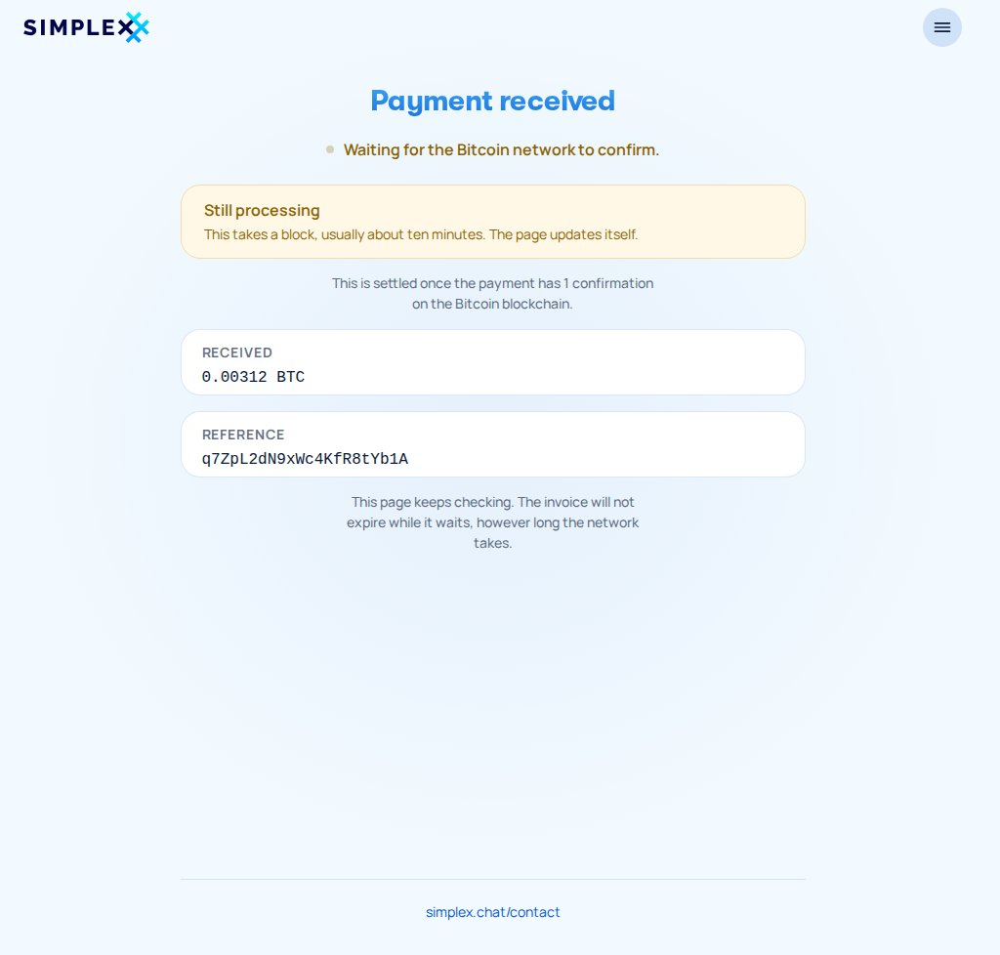 | 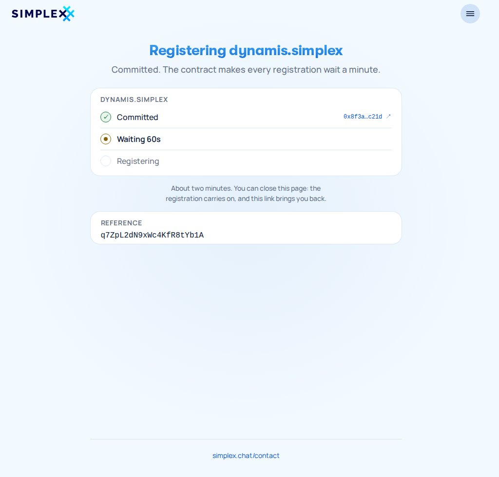 | 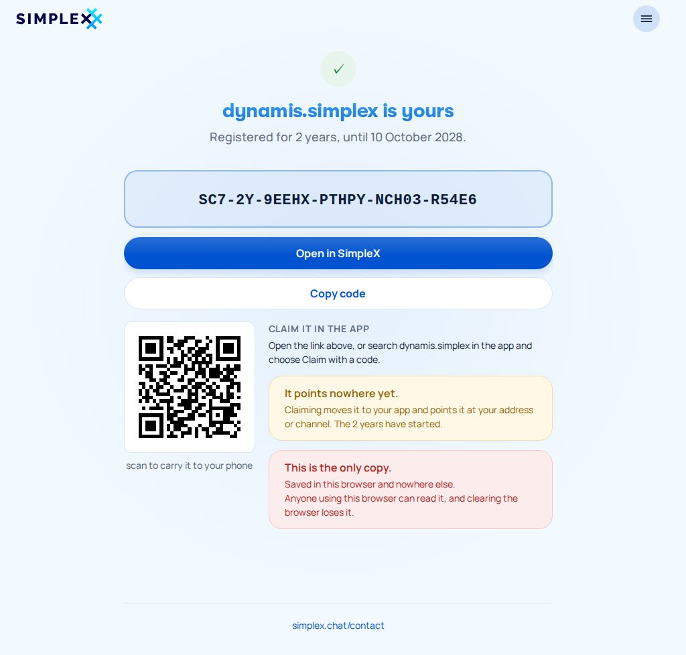 |
| **N6** committing | **N6a** waiting a minute | **N7** yours, with a claim code |

### What a search can find

| | | |
|---|---|---|
|  |  | 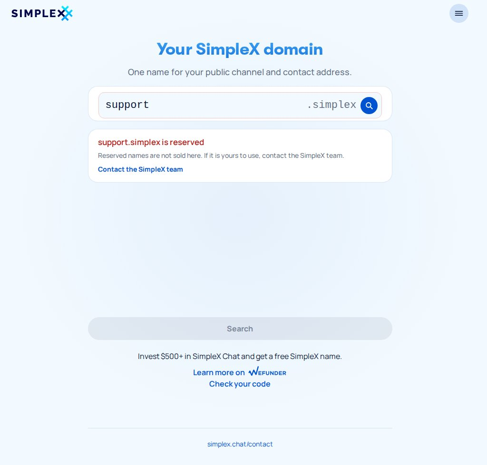 |
| **N2a** taken: what uses it | **N2b** taken, pointing nowhere | **N2c** reserved |
|  | 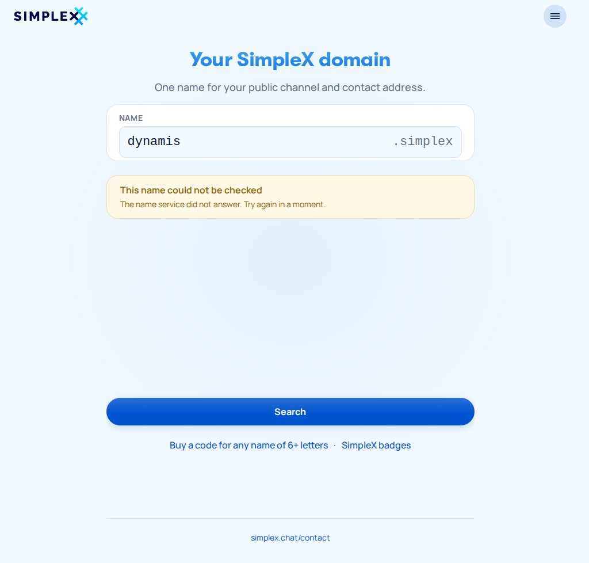 | 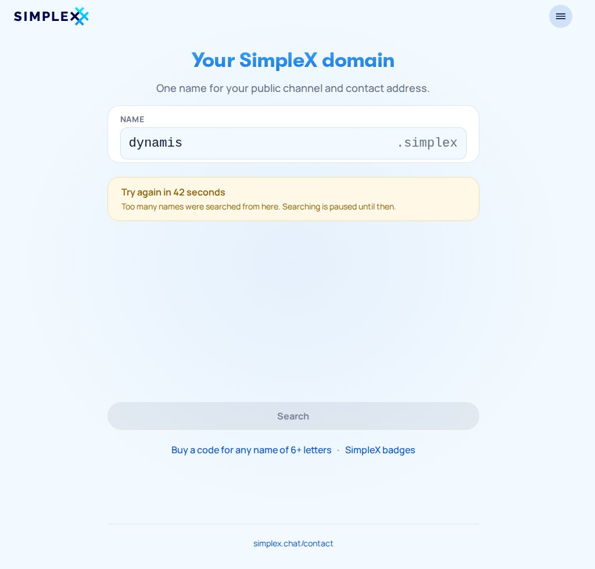 |
| **N1b** too short, judged locally | **N2d** not checked | **N2e** too many searches |

### When registering does not go through, and the secondary code

| | | |
|---|---|---|
|  | 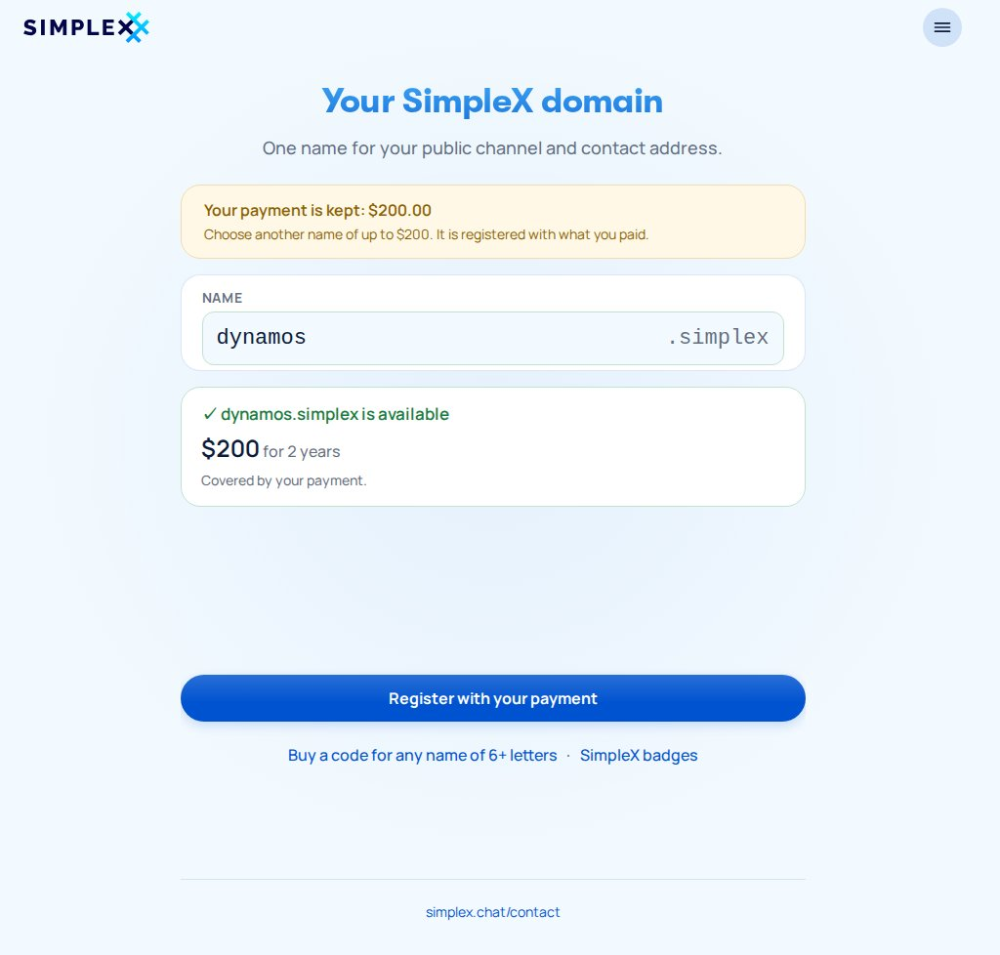 | 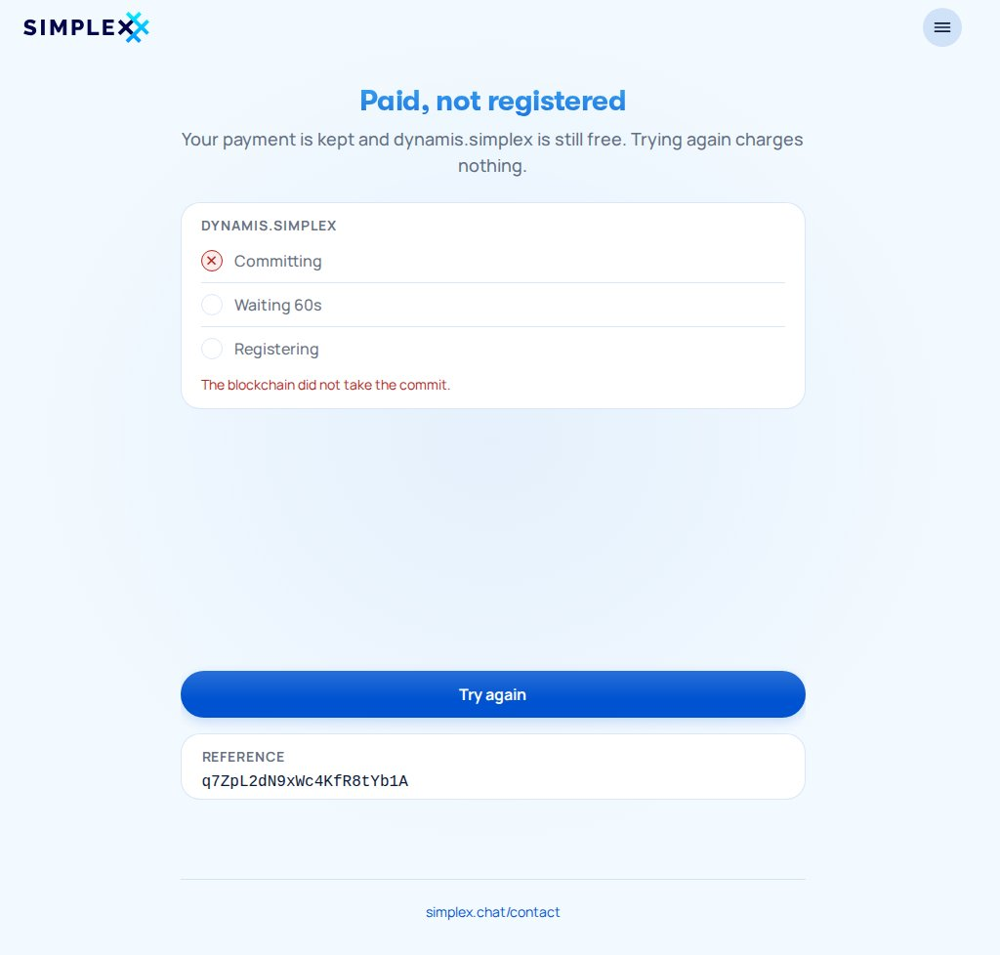 |
| **N8** someone was faster | **N8a** another name, same payment | **N9** paid, not registered |
| 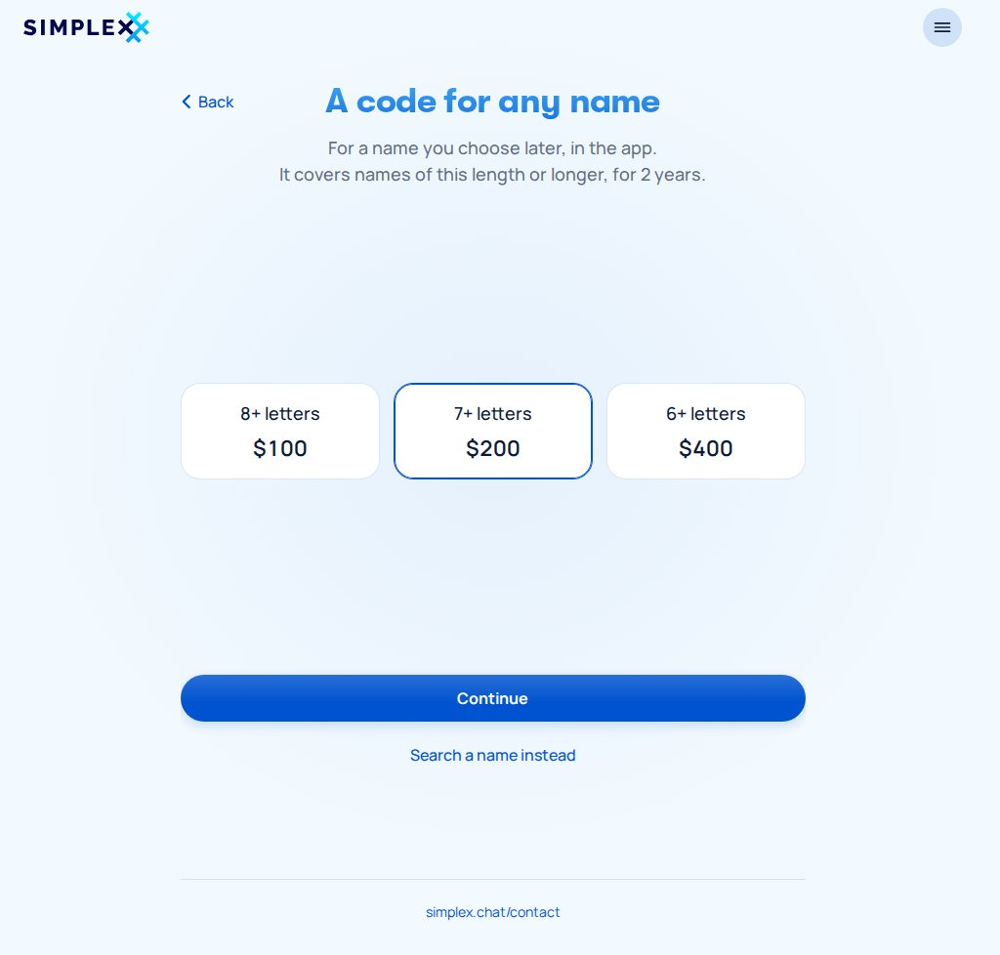 | 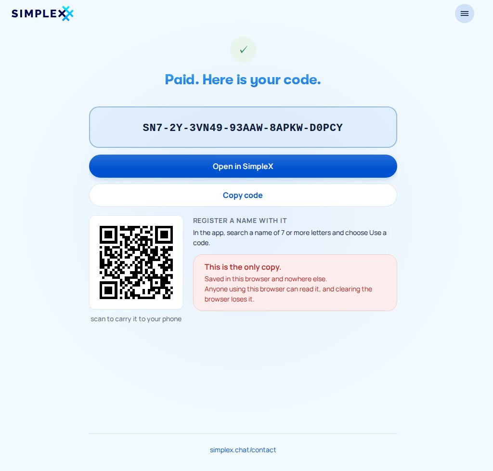 | 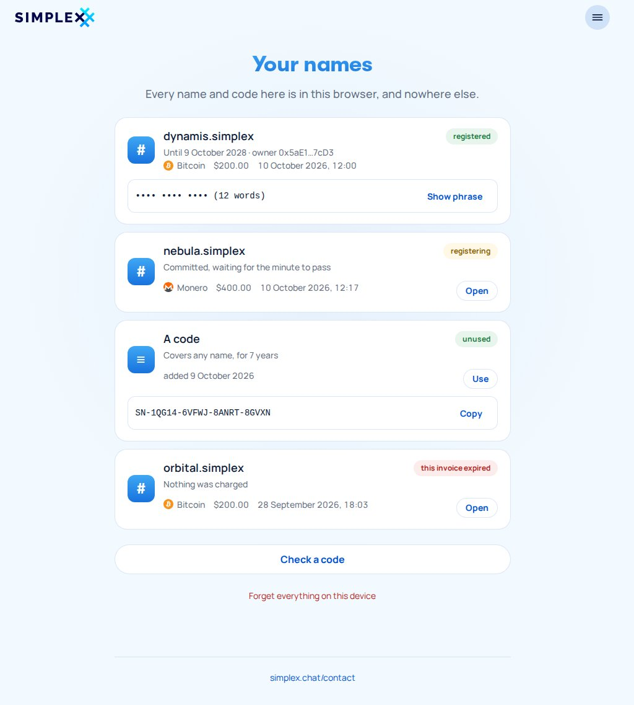 |
| **C1** a code for a length | **C3** the code | **N12** your names |

The refusals at checkout (N3a–N3e) and the payment endings (N4a–N4d, N10–N10c, N11) are the badge screens. The board shows each one with the name's content.

## 13. Deployment

Production is the split deployment in `scripts/badge-service/` (`scripts/store-service/` after the rename):
- Caddy serves the webapp folder the service exports at boot and proxies `/api` and `/webhooks`.
- The service runs with `+client_postgres` and host networking, with its ini mounted read-only.

What changes:
- **Build:** `build.js` emits two site roots, `dist/badges/` and `dist/names/`, each with its own `index.html`, `sw.js` and `assets/<hash>/`. The Dockerfile's web stage builds both.
- **Export:** `exportWebapp` writes both, with the Stripe publishable key in each shell.
- **Caddy:**
  - `badges.simplex.chat` → `web/badges`;
  - `simplex.domains` → `web/names`;
  - both proxy `/api/*`; `/webhooks/*` stays on one host.
  
  The Caddyfile is not in this repository, so the deployment README gives both host blocks and their CSP: Stripe, and `frame-ancestors` for the badges embed.
- **Chain:** the resolver (`:8000`) and reth (`:8545`) on loopback when they share the host, a private network otherwise. The registrar key is in the mounted ini, which `Dockerfile.dockerignore` already keeps out of the image.
- **Unchanged:** the database `badge_service`, the `sx_badge_service_` prefix and the migrations table.

## 14. Regenerating the board

`mockups/screens.js` builds every screen in the browser on the webapp's compiled modules. Shared screens call the real `screens.js`, and name screens are prototypes for stage 5's `nameScreens.ts`. `mockups/layout.mjs` holds each frame's caption, position and incoming arrow. `mockups/board.mjs` renders each frame with Playwright into `screens/<tag>.jpg` (JPEG at quality 85, animations frozen, so runs are byte-identical) and writes `names-flow.svg` around them.

```
cd apps/simplex-badge-service/web && npm install && npm run build && cd ../../..
npm install --prefix /tmp/pw playwright && npx --prefix /tmp/pw playwright install chromium
PLAYWRIGHT=/tmp/pw/node_modules/playwright/index.mjs node plans/names-codes/mockups/board.mjs
```

## 15. Open questions

1. **Funding:** the deployed `.testing` controller's `register` is payable in ETH, so the registrar key holds ETH. #7530's `registerWithCredit` (allowance-funded) replaces it once the `.simplex` contracts deploy.
2. **Claim mechanics (blocking stage 4):** no source here shows a registrar registering a name to itself, setting its records, then transferring it on the deployed contracts.
   - The SNS contract source is not in these repositories.
   - The names v2 RFC registers with the user as `owner` from the start.
   - Only its remark about auto-reclaim suggests the registry node follows the token.

   This has to be confirmed on the contract source first. If it does not hold, ownership falls back to the buyer giving an owner address.
3. **The open-in-app link format** (§6), for the app team.
4. **Coordination with #7530:** the StoreService rename (#7530 proposes `SHC`/`SHP`/`SHE` prefixes for ShopService; this plan uses `STC`/`STP`/`STE`), the code kind, the `Registration` encoder, the chain client, and the app side of `claimName`.
5. **Fetching link profiles** puts a load on the service that grows with searches. The cache bounds it per link, and a timeout and a rate limit of its own bound it per fetch and per client.
6. **Key custody:** the registrar key is a hot key in the ini, and it owns every unclaimed name. Should held names move to a separate holding address whose key is kept offline, with only registration on the hot key? Claim reminders keep the window short either way.
7. **Cost risk:** the buyer pays a fixed USD price; the contract's ETH fee and gas are paid at registration time. A gas spike is the service's loss.
8. **simplex.domains today** is a countdown page; the store replaces it at launch. Its heading and line ("Your SimpleX domain", "One name for your public channel and contact address") are kept.
